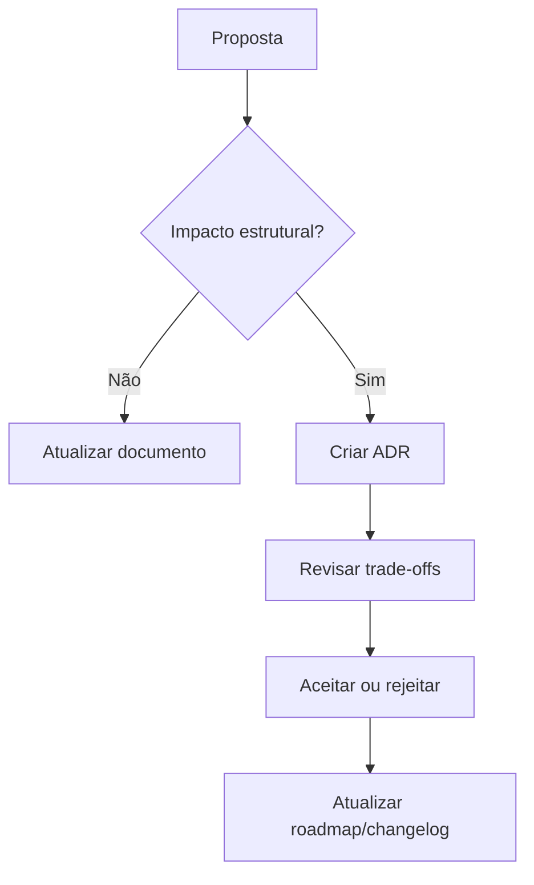

# Governance

## 1. Objetivo

Este documento define a governança do AI-SEOS.

Governança existe para proteger coerência, qualidade, evolução e confiança no framework.

---

# 2. Princípios de governança

A governança do AI-SEOS segue:

- transparência;
- rastreabilidade;
- modularidade;
- revisão explícita;
- decisões por ADR;
- qualidade sobre velocidade;
- compatibilidade entre módulos;
- abertura para contribuição;
- responsabilidade humana final.

---

# 3. Papéis

## 3.1 Project Founder

Responsável por visão inicial, direção estratégica e aprovação de grandes mudanças.

## 3.2 Core Maintainers

Responsáveis por manter arquitetura, qualidade, roadmap e governança.

## 3.3 Module Maintainers

Responsáveis por módulos específicos, como engines, frameworks, agentes ou protocolos.

## 3.4 Contributors

Pessoas ou agentes que propõem melhorias, correções, templates, exemplos ou documentação.

## 3.5 AI Agents

Agentes que podem gerar, revisar, refatorar e propor mudanças, mas devem seguir os documentos de governança.

---

# 4. Tipos de decisão

## 4.1 Decisões leves

Podem ser feitas diretamente em documentos ou PRs.

Exemplos:

- correções de texto;
- ajustes de links;
- melhorias pequenas;
- exemplos adicionais;
- refino de linguagem.

## 4.2 Decisões moderadas

Exigem explicação clara no PR ou changelog.

Exemplos:

- novo template;
- novo playbook;
- expansão de protocolo;
- reorganização pequena.

## 4.3 Decisões estruturais

Exigem ADR.

Exemplos:

- novo módulo;
- nova engine;
- mudança de estrutura;
- alteração de princípios;
- mudança de versionamento;
- mudança de licença;
- mudança de governança.

---

# 5. Processo de mudança



---

# 6. Versionamento

O AI-SEOS deve usar Semantic Versioning para releases do framework.

```text
MAJOR.MINOR.PATCH
```

## MAJOR

Mudanças incompatíveis na estrutura, governança ou protocolos principais.

## MINOR

Novas engines, frameworks, templates ou capacidades compatíveis.

## PATCH

Correções, melhorias de texto, exemplos e ajustes menores.

---

# 7. Status de documentos

Documentos podem ter status:

- Draft;
- Review;
- Stable;
- Deprecated;
- Superseded.

---

# 8. Revisão periódica

Documentos estáveis devem ser revisados periodicamente.

Recomendação:

- documentos core: trimestralmente;
- templates: semestralmente;
- exemplos: conforme necessidade;
- ADRs: não devem ser alteradas retroativamente, apenas superseded.

---

# 9. Compatibilidade

Mudanças não devem quebrar:

- links internos;
- nomes canônicos;
- estrutura de diretórios;
- templates existentes;
- protocolos documentados;
- referências de ADRs.

Quando quebra for necessária, criar plano de migração.

---

# 10. Critérios para aceitar contribuições

Uma contribuição deve:

- estar alinhada aos princípios;
- reduzir ambiguidade;
- melhorar utilidade prática;
- manter modularidade;
- não duplicar conteúdo;
- incluir exemplos quando necessário;
- incluir ADR quando estrutural;
- atualizar changelog quando aplicável.

---

# 11. Governança comunitária

Contribuições públicas devem usar os templates em `.github/ISSUE_TEMPLATE/` ou o pull request template.

Novas propostas devem indicar tipo, motivação, escopo, riscos, artefatos relacionados e impacto na governança existente.

Mudanças em protocolos, templates, frameworks, casos, anti-patterns ou best practices devem atualizar os registries ou índices relacionados quando aplicável.

Feedback público deve ser triado pelo processo definido em `docs/community/feedback-and-improvement-loop.md` e `protocols/feedback/feedback-triage-protocol.md`.

Durante a transição de naming, referências públicas devem usar Resolve Aí. Referências históricas, técnicas ou legadas a AI-SEOS devem ser preservadas quando mantiverem rastreabilidade. Substituição global cega de AI-SEOS não é permitida.

---

# 12. Governança da runtime

A camada runtime do Resolve Aí deve evoluir por ADRs e validação explícita.

Regras:

- documentação da runtime não deve prometer CLI funcional antes da implementação;
- comandos públicos devem priorizar português;
- Modo Liga/Desliga deve ser respeitado por CLI, agents, hooks e adapters futuros;
- projetos existentes devem passar por diagnóstico, plano e riscos antes de mudanças em código;
- `.resolve-ai/` é estado operacional local;
- `docs/resolve-ai/` é documentação humana preferida;
- secrets, dados pessoais e arquivos sensíveis não devem ser expostos em logs, prompts ou handoffs;
- MCP e adapters avançados só devem avançar depois do CLI MVP validado.

---

# 13. Papel da IA na governança

Agentes de IA podem:

- propor mudanças;
- revisar consistência;
- gerar documentação;
- identificar lacunas;
- sugerir ADRs;
- atualizar roadmap;
- detectar duplicações.

Agentes de IA não devem:

- alterar princípios centrais sem ADR;
- remover governança sem justificativa;
- tomar decisões sensíveis sem revisão humana;
- apagar histórico de decisões.

---

# 14. Frase de governança

```text
AI-SEOS deve evoluir rápido, mas nunca de forma caótica.
```
