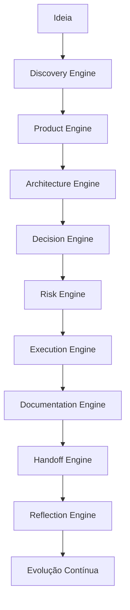

# AI Software Engineering Operating System (AI-SEOS)

**AI-SEOS** é um framework open source para Engenharia de Software orientada por Inteligência Artificial.

Ele define um sistema operacional de trabalho para equipes formadas por humanos e agentes de IA, cobrindo discovery, produto, arquitetura, decisão, risco, execução, documentação, handoff, revisão e evolução contínua de projetos de software.

O objetivo do AI-SEOS é transformar uma ideia inicial em um projeto tecnicamente estruturado, documentado, versionável, seguro, escalável e pronto para ser entregue aos agentes especializados de implementação.

---

## Por que este projeto existe

A adoção de IA em engenharia de software acelerou a criação de código, mas não resolveu automaticamente os problemas mais difíceis da engenharia:

- entender corretamente o problema;
- validar hipóteses;
- definir um MVP realista;
- escolher arquitetura adequada;
- registrar decisões;
- lidar com trade-offs;
- antecipar riscos;
- manter documentação viva;
- coordenar handoffs entre agentes;
- evitar perda de contexto;
- evitar superengenharia;
- garantir segurança e manutenibilidade.

Muitas equipes usam IA como gerador de código ou de prompts. O AI-SEOS propõe outra abordagem:

```text
IA não deve apenas gerar código.
IA deve operar dentro de um sistema de engenharia.
```

---

## O que o AI-SEOS entrega

O framework entrega:

- documentação modular;
- agentes especializados;
- engines de decisão;
- protocolos de trabalho;
- templates reutilizáveis;
- playbooks operacionais;
- ADRs;
- checklists;
- matrizes de decisão;
- exemplos reais;
- fluxo completo de desenvolvimento;
- governança de evolução;
- handoff entre agentes.

---

## Visão de alto nível



---

## Para quem é

AI-SEOS foi criado para:

- desenvolvedores que usam IA seriamente;
- founders técnicos;
- arquitetos de software;
- CTOs;
- tech leads;
- equipes de produto;
- equipes de engenharia;
- criadores de agentes;
- consultorias técnicas;
- projetos open source;
- equipes pequenas que precisam de disciplina enterprise;
- empresas que desejam padronizar uso de IA no ciclo de vida de software.

---

## O que diferencia o AI-SEOS

A maioria dos materiais públicos sobre IA para engenharia foca em prompts isolados.

O AI-SEOS foca em sistema operacional.

Ele define:

- como pensar;
- como decidir;
- como documentar;
- como comparar alternativas;
- como criar handoffs;
- como registrar decisões;
- como trabalhar em módulos;
- como coordenar múltiplos agentes;
- como manter qualidade ao longo do tempo.

---

## Estrutura inicial do repositório

```text
ai-seos/
├── README.md
├── PROJECT_BOOTSTRAP.md
├── ARCHITECTURE_VISION.md
├── ENGINEERING_PRINCIPLES.md
├── DEVELOPMENT_PROTOCOL.md
├── REPOSITORY_STRUCTURE.md
├── ROADMAP.md
├── GOVERNANCE.md
├── CONTRIBUTING.md
├── CODE_OF_CONDUCT.md
├── SECURITY.md
├── CHANGELOG.md
├── LICENSE
├── docs/
├── operating-system/
├── frameworks/
├── protocols/
├── templates/
├── playbooks/
├── agents/
├── examples/
├── adr/
└── assets/
```

---

## Roadmap resumido

### Sprint 0 — Foundation

Fundação do projeto, estrutura, governança, documentação base e diretiva mestre.

### Sprint 1 — AI CTO & Solution Architect Core

Core Identity, Operating System e Discovery Engine.

### Sprint 2 — Product and Architecture

Product Engine e Architecture Engine.

### Sprint 3 — Decision, Risk and Optimization

Decision Engine, Risk Engine e Optimization Engine.

### Sprint 4 — Execution, Documentation, Handoff and Reflection

Execution Engine, Documentation Engine, Handoff Engine e Reflection Engine.

### Sprint 5 — Frameworks completos

Frameworks reutilizáveis e independentes.

### Sprint 6 — Templates completos

Templates enterprise-ready.

### Sprint 7 — Protocolos, casos reais e consolidação

Protocolos, exemplos reais, anti-patterns, best practices e consolidação final.

---

## Como iniciar com IA no terminal

Coloque `PROJECT_BOOTSTRAP.md` na raiz do projeto e execute no terminal/Codex:

```text
Leia integralmente o arquivo PROJECT_BOOTSTRAP.md.
Assuma os papéis definidos no documento.
Execute a Sprint 0 criando a estrutura real do repositório.
Não descreva apenas. Faça as alterações reais.
Ao terminar, valide os critérios de aceite e gere o relatório final da Sprint 0.
```

---

## Status do projeto

Status atual: **Sprint 6 concluída**

Sprint 1 criou a primeira camada funcional do AI-SEOS:

- Core Identity e Operating System Kernel;
- Context and Knowledge Model;
- AI CTO & Solution Architect Agent;
- Discovery Engine, Protocol, Templates, Checklists e Playbook;
- ADRs 0007 a 0011;
- relatório de validação em `docs/sprints/sprint-1-validation-report.md`.

Sprint 2 adicionou Product Engine e Architecture Engine:

- Product Engine, PRD protocol, MVP Scope Framework, roadmap e backlog standards;
- Architecture Engine, architecture decision protocol, readiness levels e architecture view standard;
- templates de produto, arquitetura e ADR estendido;
- ADRs 0012 a 0018;
- relatório de validação em `docs/sprints/sprint-2-validation-report.md`.

Sprint 3 adicionou Decision Engine, Risk Engine e Optimization Engine:

- Decision Engine, lifecycle, object model, quality gates e anti-patterns;
- Risk Engine, taxonomy, risk register, scoring model e modelos de segurança, compliance, vendor e AI;
- Optimization Engine, modelos de custo, complexidade, escalabilidade e custo de AI;
- playbook integrado de Decision, Risk and Optimization;
- ADRs 0019 a 0026;
- relatório de validação em `docs/sprints/sprint-3-validation-report.md`.

Sprint 4 fechou o primeiro ciclo operacional completo:

- Execution Engine, readiness gates, planning protocols e work packages;
- Documentation Engine, information architecture, front matter standard e documentation review;
- Handoff Engine, handoff contracts, agent handoff e phase handoff;
- Reflection Engine, system review playbooks, sprint retrospective e improvement backlog;
- ADRs 0027 a 0036;
- relatório de validação em `docs/sprints/sprint-4-validation-report.md`.

Sprint 5 consolidou a camada de frameworks:

- framework catalog, taxonomy, map, registry e evolution policy;
- AI-SEOS Meta-Framework, Discovery-to-Delivery Framework e operating paths;
- Cross-Engine Integration Model e traceability matrix;
- Maturity Model M0-M5 e project readiness scorecards;
- Agent Collaboration Framework, framework governance, quality assurance e reference implementation skeleton;
- ADRs 0037 a 0045;
- relatório de validação em `docs/sprints/sprint-5-validation-report.md`.

Sprint 5.5 adicionou a Entry Modes Layer antes da criação dos templates completos:

- Non-Technical Builder, Vibe Coder e Professional Engineer;
- Mode Router antes do Discovery Engine;
- Builder Intake Protocol e Problem-to-Software Translation Framework;
- templates iniciais de entrada e Discovery Intake Package;
- exemplo da mesma ideia nos três modos;
- ADRs 0046 a 0051;
- relatório de validação em `docs/sprints/sprint-5-5-validation-report.md`.

Sprint 6 criou template packs completos e governados:

- packs para Non-Technical Builder, Vibe Coder e Professional Engineer;
- templates universais de lifecycle de intake a reflection;
- templates operacionais por engine;
- templates de handoff entre agentes;
- exemplos preenchidos usando o cenário de uma academia de artes marciais;
- registry, taxonomy, policy, quality standard e protocolo de manutenção de templates;
- ADRs 0052 a 0060;
- relatório de validação em `docs/sprints/sprint-6-validation-report.md`.

Próxima etapa: **Sprint 7 — Protocolos, casos reais e consolidação**.

---

## Licença

Este projeto usa a MIT License. Consulte `LICENSE` e `adr/0006-adopt-mit-license.md`.

---

## Contribuição

Contribuições devem seguir as regras de `CONTRIBUTING.md` e a governança definida em `GOVERNANCE.md`.

---

## Filosofia central

```text
Código sem contexto gera dívida.
Arquitetura sem decisão gera ambiguidade.
IA sem sistema gera caos.
AI-SEOS existe para transformar IA em disciplina de engenharia.
```
