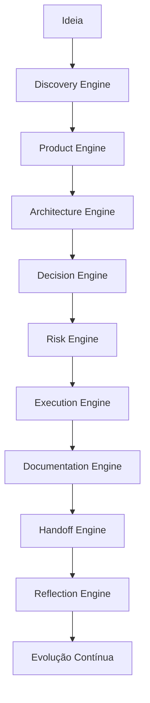

# Resolve Aí

> Me dá o problema ou a ideia, e eu te ajudo a resolver.

**Resolve Aí** é um framework open source para transformar problemas, ideias e projetos existentes em planos claros de software usando IA.

Ele ajuda pessoas não técnicas, vibe coders e engenheiros profissionais a sair da confusão antes de pedir para a IA escrever código.

Resolve Aí foi criado originalmente com o nome técnico **AI-SEOS — AI Software Engineering Operating System**. Durante a transição, AI-SEOS continua sendo o nome histórico/técnico da arquitetura, enquanto Resolve Aí passa a ser o nome público do projeto.

---

## Por que este projeto existe

A adoção de IA em engenharia de software acelerou a criação de código, mas não resolveu automaticamente os problemas mais difíceis da engenharia:

- entender corretamente o problema;
- validar hipóteses;
- definir um MVP realista;
- escolher arquitetura adequada;
- registrar decisões;
- lidar com trade-offs;
- antecipar riscos;
- manter documentação viva;
- coordenar handoffs entre agentes;
- evitar perda de contexto;
- evitar superengenharia;
- garantir segurança e manutenibilidade.

Muitas equipes usam IA como gerador de código ou de prompts. Resolve Aí propõe outra abordagem:

```text
IA não deve apenas gerar código.
IA deve operar dentro de um sistema de engenharia.
```

---

## O que o Resolve Aí entrega

O framework entrega:

- documentação modular;
- agentes especializados;
- engines de decisão;
- protocolos de trabalho;
- templates reutilizáveis;
- playbooks operacionais;
- ADRs;
- checklists;
- matrizes de decisão;
- exemplos reais;
- fluxo completo de desenvolvimento;
- governança de evolução;
- handoff entre agentes.

---

## Visão de alto nível



---

## Para quem é

Resolve Aí foi criado para:

- desenvolvedores que usam IA seriamente;
- founders técnicos;
- arquitetos de software;
- CTOs;
- tech leads;
- equipes de produto;
- equipes de engenharia;
- criadores de agentes;
- consultorias técnicas;
- projetos open source;
- equipes pequenas que precisam de disciplina enterprise;
- empresas que desejam padronizar uso de IA no ciclo de vida de software.

---

## Escolha seu caminho

Comece pelo modo que mais parece com você:

- **Non-Technical Builder**: você tem um problema real, mas não sabe descrever isso em termos de software. Comece em `docs/getting-started/for-non-technical-builders.md` e use `templates/packs/non-technical-builder-pack/`.
- **Vibe Coder**: você usa Codex, Cursor, Claude Code ou ferramentas parecidas e quer evitar caos, retrabalho e prompts vagos. Comece em `docs/getting-started/for-vibe-coders.md` e use `templates/packs/vibe-coder-pack/`.
- **Professional Engineer**: você quer aplicar Resolve Aí como workflow técnico com engines, ADRs, riscos, handoffs e readiness. Comece em `docs/getting-started/for-professional-engineers.md` e use `examples/case-library/professional-engineer/`.

Para decidir, leia `docs/getting-started/choose-your-path.md`.

---

## Projeto novo ou projeto existente

### Use Resolve Aí com um projeto novo

Use este caminho quando você ainda tem só uma ideia, problema ou processo manual. Resolve Aí ajuda a fazer intake, discovery, definição de MVP, arquitetura, riscos, plano de execução e handoff.

### Use Resolve Aí com um projeto existente

Use este caminho quando você já tem um repositório e quer diagnosticar, documentar e planejar antes de alterar código.

Abra o projeto que você quer analisar no seu terminal com IA ou coding agent e peça para aplicar Resolve Aí como framework de diagnóstico e planejamento.

Durante a transição, `docs/ai-seos/` pode aparecer como caminho legado. O caminho preferido para a próxima fase será:

```text
docs/resolve-ai/
```

O futuro runtime deve usar o comando:

```bash
resolve-ai
```

O CLI MVP já existe em `packages/resolve-ai-cli/` e pode ser executado localmente com Node.

```bash
node packages/resolve-ai-cli/dist/index.js começar
node packages/resolve-ai-cli/dist/index.js diagnosticar
node packages/resolve-ai-cli/dist/index.js planejar
node packages/resolve-ai-cli/dist/index.js preparar
node packages/resolve-ai-cli/dist/index.js resolver
node packages/resolve-ai-cli/dist/index.js status
node packages/resolve-ai-cli/dist/index.js ligar
node packages/resolve-ai-cli/dist/index.js desligar
node packages/resolve-ai-cli/dist/index.js ajuda
```

---

## O que diferencia o Resolve Aí

A maioria dos materiais públicos sobre IA para engenharia foca em prompts isolados.

Resolve Aí foca em sistema operacional de engenharia.

Ele define:

- como pensar;
- como decidir;
- como documentar;
- como comparar alternativas;
- como criar handoffs;
- como registrar decisões;
- como trabalhar em módulos;
- como coordenar múltiplos agentes;
- como manter qualidade ao longo do tempo.

---

## Estrutura inicial do repositório

```text
resolve-ai/
├── README.md
├── PROJECT_BOOTSTRAP.md
├── ARCHITECTURE_VISION.md
├── ENGINEERING_PRINCIPLES.md
├── DEVELOPMENT_PROTOCOL.md
├── REPOSITORY_STRUCTURE.md
├── ROADMAP.md
├── GOVERNANCE.md
├── CONTRIBUTING.md
├── CODE_OF_CONDUCT.md
├── SECURITY.md
├── CHANGELOG.md
├── LICENSE
├── docs/
├── operating-system/
├── frameworks/
├── protocols/
├── templates/
├── playbooks/
├── agents/
├── examples/
├── adr/
└── assets/
```

---

## Roadmap resumido

### Sprint 0 — Foundation

Fundação do projeto, estrutura, governança, documentação base e diretiva mestre.

### Sprint 1 — AI CTO & Solution Architect Core

Core Identity, Operating System e Discovery Engine.

### Sprint 2 — Product and Architecture

Product Engine e Architecture Engine.

### Sprint 3 — Decision, Risk and Optimization

Decision Engine, Risk Engine e Optimization Engine.

### Sprint 4 — Execution, Documentation, Handoff and Reflection

Execution Engine, Documentation Engine, Handoff Engine e Reflection Engine.

### Sprint 5 — Frameworks completos

Frameworks reutilizáveis e independentes.

### Sprint 6 — Templates completos

Templates enterprise-ready.

### Sprint 7 — Protocolos, casos reais e consolidação

Protocolos, exemplos reais, anti-patterns, best practices e consolidação final.

---

## Como iniciar com IA no terminal

Coloque `PROJECT_BOOTSTRAP.md` na raiz do projeto e execute no terminal/Codex:

```text
Leia integralmente o arquivo PROJECT_BOOTSTRAP.md.
Assuma os papéis definidos no documento.
Execute a Sprint 0 criando a estrutura real do repositório.
Não descreva apenas. Faça as alterações reais.
Ao terminar, valide os critérios de aceite e gere o relatório final da Sprint 0.
```

---

## Status do projeto

Status atual: **Phase 8 concluída**

Sprint 1 criou a primeira camada funcional do AI-SEOS:

- Core Identity e Operating System Kernel;
- Context and Knowledge Model;
- AI CTO & Solution Architect Agent;
- Discovery Engine, Protocol, Templates, Checklists e Playbook;
- ADRs 0007 a 0011;
- relatório de validação em `docs/sprints/sprint-1-validation-report.md`.

Sprint 2 adicionou Product Engine e Architecture Engine:

- Product Engine, PRD protocol, MVP Scope Framework, roadmap e backlog standards;
- Architecture Engine, architecture decision protocol, readiness levels e architecture view standard;
- templates de produto, arquitetura e ADR estendido;
- ADRs 0012 a 0018;
- relatório de validação em `docs/sprints/sprint-2-validation-report.md`.

Sprint 3 adicionou Decision Engine, Risk Engine e Optimization Engine:

- Decision Engine, lifecycle, object model, quality gates e anti-patterns;
- Risk Engine, taxonomy, risk register, scoring model e modelos de segurança, compliance, vendor e AI;
- Optimization Engine, modelos de custo, complexidade, escalabilidade e custo de AI;
- playbook integrado de Decision, Risk and Optimization;
- ADRs 0019 a 0026;
- relatório de validação em `docs/sprints/sprint-3-validation-report.md`.

Sprint 4 fechou o primeiro ciclo operacional completo:

- Execution Engine, readiness gates, planning protocols e work packages;
- Documentation Engine, information architecture, front matter standard e documentation review;
- Handoff Engine, handoff contracts, agent handoff e phase handoff;
- Reflection Engine, system review playbooks, sprint retrospective e improvement backlog;
- ADRs 0027 a 0036;
- relatório de validação em `docs/sprints/sprint-4-validation-report.md`.

Sprint 5 consolidou a camada de frameworks:

- framework catalog, taxonomy, map, registry e evolution policy;
- AI-SEOS Meta-Framework, Discovery-to-Delivery Framework e operating paths;
- Cross-Engine Integration Model e traceability matrix;
- Maturity Model M0-M5 e project readiness scorecards;
- Agent Collaboration Framework, framework governance, quality assurance e reference implementation skeleton;
- ADRs 0037 a 0045;
- relatório de validação em `docs/sprints/sprint-5-validation-report.md`.

Sprint 5.5 adicionou a Entry Modes Layer antes da criação dos templates completos:

- Non-Technical Builder, Vibe Coder e Professional Engineer;
- Mode Router antes do Discovery Engine;
- Builder Intake Protocol e Problem-to-Software Translation Framework;
- templates iniciais de entrada e Discovery Intake Package;
- exemplo da mesma ideia nos três modos;
- ADRs 0046 a 0051;
- relatório de validação em `docs/sprints/sprint-5-5-validation-report.md`.

Sprint 6 criou template packs completos e governados:

- packs para Non-Technical Builder, Vibe Coder e Professional Engineer;
- templates universais de lifecycle de intake a reflection;
- templates operacionais por engine;
- templates de handoff entre agentes;
- exemplos preenchidos usando o cenário de uma academia de artes marciais;
- registry, taxonomy, policy, quality standard e protocolo de manutenção de templates;
- ADRs 0052 a 0060;
- relatório de validação em `docs/sprints/sprint-6-validation-report.md`.

Sprint 7 consolidou o ciclo inicial do AI-SEOS:

- sistema oficial de protocolos, lifecycle, registry e taxonomy;
- case library e casos reais para os três perfis;
- catálogo de anti-patterns com countermeasures do AI-SEOS;
- catálogo de best practices relacionado a engines, entry modes e templates;
- documentação pública de adoção, getting started, glossário e walkthrough;
- documentação comunitária, templates de issue e pull request;
- auditoria de qualidade, release readiness e limitações conhecidas;
- ADRs 0061 a 0070;
- release readiness score: 43/50, Public alpha;
- relatório de validação em `docs/sprints/sprint-7-validation-report.md`.

Phase 2 moveu o AI-SEOS para public-alpha candidate validado:

- repository audit e hardening checklist;
- first end-to-end validation case;
- SenseiHub como primeiro caso real de validação;
- validações para Non-Technical Builder, Vibe Coder e Professional Engineer;
- estratégia de publicação e documentação GitHub-first;
- plano de release `v0.1.0-alpha`;
- feedback and improvement loop;
- ADRs 0071 a 0080;
- release readiness score: 47/50, Strong public alpha candidate;
- relatório de validação em `docs/sprints/phase-2-validation-report.md`.

Phase 2.5 renomeou e reposicionou publicamente o projeto:

- Resolve Aí é o nome público oficial;
- AI-SEOS permanece como nome técnico/histórico durante a transição;
- promessa pública definida: “Me dá o problema ou a ideia, e eu te ajudo a resolver.”;
- estratégia de migração e classificação de referências criada;
- futura CLI preparada como `resolve-ai`;
- Phase 3 renomeada para Resolve Aí Runtime Productization;
- ADRs 0081 a 0086;
- relatório de validação em `docs/sprints/phase-2-5-validation-report.md`.

Phase 3 consolidou a arquitetura runtime do Resolve Aí:

- visão runtime para transformar o framework em camada ativável por projeto;
- arquitetura da futura CLI `resolve-ai`, sem implementação nesta fase;
- Modo Liga/Desliga como controle público oficial;
- Project Adapter com `.resolve-ai/` para estado local e `docs/resolve-ai/` para documentação humana;
- fluxo oficial “Projeto em Andamento — Diagnóstico e Continuação”;
- estratégia CLI-first, MCP/adapters depois;
- comandos e UX copy em português;
- segurança, privacidade e economia de tokens como defaults;
- templates runtime e arquivos de instrução para agentes;
- ADRs 0087 a 0096;
- relatório de validação em `docs/sprints/phase-3-validation-report.md`.

Phase 4 implementou o primeiro MVP real da CLI `resolve-ai`:

- pacote `packages/resolve-ai-cli/`;
- comandos `ajuda`, `começar`, `comecar`, `ligar`, `desligar` e `status`;
- estado local em `.resolve-ai/config.json` e `.resolve-ai/state.json`;
- documentação humana em `docs/resolve-ai/README.md`, `00-project-intake.md` e `09-handoff.md`;
- Modo Liga/Desliga persistente;
- comandos idempotentes e não destrutivos;
- testes mínimos com 11 cenários aprovados;
- ADRs 0097 a 0105;
- relatório de validação em `docs/sprints/phase-4-validation-report.md`.

Phase 5 implementou o primeiro comando útil do runtime:

- comando `resolve-ai diagnosticar`;
- aliases `diagnostico` e `diagnóstico`;
- detecção local de tipo de projeto, stack provável, modo recomendado e riscos por nome;
- geração de `docs/resolve-ai/00` a `09` sem sobrescrever por padrão;
- atualização do `state.json` com último diagnóstico;
- `status` agora mostra resumo do diagnóstico quando existir;
- testes automatizados cobrindo projetos vazio, Node, Vite/React, legado, sensíveis e idempotência;
- ADRs 0106 a 0115;
- relatório de validação em `docs/sprints/phase-5-validation-report.md`.

Phase 6 implementou preparação guiada para execução:

- comando `resolve-ai planejar`;
- aliases `plano` e `planejamento`;
- leitura de `.resolve-ai/state.json` e documentos `docs/resolve-ai/`;
- geração de `docs/resolve-ai/10` a `14` sem sobrescrever por padrão;
- backlog priorizado, próximas sprints, prompts de execução e checklist de validação;
- `status` agora mostra resumo do último plano quando existir;
- testes automatizados cobrindo 24 cenários;
- ADRs 0116 a 0125;
- relatório de validação em `docs/sprints/phase-6-validation-report.md`.

Phase 7 implementou preparação guiada de execução:

- comando `resolve-ai preparar`;
- aliases `tarefa` e `executar`;
- seleção de tarefa segura a partir de diagnóstico/planejamento;
- geração de documentos `docs/resolve-ai/15` a `19`;
- `ultimoPreparo` registrado em `.resolve-ai/state.json`;
- `status` mostra a tarefa preparada;
- `canAutoExecute` sempre `false`;
- testes automatizados cobrindo 33 cenários;
- ADRs 0126 a 0135;
- relatório de validação em `docs/sprints/phase-7-validation-report.md`.

Phase 8 implementou execução assistida guiada:

- comando `resolve-ai resolver`;
- aliases `resolva` e `fazer`;
- geração de documentos `docs/resolve-ai/20` a `24`;
- aprovação humana, prompt final para agente, checklist pós-execução e registro de execução;
- `ultimaExecucaoAssistida` registrada em `.resolve-ai/state.json`;
- `status` mostra execução assistida pendente;
- `canAutoExecute` sempre `false`;
- testes automatizados cobrindo 41 cenários;
- ADRs 0136 a 0145;
- relatório de validação em `docs/sprints/phase-8-validation-report.md`.

Próxima etapa: **Phase 9 — Resolve Aí Guided Review and Validation**.

---

## Licença

Este projeto usa a MIT License. Consulte `LICENSE` e `adr/0006-adopt-mit-license.md`.

---

## Contribuição

Contribuições devem seguir as regras de `CONTRIBUTING.md` e a governança definida em `GOVERNANCE.md`.

---

## Filosofia central

```text
Código sem contexto gera dívida.
Arquitetura sem decisão gera ambiguidade.
IA sem sistema gera caos.
Resolve Aí existe para transformar IA em disciplina de engenharia.
```
