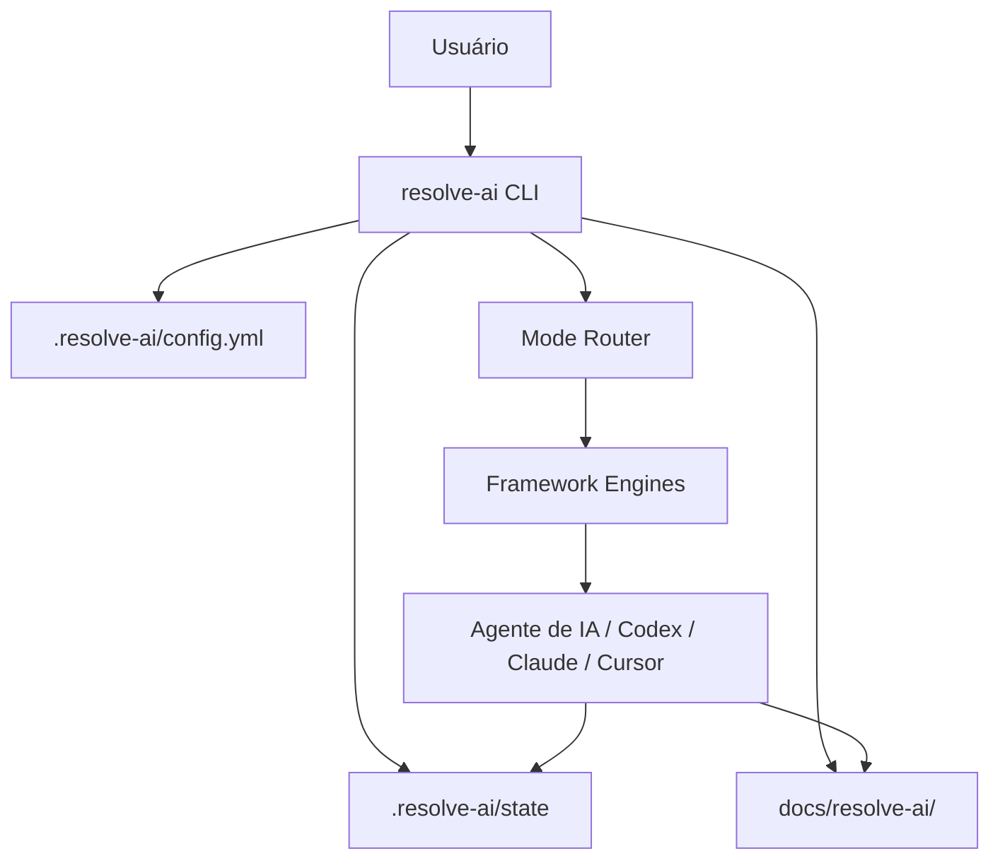

# pt111 — Resolve Aí Runtime Vision

## 1. Objetivo deste documento

Este documento define a visão da **Phase 3 — Resolve Aí Runtime Productization**.

Até a Phase 2.5, o Resolve Aí evoluiu como um framework documental, com engines, templates, protocolos, ADRs, fluxos de validação, casos reais e posicionamento público.

A Phase 3 muda o eixo do projeto.

O objetivo deixa de ser apenas documentar o método e passa a ser transformar o Resolve Aí em uma ferramenta ativável dentro de qualquer projeto.

Em outras palavras:

```text
Antes:
Leia o framework e aplique manualmente.

Depois:
Instale o Resolve Aí, ligue no projeto e deixe ele guiar o trabalho.
```

## 2. Promessa pública

Nome público:

```text
Resolve Aí
```

Promessa:

```text
Me dá o problema ou a ideia, e eu te ajudo a resolver.
```

A Phase 3 precisa materializar essa promessa no terminal.

O usuário não deve precisar entender engines, ADRs, risk register, handoff ou scorecards para começar. A ferramenta deve esconder a complexidade técnica e oferecer uma experiência simples, brasileira e direta.

## 3. Inspiração operacional

A Phase 3 é inspirada na facilidade de uso de ferramentas que funcionam como modos ativáveis dentro do ambiente de IA.

A inspiração é a experiência:

```text
instalar
ativar
usar
desativar
retomar
```

Não é objetivo copiar outro projeto, arquitetura interna, proposta de valor, código, comandos ou implementação.

O Resolve Aí possui uma missão diferente:

```text
Orquestrar engenharia de software orientada por IA.
```

A inspiração é apenas a praticidade de uso: entrar em um projeto, ativar um modo de trabalho e deixar a IA operar com contexto e regras claras.

## 4. O que muda na Phase 3

A Phase 3 introduz o **runtime**.

Runtime, neste projeto, significa uma camada operacional que pode ser ativada dentro de um projeto real para ajudar agentes de IA a trabalharem seguindo o Resolve Aí.

O runtime deve ser capaz de:

- detectar se o projeto é novo ou existente;
- criar uma pasta local de configuração;
- criar documentação de trabalho do Resolve Aí dentro do projeto;
- selecionar o modo adequado;
- guiar a IA por comandos simples;
- manter estado mínimo da sessão;
- registrar decisões, riscos e handoffs;
- ser ligado e desligado rapidamente;
- economizar tokens quando desligado;
- preparar contexto sem poluir a conversa inteira;
- funcionar primeiro como CLI simples antes de evoluir para MCP/adapters.

## 5. Princípios da Runtime

### 5.1 Simplicidade antes de automação avançada

A primeira versão da runtime não deve tentar resolver tudo.

Ela deve fazer poucas coisas muito bem:

```text
ligar
desligar
status
começar
diagnosticar
planejar
continuar
ajuda
```

### 5.2 Português como experiência principal

O Resolve Aí deve ser brasileiro por padrão.

Comandos, mensagens e documentação pública devem priorizar português.

Não usar `on/off` como experiência principal.

Usar:

```bash
resolve-ai ligar
resolve-ai desligar
resolve-ai status
```

### 5.3 Modo Liga/Desliga

O runtime deve respeitar token, foco e intenção do usuário.

Quando ligado, o Resolve Aí ajuda ativamente.

Quando desligado, ele para de injetar contexto e reduz interferência.

### 5.4 Projeto novo e projeto existente são cenários diferentes

O Resolve Aí precisa entender duas situações:

```text
1. Projeto do zero
2. Projeto em andamento
```

Para projeto do zero, ele conduz entrevista, discovery e planejamento.

Para projeto existente, ele não deve modificar código primeiro. Ele deve executar o fluxo:

```text
Projeto em Andamento — Diagnóstico e Continuação
```

### 5.5 Runtime não substitui o framework

A CLI não deve apagar a documentação.

A CLI deve ser a porta de entrada operacional para aplicar o framework.

## 6. Arquitetura conceitual



## 7. Experiência desejada

### 7.1 Primeiro uso em projeto existente

```bash
resolve-ai começar
```

A ferramenta responde:

```text
Beleza. Vou entender este projeto antes de mexer em qualquer código.

Detectei que parece ser um projeto em andamento.
Vou usar o fluxo: Projeto em Andamento — Diagnóstico e Continuação.

Vou criar docs/resolve-ai/ e gerar um diagnóstico inicial.
```

### 7.2 Ligar

```bash
resolve-ai ligar
```

Resposta esperada:

```text
Resolve Aí ligado.
Vou acompanhar este projeto, organizar contexto e te ajudar a resolver sem bagunça.
```

### 7.3 Desligar

```bash
resolve-ai desligar
```

Resposta esperada:

```text
Resolve Aí desligado.
Vou parar de injetar contexto e economizar tokens. Quando quiser, é só ligar de novo.
```

### 7.4 Status

```bash
resolve-ai status
```

Resposta esperada:

```text
Resolve Aí está ligado neste projeto.
Modo atual: Projeto em Andamento — Diagnóstico e Continuação.
Último contexto salvo: há 12 minutos.
Próxima ação sugerida: revisar riscos antes de implementar.
```

## 8. Escopo da Phase 3

A Phase 3 deve entregar documentação e arquitetura suficientes para iniciar a implementação do runtime.

Ela deve definir:

- visão do runtime;
- arquitetura da CLI;
- comandos oficiais em português;
- Modo Liga/Desliga;
- project adapter;
- estrutura `.resolve-ai/`;
- estrutura `docs/resolve-ai/`;
- fluxo para projeto do zero;
- fluxo para projeto em andamento;
- MCP/server como evolução futura;
- agent instruction files;
- segurança, privacidade e economia de tokens;
- ADRs de runtime.

## 9. Não objetivos da Phase 3

A Phase 3 não deve:

- copiar outro projeto;
- implementar uma CLI complexa antes da arquitetura;
- prometer automação total;
- substituir julgamento humano;
- esconder riscos críticos;
- fazer deploy automático;
- modificar código de projeto sem diagnóstico;
- consumir tokens sem necessidade;
- priorizar comandos em inglês como UX pública.

## 10. Resultado esperado

Ao final da Phase 3, o Resolve Aí deve ter uma especificação clara para se tornar uma ferramenta instalável.

A pergunta que a Phase 3 deve responder é:

```text
Como uma pessoa instala, liga, usa, desliga e retoma o Resolve Aí dentro de qualquer projeto?
```
