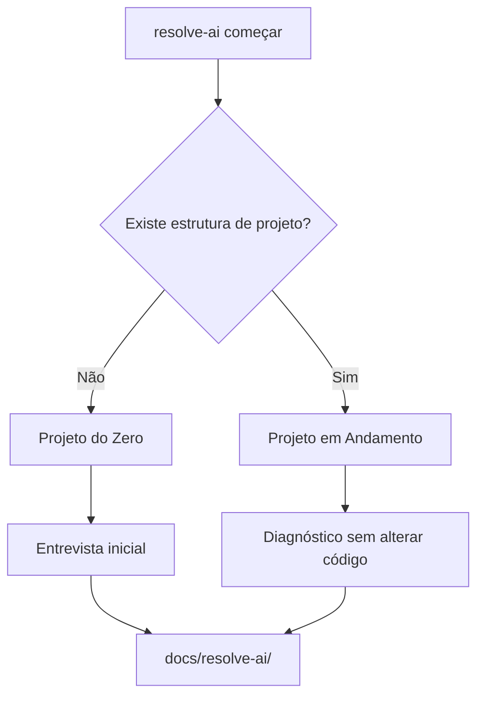

# pt112 — Resolve Aí CLI Architecture

## 1. Objetivo

Este documento define a arquitetura da futura CLI do Resolve Aí.

O comando público recomendado é:

```bash
resolve-ai
```

A CLI deve ser simples, brasileira e orientada a ações reais.

Ela não deve parecer uma ferramenta corporativa complicada. Deve parecer uma ajuda prática que entra no projeto e organiza o caminho.

## 2. Princípios da CLI

### 2.1 Português primeiro

Comandos oficiais:

```bash
resolve-ai começar
resolve-ai ligar
resolve-ai desligar
resolve-ai status
resolve-ai diagnosticar
resolve-ai planejar
resolve-ai continuar
resolve-ai revisar
resolve-ai entregar
resolve-ai ajuda
```

### 2.2 Baixa fricção

A pessoa deve conseguir usar sem ler toda a documentação.

Exemplo:

```bash
npx resolve-ai começar
```

ou futuramente:

```bash
resolve-ai começar
```

### 2.3 Não modificar código por padrão

Comandos iniciais devem priorizar diagnóstico e documentação.

Modificação de código deve exigir intenção clara.

### 2.4 Estado local, não dependência de nuvem

Primeira versão deve funcionar localmente.

Sem conta, sem login, sem servidor externo obrigatório.

## 3. Comandos oficiais

## 3.1 `resolve-ai começar`

Comando de entrada universal.

Função:

- detectar projeto novo ou existente;
- verificar se `.resolve-ai/` existe;
- criar configuração inicial;
- sugerir modo;
- iniciar fluxo adequado.

Fluxo:



## 3.2 `resolve-ai ligar`

Ativa o Modo Liga/Desliga.

Quando ligado, o Resolve Aí pode:

- carregar contexto local;
- sugerir próximo passo;
- orientar agente de IA;
- atualizar estado;
- registrar decisões e riscos.

Não significa que ele pode modificar código automaticamente.

## 3.3 `resolve-ai desligar`

Desativa o Resolve Aí no projeto atual.

Quando desligado:

- não injeta contexto pesado;
- não roda hooks pesados;
- não gera documentação automática;
- não interfere no fluxo do agente;
- mantém apenas configuração local.

## 3.4 `resolve-ai status`

Mostra estado atual.

Saída mínima:

```text
Estado: ligado/desligado
Modo atual
Tipo de projeto
Última ação
Próxima ação sugerida
Documentos gerados
Riscos abertos
```

## 3.5 `resolve-ai diagnosticar`

Executa diagnóstico de projeto existente.

Deve criar ou atualizar:

```text
docs/resolve-ai/00-project-intake.md
docs/resolve-ai/01-current-state-assessment.md
docs/resolve-ai/02-discovery.md
docs/resolve-ai/03-product-definition.md
docs/resolve-ai/04-architecture-review.md
docs/resolve-ai/05-risk-register.md
docs/resolve-ai/06-decision-log.md
docs/resolve-ai/07-execution-plan.md
docs/resolve-ai/08-backlog.md
docs/resolve-ai/09-handoff.md
```

## 3.6 `resolve-ai planejar`

Gera plano de continuação.

Pode consumir diagnóstico anterior.

## 3.7 `resolve-ai continuar`

Retoma a última ação sugerida.

Deve ler estado local antes de agir.

## 3.8 `resolve-ai revisar`

Executa revisão de readiness, riscos ou documentação.

## 3.9 `resolve-ai entregar`

Gera handoff e resumo para próximo agente, pessoa ou etapa.

## 3.10 `resolve-ai ajuda`

Mostra ajuda simples.

Exemplo:

```text
Resolve Aí — Me dá o problema ou a ideia, e eu te ajudo a resolver.

Comandos:
  começar       Começa a usar o Resolve Aí neste projeto
  ligar         Liga o Resolve Aí
  desligar      Desliga para economizar tokens
  status        Mostra como o Resolve Aí está neste projeto
  diagnosticar  Entende um projeto existente antes de mexer
  planejar      Cria um plano de ação
  continuar     Continua de onde parou
  revisar       Revisa riscos, decisões e prontidão
  entregar      Gera handoff para a próxima etapa
```

## 4. Estrutura interna da CLI

```text
packages/resolve-ai-cli/
├── src/
│   ├── commands/
│   │   ├── comecar.ts
│   │   ├── ligar.ts
│   │   ├── desligar.ts
│   │   ├── status.ts
│   │   ├── diagnosticar.ts
│   │   ├── planejar.ts
│   │   ├── continuar.ts
│   │   ├── revisar.ts
│   │   ├── entregar.ts
│   │   └── ajuda.ts
│   ├── core/
│   │   ├── project-detector.ts
│   │   ├── mode-router.ts
│   │   ├── state-store.ts
│   │   ├── docs-writer.ts
│   │   └── prompt-builder.ts
│   ├── adapters/
│   ├── templates/
│   └── index.ts
├── package.json
└── README.md
```

## 5. Estado local

A CLI deve criar:

```text
.resolve-ai/
├── config.yml
├── state.json
├── session.md
├── handoff.md
├── logs/
└── cache/
```

A pasta `.resolve-ai/` é operacional.

A pasta `docs/resolve-ai/` é humana e versionável, salvo quando contiver dados sensíveis.

## 6. Política de segurança

A CLI deve evitar registrar:

- secrets;
- tokens;
- `.env`;
- dumps com dados pessoais;
- CSVs reais;
- senhas;
- chaves privadas;
- dados sensíveis sem consentimento.

## 7. Critérios de aceite

A primeira arquitetura da CLI estará pronta quando:

- comandos públicos estiverem definidos em português;
- Modo Liga/Desliga estiver documentado;
- fluxo para projeto novo estiver documentado;
- fluxo para projeto existente estiver documentado;
- estrutura `.resolve-ai/` estiver especificada;
- estrutura `docs/resolve-ai/` estiver especificada;
- limites de segurança estiverem claros;
- próximos passos de implementação estiverem definidos.
