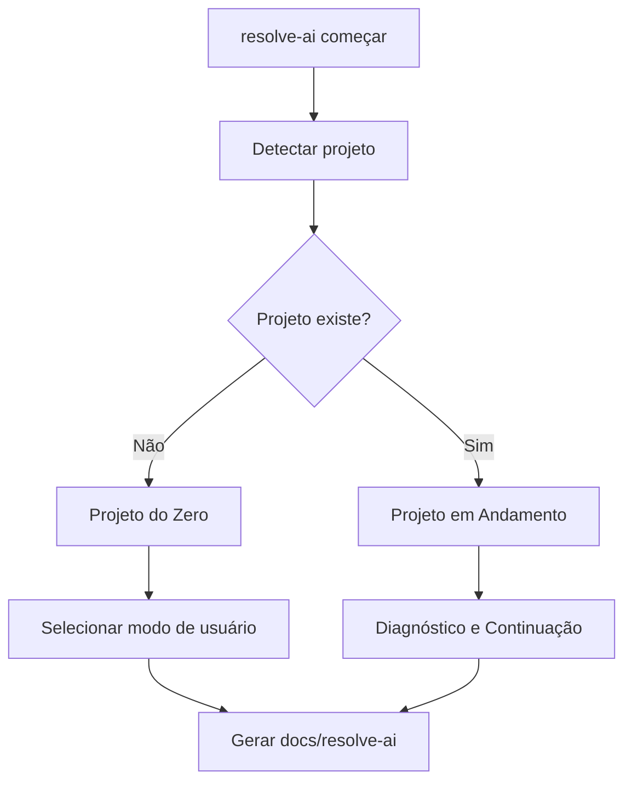

# pt115 — Project Entry Flows

## 1. Objetivo

Este documento define os fluxos de entrada do Resolve Aí.

O runtime precisa decidir rapidamente se está entrando em:

```text
1. Projeto do zero
2. Projeto em andamento
```

E depois escolher o modo de linguagem/profundidade:

```text
Non-Technical Builder
Vibe Coder
Professional Engineer
```

## 2. Fluxo universal



## 3. Projeto do Zero

Aplicado quando:

- diretório está vazio;
- não há `package.json`, `src/`, `app/`, `README.md` significativo;
- usuário declara que quer começar uma ideia;
- não existe código relevante.

Fluxo:

```text
Ideia
↓
Entrevista
↓
Discovery
↓
Produto
↓
Arquitetura
↓
Riscos
↓
Plano
↓
Primeiro backlog
```

Pergunta inicial:

```text
Me dá o problema ou a ideia, e eu te ajudo a resolver.

Você quer criar algo do zero ou já existe um projeto aqui?
```

## 4. Projeto em Andamento — Diagnóstico e Continuação

Aplicado quando:

- existe código;
- existe estrutura de app;
- existem configs;
- existe README ou roadmap;
- existe histórico Git;
- projeto parece parcialmente implementado.

Fluxo:

```text
Inspecionar
↓
Detectar stack
↓
Entender objetivo
↓
Mapear riscos
↓
Mapear decisões implícitas
↓
Criar docs/resolve-ai
↓
Plano de continuação
↓
Backlog priorizado
↓
Handoff
```

Regra:

```text
Não mexer em código primeiro.
```

## 5. Modo Non-Technical Builder

Usar quando:

- usuário não sabe termos técnicos;
- ideia ainda é vaga;
- problema de negócio precisa ser descoberto;
- usuário quer resolver algo do dia a dia.

Linguagem:

```text
simples, conversacional, sem jargão
```

## 6. Modo Vibe Coder

Usar quando:

- usuário usa IA para programar;
- projeto existe, mas documentação é fraca;
- há risco de bagunça arquitetural;
- usuário quer passos práticos.

Linguagem:

```text
prática, direta, com proteção de engenharia
```

## 7. Modo Professional Engineer

Usar quando:

- projeto já tem stack clara;
- usuário entende termos técnicos;
- há arquitetura e decisões relevantes;
- risco, segurança e escalabilidade importam.

Linguagem:

```text
técnica, precisa, com ADRs, riscos e trade-offs
```

## 8. Combinação de fluxos

Os modos não são exclusivos.

Exemplo:

```text
Projeto existente + Professional Engineer
```

Foi o caso do Ecossistema Avança Comercial.

Exemplo:

```text
Projeto existente + Vibe Coder
```

Quando o projeto já existe, mas foi criado com IA sem governança.

Exemplo:

```text
Projeto novo + Non-Technical Builder
```

Quando a pessoa só tem uma ideia ou problema.

## 9. Saídas obrigatórias para projeto existente

```text
docs/resolve-ai/00-project-intake.md
docs/resolve-ai/01-current-state-assessment.md
docs/resolve-ai/02-discovery.md
docs/resolve-ai/03-product-definition.md
docs/resolve-ai/04-architecture-review.md
docs/resolve-ai/05-risk-register.md
docs/resolve-ai/06-decision-log.md
docs/resolve-ai/07-execution-plan.md
docs/resolve-ai/08-backlog.md
docs/resolve-ai/09-handoff.md
```

## 10. Critérios de aceite

O fluxo de entrada estará pronto quando:

- projeto novo e existente forem tratados separadamente;
- Projeto em Andamento for fluxo oficial;
- os três modos forem aplicáveis;
- outputs obrigatórios forem definidos;
- regra de não alterar código antes do diagnóstico estiver explícita.
