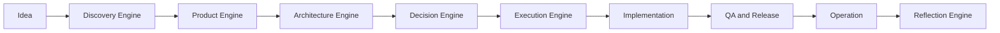
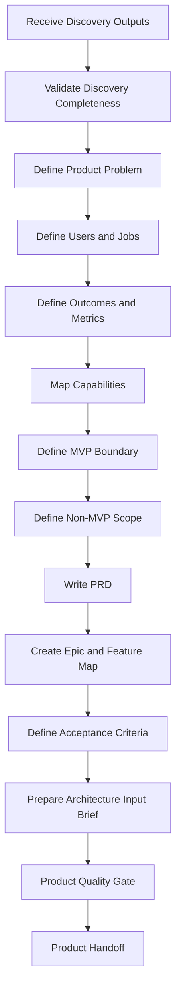

# pt21 — Product Engine

## 1. Purpose

The Product Engine is the AI-SEOS operating engine responsible for transforming validated discovery outputs into a coherent product strategy, MVP definition, product requirements, user journeys, roadmap slices, measurable outcomes, and execution-ready backlog.

It exists to prevent a common failure mode in AI-assisted software engineering: jumping from idea directly to architecture or implementation without proving that the product scope, users, outcomes, constraints, and success metrics are sufficiently clear.

The Product Engine receives the Discovery Engine outputs from Sprint 1 and produces product artifacts that can be consumed by the Architecture Engine, Decision Engine, Execution Engine, QA agents, implementation agents, documentation agents, and future product agents.

## 2. Core Principle

Product work in AI-SEOS is not feature listing.

Product work is the disciplined conversion of a business problem into a sequence of validated user outcomes, scoped capabilities, measurable success criteria, and implementation-ready product decisions.

The Product Engine must always ask:

1. What problem are we solving?
2. For whom?
3. Why now?
4. What outcome proves value?
5. What is the smallest coherent product increment?
6. What must not be built yet?
7. What assumptions remain risky?
8. What must architecture know before designing the system?

## 3. Position in the AI-SEOS Lifecycle

The Product Engine is not optional. Architecture without product boundaries creates overengineering. Implementation without product clarity creates waste. QA without product success metrics creates shallow validation.

## 4. Inputs

The Product Engine consumes:

- Discovery Document
- Context Package
- Stakeholder Map
- Problem Statement
- User Segments
- Personas
- Jobs To Be Done
- Business Objectives
- Constraints
- Assumptions Register
- Risk Register from Discovery
- Opportunity Map
- Existing solution analysis
- Initial success metrics
- Known non-goals
- Any explicit user or business constraints

## 5. Outputs

The Product Engine produces:

- Product Vision
- Product Strategy Brief
- Product Requirements Document (PRD)
- MVP Definition
- Non-MVP Scope
- User Journey Map
- Capability Map
- Epic Map
- Feature Breakdown
- Acceptance Criteria
- Outcome Metrics
- Product Roadmap
- Product Risk Register
- Architecture Input Brief
- Product Handoff Package
- ADRs for product-shaping decisions when needed

## 6. Responsibilities

The Product Engine is responsible for:

1. Converting discovery insights into product direction.
2. Defining the minimum coherent product release.
3. Separating MVP, post-MVP, and explicitly excluded scope.
4. Prioritizing outcomes before features.
5. Producing architecture-relevant requirements.
6. Exposing unresolved assumptions.
7. Creating measurable success criteria.
8. Preventing product bloat.
9. Preventing premature architecture decisions.
10. Preparing product artifacts for downstream agents.

## 7. Non-Responsibilities

The Product Engine does not:

- Choose the final technical architecture.
- Estimate detailed implementation tasks in isolation.
- Replace market validation with assumptions.
- Create UI designs as final deliverables.
- Decide security architecture.
- Hide product risks.
- Convert every stakeholder request into a requirement.
- Optimize implementation before product boundaries are clear.

## 8. Product Engine Pipeline

## 9. Product Engine State Model

| State | Meaning | Required Action |
|---|---|---|
| Uninitialized | Product Engine has not received discovery output | Request Context Package |
| Discovery Received | Discovery output exists but has not been validated | Validate discovery completeness |
| Product Problem Defined | Problem statement is stable enough | Define users, jobs and outcomes |
| MVP Candidate | Initial MVP boundary exists | Challenge scope and assumptions |
| PRD Draft | PRD exists but has not passed quality gates | Review, refine, and validate |
| Product Ready | Product artifacts passed gates | Handoff to Architecture Engine |
| Blocked | Missing critical information | Produce assumptions and escalation note |

## 10. Product Readiness Levels

AI-SEOS uses Product Readiness Levels (PRL) to communicate maturity.

| Level | Name | Description |
|---|---|---|
| PRL-0 | Idea | A rough concept exists |
| PRL-1 | Problem Framed | Problem, users and context are described |
| PRL-2 | Outcome Defined | Desired business/user outcomes are measurable |
| PRL-3 | MVP Scoped | MVP and non-MVP boundaries exist |
| PRL-4 | PRD Ready | Requirements, journeys and acceptance criteria exist |
| PRL-5 | Architecture Ready | Architecture input brief is complete |
| PRL-6 | Execution Ready | Backlog and roadmap are structured |
| PRL-7 | Validation Ready | Product can be validated with users or telemetry |

Sprint 2 must establish the Product Engine so future projects can move from PRL-1/2 to PRL-5/6.

## 11. Product Quality Gates

A product artifact cannot be handed off unless these gates pass:

### Gate P1 — Problem Clarity

- The problem is written in user/business terms.
- The problem is not stated as a preselected solution.
- The cost of not solving the problem is explicit.
- The affected user segments are identified.

### Gate P2 — User and Buyer Clarity

- User, buyer, admin, operator and stakeholder roles are separated.
- Primary and secondary personas are identified.
- Jobs To Be Done are documented.
- Edge stakeholders are not ignored.

### Gate P3 — Outcome Metrics

- Product success metrics exist.
- Business metrics and user behavior metrics are separated.
- Leading and lagging indicators are identified.
- Vanity metrics are rejected or labeled.

### Gate P4 — MVP Boundary

- MVP scope is explicit.
- Non-MVP scope is explicit.
- Deferred features have rationale.
- The MVP is coherent, not just small.

### Gate P5 — Requirement Quality

- Requirements are testable.
- Requirements avoid implementation detail unless required.
- Functional and non-functional requirements are separated.
- Acceptance criteria exist.

### Gate P6 — Architecture Input Readiness

- Critical non-functional requirements are documented.
- Domain concepts are identified.
- Integration needs are documented.
- Data sensitivity and compliance signals are documented.
- Scale expectations are documented.

## 12. Product Anti-Patterns

The Product Engine must detect and call out:

- Feature dump without outcomes.
- MVP as a smaller version of the final product.
- User story inflation.
- Architecture-driven product scope.
- Stakeholder appeasement disguised as roadmap.
- Ignoring non-users such as admins, support, finance and compliance.
- Defining success only as launch.
- Treating assumptions as facts.
- Confusing buyer value with user value.
- Building differentiation before solving the core job.

## 13. Product Best Practices

- Define the problem before defining the product.
- Use outcomes to constrain scope.
- Treat MVP as a learning system, not a cheap product.
- Separate mandatory capabilities from differentiators.
- Keep scope reversible where possible.
- Make non-goals visible.
- Ask architecture questions early but do not decide architecture prematurely.
- Maintain an assumptions register.
- Keep a product risk register.
- Use handoff packages, not informal summaries.

## 14. Interfaces with Other Engines

### Discovery Engine → Product Engine

Discovery provides context, validated problem framing, assumptions and constraints.

### Product Engine → Architecture Engine

Product provides PRD, MVP, user journeys, capabilities, data needs, scale signals, integration needs and non-functional requirements.

### Product Engine → Decision Engine

Product provides prioritization decisions and trade-offs requiring ADRs or RFCs.

### Product Engine → Execution Engine

Product provides epics, feature breakdown, milestones and acceptance criteria.

### Product Engine → QA Engine

Product provides acceptance criteria, user journeys and measurable success indicators.

## 15. Product Engine Definition of Done

The Product Engine is considered complete for Sprint 2 when:

- `operating-system/product/product-engine.md` exists.
- Product lifecycle and readiness levels are documented.
- PRD template exists.
- MVP scope framework exists.
- Product backlog and roadmap template exists.
- Product quality gates exist.
- Product handoff contract exists.
- Product-to-Architecture interface is documented.
- ADRs for product engine adoption and MVP boundary standard are created.

## 16. Canonical Files to Create

The Codex maintainer must create or update:

- `operating-system/product/README.md`
- `operating-system/product/product-engine.md`
- `operating-system/product/product-lifecycle.md`
- `operating-system/product/product-readiness-levels.md`
- `operating-system/product/product-quality-gates.md`
- `operating-system/product/product-handoff-contract.md`
- `frameworks/product-framework/README.md`
- `frameworks/product-framework/mvp-scope-framework.md`
- `frameworks/product-framework/capability-mapping-framework.md`
- `templates/product/prd-template.md`
- `templates/product/mvp-definition-template.md`
- `templates/product/product-roadmap-template.md`
- `templates/product/product-backlog-template.md`
- `protocols/product-definition/README.md`

## 17. Sprint 2 Implementation Note

When implementing this file into the repository, do not simply copy it as a single document. Split it into the canonical structure above, preserving conceptual integrity and cross-links.
