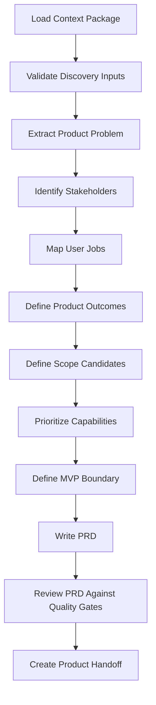

# pt22 — Discovery to PRD Protocol

## 1. Purpose

The Discovery to PRD Protocol defines how AI-SEOS converts discovery artifacts into product requirements without losing context, assumptions, risks, constraints or trade-offs.

A PRD in AI-SEOS is not a bureaucratic document. It is a product contract between discovery, architecture, execution, QA, stakeholders and future agents.

## 2. Protocol Principle

No PRD may be created directly from an idea.

A PRD must be created from a Context Package and Discovery Output. If discovery is incomplete, the PRD must explicitly mark assumptions and unresolved questions.

## 3. Required Input Artifacts

The protocol expects:

- Discovery Document
- Context Package
- Problem Statement
- User/Buyer Map
- Personas or user segments
- Jobs To Be Done
- Current solution analysis
- Business goals
- Constraints
- Assumptions Register
- Risks Register
- Initial metric candidates
- Non-goals

If any required input is missing, the Product Engine must create a `Product Input Gap Report`.

## 4. Discovery to PRD Transformation Map

| Discovery Artifact | PRD Section |
|---|---|
| Problem Statement | Product Problem |
| User Segments | Target Users |
| Buyer/User Map | Stakeholders and Personas |
| Jobs To Be Done | User Needs and Use Cases |
| Current Solution | Competitive/Alternative Context |
| Business Goals | Product Objectives |
| Constraints | Product Constraints |
| Assumptions | Assumptions Register |
| Risks | Product Risks |
| Metrics | Success Metrics |
| Opportunity Map | Scope Options |
| Non-goals | Out of Scope |

## 5. Transformation Pipeline



## 6. PRD Construction Rules

### Rule 1 — Preserve Traceability

Every major requirement should trace back to a discovery finding, assumption, risk or stakeholder objective.

### Rule 2 — Separate Problem, Outcome and Solution

The PRD must not collapse these into one sentence.

Bad:

> Build a dashboard so managers can control everything.

Better:

> Managers lack operational visibility into payment status, attendance, student retention and revenue. The product must improve visibility by consolidating these signals into actionable views. A dashboard is one possible interface for this outcome.

### Rule 3 — Mark Assumptions Explicitly

Assumptions must be labeled as assumptions, not hidden as requirements.

### Rule 4 — Define Non-MVP Explicitly

Deferred scope must be written down so future agents do not accidentally reintroduce it.

### Rule 5 — Requirements Must Be Testable

If a requirement cannot be validated, rewritten or instrumented, it is not ready.

## 7. PRD Section Standard

The canonical PRD must include:

1. Metadata
2. Executive Summary
3. Product Problem
4. Target Users
5. Stakeholders
6. Product Objectives
7. Success Metrics
8. User Journeys
9. Jobs To Be Done
10. MVP Scope
11. Non-MVP Scope
12. Functional Requirements
13. Non-Functional Requirements
14. Data Requirements
15. Integration Requirements
16. Security and Privacy Signals
17. Constraints
18. Assumptions
19. Product Risks
20. Acceptance Criteria
21. Architecture Input Brief
22. Open Questions
23. Handoff Notes

## 8. Product Requirement Types

AI-SEOS classifies requirements as:

| Type | Description | Example |
|---|---|---|
| Functional | What the product must do | User can create an account |
| Behavioral | How users interact | Admin receives a warning before deleting data |
| Business Rule | Domain rule | Subscription expires after grace period |
| Non-Functional | Quality attribute | 99.9% availability target |
| Data | Data captured/processed | Customer tax identifier stored securely |
| Integration | External dependency | Payment provider webhook required |
| Operational | Support/admin need | Support can inspect failed payments |
| Compliance | Regulatory or policy requirement | Consent tracking required |
| Observability | Measurement and diagnostics | Track onboarding completion rate |

## 9. Product Input Gap Report

When discovery is incomplete, create:

```markdown
# Product Input Gap Report

## Missing Information

## Impact on PRD

## Assumptions Required to Continue

## Risks Introduced

## Recommended Follow-up Questions

## Can Work Continue?

- Yes / No / Conditionally
```

## 10. PRD Review Checklist

- [ ] Is the problem clear without referencing a specific solution?
- [ ] Are users and buyers separated?
- [ ] Are outcomes measurable?
- [ ] Is MVP scope explicit?
- [ ] Is non-MVP scope explicit?
- [ ] Are requirements testable?
- [ ] Are assumptions labeled?
- [ ] Are constraints visible?
- [ ] Are architecture-relevant details included?
- [ ] Are risks documented?
- [ ] Are open questions documented?
- [ ] Can QA derive test scenarios from the PRD?
- [ ] Can Architecture derive system constraints from the PRD?

## 11. Output Contract

At the end of the protocol, the Product Engine must produce:

- PRD
- MVP Definition
- Product Roadmap
- Backlog Candidate
- Product Risk Register
- Architecture Input Brief
- Product Handoff Package

## 12. Canonical Files to Create

- `protocols/product-definition/README.md`
- `protocols/product-definition/discovery-to-prd-protocol.md`
- `protocols/product-definition/prd-review-protocol.md`
- `templates/product/product-input-gap-report.md`
- `templates/product/product-handoff-package.md`
