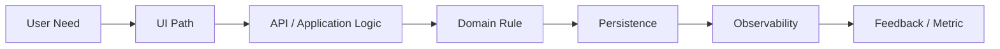

# pt23 — MVP and Scope Framework

## 1. Purpose

The MVP and Scope Framework defines how AI-SEOS determines the smallest coherent product increment worth building, validating and operating.

The framework exists to protect teams from two opposite failures:

1. Building too much before learning.
2. Building too little to validate anything meaningful.

In AI-SEOS, an MVP is not the smallest possible implementation. It is the smallest coherent system capable of testing the highest-value assumptions with acceptable operational and architectural risk.

## 2. MVP Definition

An MVP is a product increment that:

- solves one clearly defined problem for one or more explicit user segments;
- produces observable value;
- enables measurable learning;
- can be implemented with controlled complexity;
- does not create irreversible architectural damage;
- is coherent enough for real usage or realistic validation;
- has explicit non-goals and deferred scope.

## 3. MVP Scope Equation

```text
MVP Scope = Core User Job + Critical Business Rule + Minimal Trust Layer + Observable Outcome + Acceptable Operational Path
```

Where:

- Core User Job: the essential user task being enabled.
- Critical Business Rule: domain logic required to make the product meaningful.
- Minimal Trust Layer: security, privacy, reliability and UX baseline required for adoption.
- Observable Outcome: measurable signal that proves or disproves value.
- Acceptable Operational Path: support, monitoring and maintenance path for real usage.

## 4. Scope Classification Model

AI-SEOS classifies scope into five categories.

| Category | Meaning | Treatment |
|---|---|---|
| Core MVP | Required to validate product value | Build now |
| Enabling MVP | Required to make core MVP usable/safe | Build now if necessary |
| Post-MVP | Valuable but not necessary for first validation | Defer |
| Experimental | Hypothesis that needs research | Prototype or research |
| Explicitly Out | Misaligned, premature or risky | Exclude and document |

## 5. MVP Boundary Questions

The Product Engine must answer:

1. What is the single most important user outcome?
2. What capability is absolutely required to produce that outcome?
3. What business rule makes the product valid in the real world?
4. What security/privacy baseline is non-negotiable?
5. What operational path is required to support usage?
6. What can be faked manually for validation?
7. What can be deferred without breaking trust?
8. What would make the MVP too expensive, slow or complex?
9. What would make the MVP too shallow to learn from?
10. What must architecture know about future evolution?

## 6. Scope Decision Matrix

Score each candidate capability from 1 to 5.

| Criterion | Weight | Question |
|---|---:|---|
| User Value | 5 | Does it directly help the primary user outcome? |
| Learning Value | 5 | Does it validate a critical assumption? |
| Business Value | 4 | Does it support the business objective? |
| Trust Requirement | 4 | Is it required for security, privacy or credibility? |
| Implementation Complexity | -4 | Is it expensive or technically complex? |
| Operational Cost | -3 | Does it add support or maintenance burden? |
| Architectural Irreversibility | -5 | Does it create hard-to-reverse decisions? |
| Dependency Risk | -3 | Does it rely on uncertain external dependencies? |

Capabilities with high value and low complexity are MVP candidates. Capabilities with high value and high irreversibility require ADR or architecture review.

## 7. MVP Anti-Patterns

- MVP as demo only.
- MVP without measurable learning.
- MVP without user trust baseline.
- MVP that ignores data model consequences.
- MVP that requires enterprise architecture before validation.
- MVP overloaded with admin features.
- MVP overloaded with analytics before core usage.
- MVP that cannot be operated.
- MVP that validates only technical feasibility, not product value.
- MVP whose success metric is "it was built".

## 8. Vertical Slice Principle

Prefer a vertical slice over horizontal layers.

Bad MVP:

```text
Build database schema, then backend, then frontend, then dashboards.
```

Better MVP:

```text
Build one complete user journey end-to-end with minimal but production-conscious architecture.
```



## 9. MVP Definition Template

The canonical MVP document must include:

- MVP Name
- Target User
- Core Problem
- Core User Job
- Primary Outcome
- Success Metrics
- Core MVP Scope
- Enabling MVP Scope
- Non-MVP Scope
- Manual Workarounds
- Assumptions Tested
- Risks Accepted
- Risks Not Accepted
- Architecture Signals
- Release Criteria
- Validation Plan

## 10. Scope Review Protocol

Before approving MVP scope, run the following challenge:

1. Remove every feature that does not directly support the primary outcome.
2. Re-add only features required for trust, operation, legality or measurement.
3. Mark all removed items as post-MVP or explicitly out.
4. Check whether the MVP is still coherent.
5. Check whether learning is still possible.
6. Check whether architecture can support plausible evolution.
7. Document final trade-offs.

## 11. Architecture Interaction

The MVP boundary must not hide future needs from architecture.

Example:

A feature may be excluded from MVP, but its future existence may affect domain boundaries, data ownership, integration strategy or security model. Therefore, Product Engine must communicate future product direction to Architecture Engine without forcing premature implementation.

## 12. Canonical Files to Create

- `frameworks/product-framework/mvp-scope-framework.md`
- `frameworks/product-framework/scope-decision-matrix.md`
- `templates/product/mvp-definition-template.md`
- `templates/product/scope-decision-matrix-template.md`
- `templates/product/non-mvp-scope-register.md`
