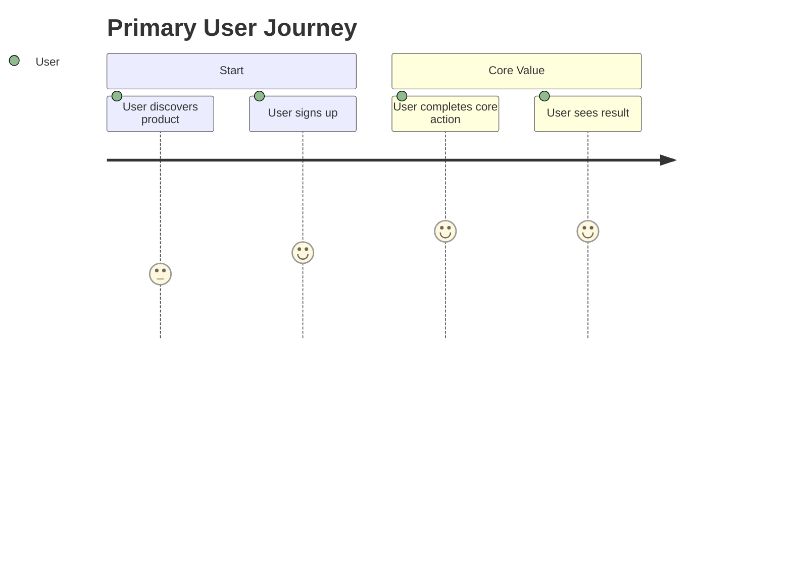

# pt24 — Product Requirements Template

## 1. Purpose

This file defines the canonical AI-SEOS Product Requirements Document template.

The Codex maintainer must create `templates/product/prd-template.md` from this content and cross-link it from the Product Engine documentation.

---

# Product Requirements Document Template

```markdown
---
title: "[Product / Project Name] — Product Requirements Document"
version: "0.1.0"
status: "Draft | Review | Approved | Deprecated"
owner: "[Product Owner / AI Product Agent]"
created: "YYYY-MM-DD"
last_updated: "YYYY-MM-DD"
discovery_source: "[Link to Discovery Document]"
context_package: "[Link to Context Package]"
---

# [Product / Project Name] — PRD

## 1. Executive Summary

### 1.1 Product Summary

Describe the product in one or two paragraphs.

### 1.2 Problem Summary

Describe the problem without describing the solution.

### 1.3 Target Outcome

Describe the measurable outcome the product must create.

### 1.4 MVP Summary

Describe the first coherent release.

## 2. Context

### 2.1 Background

What led to this product?

### 2.2 Discovery Source

Which discovery artifacts support this PRD?

### 2.3 Business Context

What business objective does this product support?

### 2.4 Current State

How is the problem solved today?

## 3. Problem Definition

### 3.1 Primary Problem

### 3.2 Secondary Problems

### 3.3 Cost of Inaction

### 3.4 Problem Evidence

## 4. Users and Stakeholders

### 4.1 Primary Users

### 4.2 Secondary Users

### 4.3 Buyers / Decision Makers

### 4.4 Administrators / Operators

### 4.5 Support / Compliance / Finance Stakeholders

## 5. Personas and Jobs To Be Done

### 5.1 Persona: [Name]

- Context:
- Goals:
- Pain points:
- Current workaround:
- Motivation:
- Barriers:

### 5.2 Job Story

When [situation], I want to [motivation], so I can [expected outcome].

## 6. Product Objectives

| Objective | Metric | Target | Timeframe | Notes |
|---|---|---|---|---|
|  |  |  |  |  |

## 7. Success Metrics

### 7.1 North Star Metric

### 7.2 Leading Indicators

### 7.3 Lagging Indicators

### 7.4 Guardrail Metrics

### 7.5 Metrics Not Used

## 8. Scope

### 8.1 MVP Scope

| Capability | User Outcome | Priority | Rationale |
|---|---|---|---|
|  |  |  |  |

### 8.2 Enabling MVP Scope

| Capability | Why Required | Risk if Missing |
|---|---|---|
|  |  |  |

### 8.3 Post-MVP Scope

### 8.4 Explicitly Out of Scope

### 8.5 Manual Workarounds Allowed

## 9. User Journeys

### 9.1 Primary Journey



### 9.2 Alternative Journeys

### 9.3 Failure Journeys

## 10. Functional Requirements

| ID | Requirement | Priority | Acceptance Criteria | Source |
|---|---|---|---|---|
| FR-001 |  | Must |  |  |

## 11. Non-Functional Requirements

| ID | Category | Requirement | Target | Rationale |
|---|---|---|---|---|
| NFR-001 | Performance |  |  |  |

Categories:

- Security
- Privacy
- Reliability
- Availability
- Performance
- Scalability
- Accessibility
- Observability
- Maintainability
- Compliance

## 12. Data Requirements

| Data Object | Purpose | Sensitivity | Retention | Owner |
|---|---|---|---|---|
|  |  |  |  |  |

## 13. Integration Requirements

| Integration | Purpose | Direction | Criticality | Risk |
|---|---|---|---|---|
|  |  | Inbound/Outbound |  |  |

## 14. Business Rules

| Rule ID | Rule | Source | Notes |
|---|---|---|---|
| BR-001 |  |  |  |

## 15. Security and Privacy Signals

### 15.1 Sensitive Data

### 15.2 Authentication / Authorization Signals

### 15.3 Audit Requirements

### 15.4 Compliance Considerations

## 16. Constraints

| Constraint | Type | Impact | Mitigation |
|---|---|---|---|
|  | Technical / Business / Legal / Time / Cost |  |  |

## 17. Assumptions

| ID | Assumption | Confidence | Validation Plan | Owner |
|---|---|---|---|---|
| A-001 |  | Low/Medium/High |  |  |

## 18. Product Risks

| ID | Risk | Probability | Impact | Mitigation |
|---|---|---|---|---|
| R-001 |  |  |  |  |

## 19. Acceptance Criteria

### 19.1 Release Acceptance Criteria

### 19.2 Feature Acceptance Criteria

### 19.3 Operational Acceptance Criteria

## 20. Architecture Input Brief

### 20.1 Domain Concepts

### 20.2 Scale Expectations

### 20.3 Integration Needs

### 20.4 Data and Privacy Signals

### 20.5 Availability / Reliability Needs

### 20.6 Future Evolution Signals

## 21. Open Questions

| Question | Impact | Owner | Deadline |
|---|---|---|---|
|  |  |  |  |

## 22. Decisions and ADR Links

| Decision | ADR | Notes |
|---|---|---|
|  |  |  |

## 23. Handoff Notes

### 23.1 To Architecture Engine

### 23.2 To Execution Engine

### 23.3 To QA Engine

### 23.4 To Security Agent

## 24. Review Checklist

- [ ] Problem is clear.
- [ ] Users and buyers are separated.
- [ ] Metrics are measurable.
- [ ] MVP and non-MVP scope are explicit.
- [ ] Requirements are testable.
- [ ] Assumptions are labeled.
- [ ] Risks are documented.
- [ ] Architecture input is complete.
- [ ] Acceptance criteria are defined.
- [ ] Handoff notes are present.
```

## 2. Additional Templates to Create

The Codex maintainer must also create:

- `templates/product/mvp-definition-template.md`
- `templates/product/product-roadmap-template.md`
- `templates/product/product-backlog-template.md`
- `templates/product/product-handoff-package.md`
- `templates/product/product-input-gap-report.md`

Use the PRD template as the master reference.
