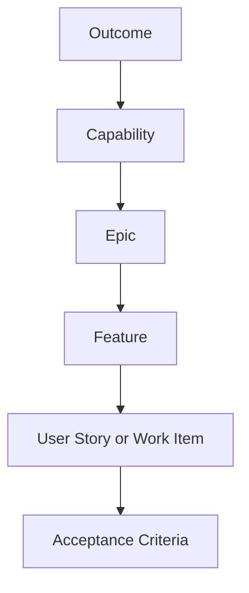

# pt25 — Product Backlog and Roadmap Templates

## 1. Purpose

This file defines how AI-SEOS structures roadmap and backlog artifacts before they are handed to the Execution Engine.

The Product Engine does not create a detailed implementation plan. It creates product-meaningful work packages: outcomes, capabilities, epics, features, acceptance criteria and dependencies.

## 2. Roadmap Philosophy

AI-SEOS roadmaps are outcome-oriented, not date theater.

A roadmap should communicate:

- what outcome is being pursued;
- which user or business problem it serves;
- what capabilities are planned;
- what dependencies exist;
- what assumptions are being tested;
- what architectural implications are expected;
- what is intentionally deferred.

## 3. Roadmap Horizons

AI-SEOS uses three roadmap horizons:

| Horizon | Meaning | Detail Level |
|---|---|---|
| Now | Current validated scope | High |
| Next | Likely follow-up work | Medium |
| Later | Strategic direction | Low |

This prevents false precision while preserving direction.

## 4. Product Roadmap Template

Create `templates/product/product-roadmap-template.md` with:

```markdown
---
title: "[Project] — Product Roadmap"
version: "0.1.0"
status: "Draft"
owner: "[Owner]"
last_updated: "YYYY-MM-DD"
---

# [Project] — Product Roadmap

## 1. Roadmap Summary

## 2. Product Outcomes

| Outcome | Metric | Target | Horizon |
|---|---|---|---|
|  |  |  | Now/Next/Later |

## 3. Now

### 3.1 Objective

### 3.2 Capabilities

| Capability | User Value | Business Value | Dependencies | Risks |
|---|---|---|---|---|
|  |  |  |  |  |

### 3.3 Validation Target

### 3.4 Exit Criteria

## 4. Next

### 4.1 Objective

### 4.2 Candidate Capabilities

### 4.3 Dependencies

### 4.4 Assumptions to Validate

## 5. Later

### 5.1 Strategic Direction

### 5.2 Known Future Capabilities

### 5.3 Architecture Signals

## 6. Explicitly Not Planned

## 7. Roadmap Risks

## 8. Decision Log
```

## 5. Backlog Philosophy

AI-SEOS backlog items must be traceable to product outcomes. A backlog is not a dumping ground for ideas.

Every backlog item should answer:

- Which outcome does this support?
- Which user or stakeholder benefits?
- What requirement or assumption does this trace to?
- What acceptance criteria prove completion?
- What dependencies or risks exist?

## 6. Backlog Hierarchy



## 7. Product Backlog Template

Create `templates/product/product-backlog-template.md` with:

```markdown
---
title: "[Project] — Product Backlog"
version: "0.1.0"
status: "Draft"
owner: "[Owner]"
last_updated: "YYYY-MM-DD"
---

# [Project] — Product Backlog

## 1. Backlog Summary

## 2. Outcomes

| Outcome ID | Outcome | Metric | Priority |
|---|---|---|---|
| OUT-001 |  |  |  |

## 3. Capabilities

| Capability ID | Capability | Outcome | Priority | MVP? |
|---|---|---|---|---|
| CAP-001 |  | OUT-001 | Must | Yes/No |

## 4. Epics

| Epic ID | Epic | Capability | Priority | Notes |
|---|---|---|---|---|
| EPIC-001 |  | CAP-001 |  |  |

## 5. Features

| Feature ID | Feature | Epic | Requirement IDs | Acceptance Criteria |
|---|---|---|---|---|
| FEAT-001 |  | EPIC-001 | FR-001 |  |

## 6. User Stories / Work Items

### STORY-001 — [Title]

As a [user], I want [capability], so that [outcome].

#### Acceptance Criteria

- Given...
- When...
- Then...

#### Dependencies

#### Risks

#### Notes

## 7. Non-Product Work

Include necessary technical enablement, security, QA, documentation and operational work that supports product delivery.

## 8. Backlog Quality Checklist

- [ ] Every epic maps to a capability.
- [ ] Every capability maps to an outcome.
- [ ] MVP items are marked.
- [ ] Non-MVP items are marked.
- [ ] Acceptance criteria exist for MVP features.
- [ ] Risks are visible.
- [ ] Dependencies are visible.
```

## 8. Prioritization Model

AI-SEOS uses a pragmatic prioritization model.

| Criterion | Score 1-5 | Notes |
|---|---:|---|
| User Value |  |  |
| Business Value |  |  |
| Learning Value |  |  |
| Urgency |  |  |
| Risk Reduction |  |  |
| Complexity |  | Negative weight |
| Dependency Risk |  | Negative weight |

The Codex maintainer may implement this as `frameworks/product-framework/product-prioritization-framework.md`.

## 9. Product Handoff to Execution

The Product Engine may prepare backlog candidates, but the Execution Engine owns final sprint planning and sequencing.

## 10. Canonical Files to Create

- `templates/product/product-roadmap-template.md`
- `templates/product/product-backlog-template.md`
- `frameworks/product-framework/product-prioritization-framework.md`
- `operating-system/product/product-roadmap-standard.md`
- `operating-system/product/product-backlog-standard.md`
