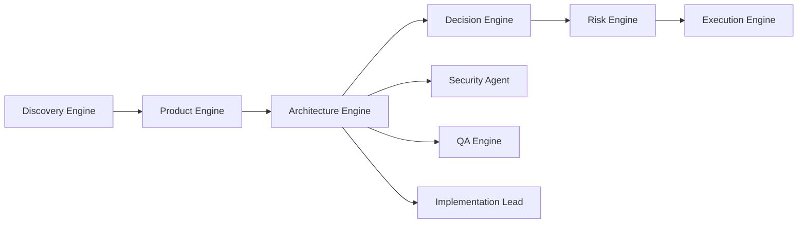
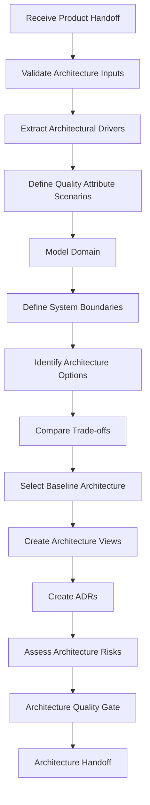

# pt26 — Architecture Engine

## 1. Purpose

The Architecture Engine is the AI-SEOS operating engine responsible for transforming product requirements and discovery context into an architecture direction, solution options, system boundaries, quality attribute strategy, domain model, integration model, data strategy, operational model, and decision-ready architecture artifacts.

It does not exist to overengineer. It exists to make architecture explicit, explainable, evolvable and aligned with product needs.

## 2. Core Principle

Architecture in AI-SEOS is the disciplined management of trade-offs under constraints.

The Architecture Engine must always ask:

1. What product outcome must the system enable?
2. What quality attributes matter most?
3. What constraints are real?
4. What decisions are reversible?
5. What decisions are expensive to reverse?
6. What can be delayed?
7. What must be decided now?
8. What is the simplest architecture that preserves future optionality?

## 3. Position in Lifecycle



## 4. Inputs

Architecture Engine consumes:

- Product Requirements Document
- MVP Definition
- Product Roadmap
- Product Backlog Candidate
- Architecture Input Brief
- Discovery Context Package
- Assumptions Register
- Constraints Register
- Non-Functional Requirements
- Data Requirements
- Integration Requirements
- Security and Privacy Signals
- Scale Expectations
- Domain Concepts
- Known future product direction

## 5. Outputs

Architecture Engine produces:

- Architecture Overview
- System Context Diagram
- Container Diagram
- Component View when appropriate
- Domain Model
- Data Strategy
- Integration Strategy
- API Strategy
- Security Architecture Signals
- Observability Strategy
- Deployment Strategy
- Quality Attribute Scenarios
- Architecture Options
- Trade-off Matrix
- Architecture Decision Candidates
- ADRs
- Architecture Risk Register
- Architecture Handoff Package

## 6. Responsibilities

The Architecture Engine is responsible for:

1. Translating product requirements into technical constraints.
2. Identifying architectural drivers.
3. Comparing architecture options.
4. Defining system boundaries.
5. Defining domain and data models at the appropriate level.
6. Establishing integration strategy.
7. Identifying quality attributes and scenarios.
8. Creating diagrams and views.
9. Documenting trade-offs.
10. Producing ADRs for significant decisions.
11. Preparing implementation handoff.

## 7. Non-Responsibilities

The Architecture Engine does not:

- Create detailed code implementation.
- Replace Security Engine review.
- Replace Product Engine scope decisions.
- Choose technology because it is trendy.
- Force distributed systems when modular monolith is enough.
- Decide implementation sequence without Execution Engine.
- Hide unresolved risks.

## 8. Architecture Engine Pipeline



## 9. Architectural Drivers

Architectural drivers are the small set of factors that should shape the architecture.

Types:

- Business drivers
- Product drivers
- Quality attribute drivers
- Domain complexity drivers
- Data drivers
- Security/privacy drivers
- Integration drivers
- Scalability drivers
- Team/operational drivers
- Cost drivers
- Regulatory drivers

## 10. Quality Attribute Scenario Format

Use this format:

```text
Given [context]
When [stimulus]
The system should [response]
Within [measure]
Under [constraints]
```

Example:

```text
Given 10,000 active tenants
When payment webhook events are received concurrently
The system should process each event idempotently
Within 30 seconds for 95% of events
Under provider retry behavior and transient database failures
```

## 11. Architecture Readiness Levels

| Level | Name | Description |
|---|---|---|
| ARL-0 | Unframed | No architecture input exists |
| ARL-1 | Drivers Identified | Drivers and constraints are documented |
| ARL-2 | Options Identified | Multiple viable options exist |
| ARL-3 | Trade-offs Compared | Options compared against criteria |
| ARL-4 | Baseline Selected | Initial architecture selected and justified |
| ARL-5 | Views Documented | Diagrams and architecture document exist |
| ARL-6 | Decisions Recorded | ADRs exist for key decisions |
| ARL-7 | Implementation Ready | Handoff package ready |

## 12. Architecture Quality Gates

### Gate A1 — Input Completeness

- Product requirements available.
- MVP scope available.
- NFRs available or assumptions documented.
- Data/integration/security signals available.

### Gate A2 — Drivers Identified

- Architectural drivers are explicit.
- Constraints are separated from preferences.
- Quality attributes are prioritized.

### Gate A3 — Options Compared

- At least three architecture options considered when decision is significant.
- Trade-offs are explicit.
- Reversibility is considered.

### Gate A4 — Views Documented

- System context view exists.
- Container view exists for non-trivial systems.
- Domain model exists where domain complexity exists.
- Integration view exists when external systems are involved.

### Gate A5 — Decisions Recorded

- ADRs exist for significant architecture choices.
- Consequences and rollback paths are included.

### Gate A6 — Implementation Handoff Ready

- Boundaries are clear.
- Risks are visible.
- Non-functional requirements are actionable.
- Open questions are documented.

## 13. Default Architecture Bias

AI-SEOS prefers:

- modular monolith before microservices;
- explicit domain boundaries before distributed boundaries;
- boring technology before trendy technology;
- managed services when they reduce operational burden;
- reversible decisions where uncertainty is high;
- clear contracts between modules;
- security and observability from the start;
- cost visibility from early architecture.

These are biases, not rules. They may be overridden with ADR-backed justification.

## 14. Architecture Anti-Patterns

- Microservices before product-market fit.
- Event-driven architecture without operational maturity.
- Premature multi-cloud.
- Technology selection before requirements.
- Database choice based only on popularity.
- Ignoring data ownership.
- Ignoring failure modes.
- No observability plan.
- Architecture diagrams without decisions.
- ADRs after implementation only.
- Security as a late add-on.

## 15. Canonical Files to Create

- `operating-system/architecture/README.md`
- `operating-system/architecture/architecture-engine.md`
- `operating-system/architecture/architecture-lifecycle.md`
- `operating-system/architecture/architecture-readiness-levels.md`
- `operating-system/architecture/architecture-quality-gates.md`
- `operating-system/architecture/architecture-handoff-contract.md`
- `frameworks/architecture-framework/README.md`
- `frameworks/architecture-framework/architecture-thinking-framework.md`
- `frameworks/architecture-framework/quality-attribute-framework.md`
- `frameworks/architecture-framework/trade-off-analysis-framework.md`
- `templates/architecture/architecture-overview-template.md`
- `templates/architecture/architecture-decision-matrix-template.md`
- `templates/architecture/quality-attribute-scenario-template.md`
- `protocols/architecture-review/README.md`

## 16. Sprint 2 Implementation Note

Architecture Engine documents must connect explicitly to Product Engine outputs. Sprint 2 succeeds only if the handoff from Discovery → Product → Architecture is documented as a coherent flow.
