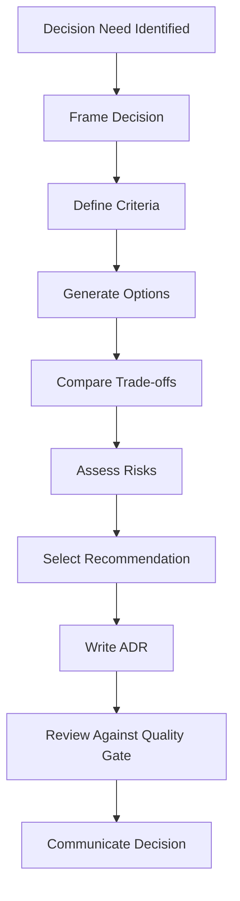

# pt27 — Architecture Decision Protocol

## 1. Purpose

The Architecture Decision Protocol defines how AI-SEOS identifies, evaluates, records and communicates architecture decisions.

Sprint 2 must establish this protocol even though the full Decision Engine will be expanded in Sprint 3. Architecture decisions cannot wait until the Decision Engine exists.

## 2. Decision Principle

Every significant architecture decision must be explicit, comparative and reversible when possible.

No architecture decision should be accepted merely because it is popular, convenient or familiar.

## 3. What Requires an ADR

Create an ADR when a decision affects:

- system structure;
- data ownership;
- deployment model;
- integration approach;
- security model;
- technology platform;
- persistence strategy;
- communication style;
- scalability path;
- operational model;
- cost profile;
- team topology;
- long-term maintainability.

## 4. Architecture Decision Pipeline



## 5. Minimum Three Options Rule

For significant decisions, consider at least three options:

1. Conservative option.
2. Balanced option.
3. Ambitious or scalable option.

Example:

| Decision | Option 1 | Option 2 | Option 3 |
|---|---|---|---|
| Architecture style | Modular monolith | Service-oriented modules | Microservices |
| API style | REST | GraphQL | Event-driven APIs |
| Data storage | Relational DB | Document DB | Polyglot persistence |

If fewer than three options are viable, document why.

## 6. Decision Criteria

Default criteria:

- Product fit
- Complexity
- Maintainability
- Security
- Reliability
- Scalability
- Cost
- Team capability
- Operational burden
- Vendor lock-in
- Reversibility
- Time to market

## 7. Reversibility Classification

| Class | Meaning | Decision Handling |
|---|---|---|
| Type 1 | Hard to reverse | Requires ADR, review and rollback plan |
| Type 2 | Reversible | ADR recommended, lightweight review allowed |
| Type 3 | Local implementation detail | Document in code or local notes |

## 8. Architecture Decision Matrix Template

Create `templates/architecture/architecture-decision-matrix-template.md`:

```markdown
# Architecture Decision Matrix

## Decision

## Context

## Options

| Option | Description | Summary |
|---|---|---|
| A |  |  |
| B |  |  |
| C |  |  |

## Criteria

| Criterion | Weight | Rationale |
|---|---:|---|
| Product Fit | 5 |  |
| Maintainability | 5 |  |
| Security | 5 |  |
| Complexity | 4 |  |
| Cost | 3 |  |
| Reversibility | 4 |  |

## Scoring

| Option | Product Fit | Maintainability | Security | Complexity | Cost | Reversibility | Total |
|---|---:|---:|---:|---:|---:|---:|---:|
| A |  |  |  |  |  |  |  |
| B |  |  |  |  |  |  |  |
| C |  |  |  |  |  |  |  |

## Recommendation

## Trade-offs

## Risks

## Decision Owner

## ADR Link
```

## 9. ADR Template Extension

The existing ADR framework should be extended with:

- Decision type
- Reversibility class
- Decision drivers
- Options considered
- Decision matrix link
- Consequences
- Validation plan
- Review date
- Rollback or migration plan

## 10. Architecture Review Protocol

Before accepting an architecture decision, review:

- Is the problem being solved clear?
- Are options real and distinct?
- Are criteria appropriate?
- Are trade-offs explicit?
- Are risks visible?
- Is the selected option aligned with product scope?
- Is the decision reversible?
- Does this decision create lock-in?
- Does the team have capability to operate it?
- Is there a simpler acceptable alternative?

## 11. Decision Log

Create `docs/architecture/decision-log.md` or update ADR README with a table:

| ADR | Decision | Status | Date | Reversibility | Review Date |
|---|---|---|---|---|---|

## 12. Sprint 2 ADRs Required

Sprint 2 should create at least:

- `adr/0012-adopt-product-engine.md`
- `adr/0013-adopt-mvp-scope-framework.md`
- `adr/0014-adopt-architecture-engine.md`
- `adr/0015-adopt-architecture-decision-protocol.md`
- `adr/0016-adopt-architecture-readiness-levels.md`
- `adr/0017-adopt-product-to-architecture-handoff.md`

Optionally:

- `adr/0018-adopt-c4-inspired-architecture-views.md`

## 13. Canonical Files to Create

- `protocols/architecture-review/architecture-decision-protocol.md`
- `protocols/architecture-review/architecture-review-checklist.md`
- `templates/architecture/architecture-decision-matrix-template.md`
- `templates/adr/adr-extended-template.md`
- `docs/architecture/decision-log.md`
