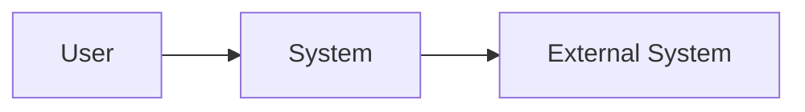
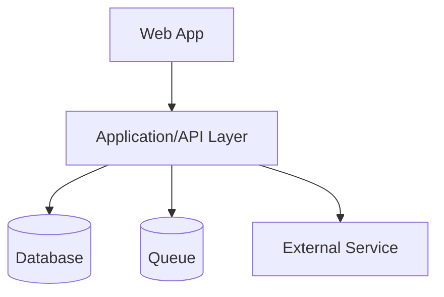
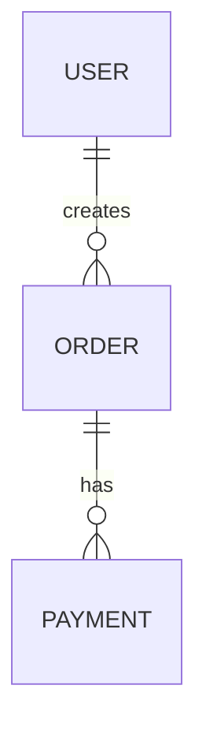
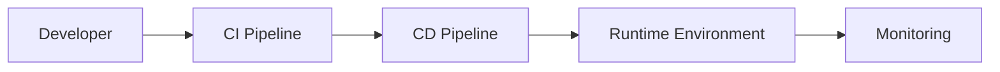

# pt28 — Architecture Overview Template

## 1. Purpose

This file defines the canonical Architecture Overview Template used by AI-SEOS.

The Architecture Overview is the central architecture artifact for a project. It is not a replacement for ADRs, detailed design documents, code documentation or runbooks. It is the entry point that explains how the system is structured and why.

## 2. Template

Create `templates/architecture/architecture-overview-template.md` with:

```markdown
---
title: "[Project] — Architecture Overview"
version: "0.1.0"
status: "Draft | Review | Approved | Deprecated"
owner: "[Architecture Owner]"
created: "YYYY-MM-DD"
last_updated: "YYYY-MM-DD"
prd_source: "[Link to PRD]"
adr_index: "[Link to ADR directory]"
---

# [Project] — Architecture Overview

## 1. Executive Summary

Describe the architecture in plain language.

## 2. Architecture Goals

| Goal | Rationale | Source |
|---|---|---|
|  |  | PRD / NFR / ADR |

## 3. Architecture Non-Goals

## 4. Context

### 4.1 Business Context

### 4.2 Product Context

### 4.3 Technical Context

### 4.4 Constraints

## 5. Architectural Drivers

| Driver | Type | Priority | Impact |
|---|---|---|---|
|  | Business/Product/Quality/Data/Security/Cost |  |  |

## 6. Quality Attribute Scenarios

| ID | Attribute | Scenario | Measure |
|---|---|---|---|
| QA-001 | Availability |  |  |

## 7. System Context View



## 8. Container View



## 9. Component View

Use this section for non-trivial systems or modules.

## 10. Domain Model

### 10.1 Core Domain Concepts

| Concept | Description | Owner | Notes |
|---|---|---|---|
|  |  |  |  |

### 10.2 Domain Relationships



### 10.3 Business Rules

## 11. Data Architecture

### 11.1 Data Ownership

### 11.2 Data Stores

### 11.3 Data Sensitivity

### 11.4 Retention and Lifecycle

## 12. Integration Architecture

| Integration | Purpose | Direction | Protocol | Criticality |
|---|---|---|---|---|
|  |  | Inbound/Outbound |  |  |

## 13. API Strategy

### 13.1 API Style

### 13.2 Versioning

### 13.3 Idempotency

### 13.4 Error Model

## 14. Security Architecture Signals

### 14.1 Authentication

### 14.2 Authorization

### 14.3 Secrets

### 14.4 Audit

### 14.5 Privacy

## 15. Observability Strategy

### 15.1 Logs

### 15.2 Metrics

### 15.3 Traces

### 15.4 Alerts

### 15.5 Product Telemetry

## 16. Deployment and Runtime Model



## 17. Scalability Strategy

### 17.1 Expected Scale

### 17.2 Bottlenecks

### 17.3 Scaling Path

## 18. Reliability and Failure Modes

| Failure Mode | Impact | Detection | Mitigation |
|---|---|---|---|
|  |  |  |  |

## 19. Cost Considerations

## 20. Architecture Options Considered

| Option | Summary | Decision | ADR |
|---|---|---|---|
|  |  | Accepted/Rejected |  |

## 21. Decisions

| ADR | Decision | Status |
|---|---|---|
|  |  |  |

## 22. Risks and Open Questions

## 23. Implementation Handoff

### 23.1 Boundaries

### 23.2 Dependencies

### 23.3 Technical Backlog Candidates

### 23.4 Required Follow-up Reviews

## 24. Review Checklist

- [ ] Architecture goals are clear.
- [ ] Drivers are explicit.
- [ ] Quality attributes are documented.
- [ ] System context view exists.
- [ ] Container view exists if applicable.
- [ ] Domain concepts are documented.
- [ ] Data strategy is documented.
- [ ] Integration strategy is documented.
- [ ] Security signals are documented.
- [ ] Observability strategy is documented.
- [ ] Major decisions link to ADRs.
- [ ] Risks are visible.
- [ ] Handoff is actionable.
```

## 3. Architecture View Standards

AI-SEOS uses a C4-inspired view model but does not require strict C4 compliance in every project.

Required minimum for non-trivial systems:

- System Context View
- Container View
- Domain Concept View
- Integration View
- Deployment/Runtime View

Optional:

- Component View
- Sequence Diagrams
- State Diagrams
- Data Flow Diagrams
- Threat Model Diagrams

## 4. Mermaid Standards

Use Mermaid diagrams for repository-native documentation.

Rules:

- Diagrams must clarify decisions, not decorate documents.
- Use meaningful node names.
- Avoid unreadable mega-diagrams.
- Prefer multiple smaller diagrams over one huge diagram.
- Keep diagrams close to the text they explain.

## 5. Canonical Files to Create

- `templates/architecture/architecture-overview-template.md`
- `templates/architecture/quality-attribute-scenario-template.md`
- `templates/architecture/integration-map-template.md`
- `templates/architecture/domain-model-template.md`
- `templates/architecture/failure-mode-table-template.md`
- `docs/architecture/architecture-view-standard.md`
