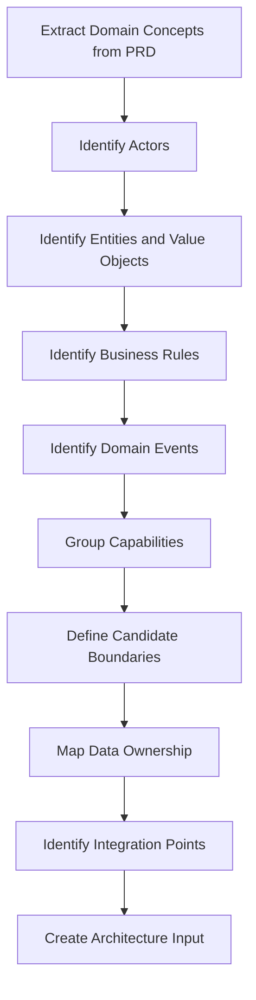
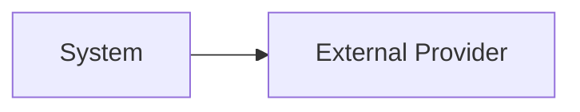

# pt29 — Domain and Integration Modeling

## 1. Purpose

Domain and Integration Modeling helps AI-SEOS architecture agents understand what the system is about, where boundaries exist, how data moves, and which external systems shape architecture.

Sprint 2 must establish a pragmatic model. Deep Domain-Driven Design patterns may be expanded in later sprints, but the foundation must exist now.

## 2. Domain Modeling Principle

Do not start architecture from infrastructure.

Start from the domain:

- actors;
- entities;
- business processes;
- business rules;
- events;
- data ownership;
- invariants;
- boundaries;
- language.

Infrastructure should support the domain, not define it.

## 3. Domain Modeling Pipeline



## 4. Domain Concept Types

| Type | Description | Example |
|---|---|---|
| Actor | Human/system interacting with domain | Student, Admin, Payment Provider |
| Entity | Object with identity | Subscription, Account, Invoice |
| Value Object | Object defined by value | Money, Address, Date Range |
| Aggregate | Consistency boundary | Order with Order Items |
| Domain Event | Something meaningful happened | PaymentReceived |
| Policy | Rule that reacts to events | SendReminderWhenPaymentOverdue |
| Process | Multi-step workflow | Onboarding, Billing, Approval |
| External System | Outside dependency | Stripe, Asaas, CRM |

## 5. Bounded Context Candidate Questions

Ask:

1. Which concepts have different meanings in different parts of the business?
2. Which data should be owned together?
3. Which rules must be consistent together?
4. Which workflows change independently?
5. Which teams or agents may own different areas?
6. Which integrations affect boundaries?
7. Which future product capabilities suggest separation?

## 6. Data Ownership Matrix

Create `templates/architecture/data-ownership-matrix-template.md`:

```markdown
# Data Ownership Matrix

| Data Object | Owner Context | Readers | Writers | Sensitivity | Notes |
|---|---|---|---|---|---|
|  |  |  |  | Public/Internal/Confidential/Restricted |  |
```

## 7. Domain Model Template

Create `templates/architecture/domain-model-template.md`:

```markdown
# Domain Model

## 1. Domain Summary

## 2. Ubiquitous Language

| Term | Definition | Notes |
|---|---|---|
|  |  |  |

## 3. Actors

## 4. Entities

## 5. Value Objects

## 6. Aggregates

## 7. Business Rules

## 8. Domain Events

## 9. Candidate Boundaries

## 10. Open Questions

## 11. Diagram

```mermaid
erDiagram
```
```

## 8. Integration Modeling Principle

Every integration is a product, architecture, security and operational decision.

Integrations must not be treated as simple implementation details.

## 9. Integration Types

| Type | Description |
|---|---|
| Synchronous API | Request/response integration |
| Async Event | Event-driven communication |
| Webhook | External system calls back into system |
| Batch Import/Export | Scheduled or manual file/data exchange |
| Embedded SDK | Vendor SDK integrated into application |
| Human Operational | Manual process bridging systems |

## 10. Integration Assessment Questions

For each integration:

1. Who owns the source of truth?
2. Is the integration synchronous or asynchronous?
3. What happens when the integration fails?
4. Are retries safe?
5. Is idempotency required?
6. What data is exchanged?
7. Is the data sensitive?
8. What are provider limits?
9. What are cost implications?
10. What observability is required?
11. What is the fallback path?
12. Does vendor lock-in matter?

## 11. Integration Map Template

Create `templates/architecture/integration-map-template.md`:

```markdown
# Integration Map

| Integration | Purpose | Direction | Protocol | Sync/Async | Criticality | Owner | Failure Strategy |
|---|---|---|---|---|---|---|---|
|  |  | Inbound/Outbound | REST/Webhook/Event/Batch |  | Low/Medium/High/Critical |  |  |

## Integration Diagram



## Failure Modes

| Failure | Impact | Detection | Mitigation |
|---|---|---|---|
|  |  |  |  |
```

## 12. Integration Architecture Anti-Patterns

- No idempotency for webhooks.
- No retry strategy.
- External provider as hidden source of truth.
- Sensitive data shared unnecessarily.
- Synchronous dependency in critical user journey without fallback.
- No provider limit analysis.
- No observability for integration failures.
- No contract documentation.
- No local state reconciliation strategy.

## 13. Domain + Integration Handoff

The Architecture Engine must include in the Architecture Handoff Package:

- domain concepts;
- candidate boundaries;
- data ownership;
- integration map;
- critical external dependencies;
- failure modes;
- open domain questions;
- decisions requiring ADR.

## 14. Canonical Files to Create

- `frameworks/architecture-framework/domain-and-integration-modeling.md`
- `templates/architecture/domain-model-template.md`
- `templates/architecture/integration-map-template.md`
- `templates/architecture/data-ownership-matrix-template.md`
- `templates/architecture/failure-mode-table-template.md`
- `operating-system/architecture/domain-modeling-standard.md`
- `operating-system/architecture/integration-modeling-standard.md`
