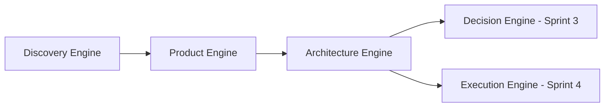

# pt30 — Sprint 2 Handoff and Execution Directive

## 1. Sprint 2 Objective

Execute Sprint 2 of AI-SEOS by implementing the Product Engine and Architecture Engine as first-class operating engines connected to the existing Sprint 1 Discovery Engine, Core Identity, Context Package Standard and AI CTO Agent.

Sprint 2 must make the flow below real inside the repository:



## 2. Required Source Files

The Codex maintainer must read:

- `pt21_PRODUCT_ENGINE.md`
- `pt22_PRODUCT_DISCOVERY_TO_PRD_PROTOCOL.md`
- `pt23_MVP_AND_SCOPE_FRAMEWORK.md`
- `pt24_PRODUCT_REQUIREMENTS_TEMPLATE.md`
- `pt25_PRODUCT_BACKLOG_AND_ROADMAP_TEMPLATE.md`
- `pt26_ARCHITECTURE_ENGINE.md`
- `pt27_ARCHITECTURE_DECISION_PROTOCOL.md`
- `pt28_ARCHITECTURE_OVERVIEW_TEMPLATE.md`
- `pt29_DOMAIN_AND_INTEGRATION_MODELING.md`
- `pt30_SPRINT_2_HANDOFF.md`

The Codex maintainer must also consult existing canonical project governance:

- `PROJECT_BOOTSTRAP.md`
- `ENGINEERING_PRINCIPLES.md`
- `ARCHITECTURE_VISION.md`
- `DEVELOPMENT_PROTOCOL.md`
- `REPOSITORY_STRUCTURE.md`
- `ROADMAP.md`
- `GOVERNANCE.md`
- Sprint 1 outputs under `operating-system/core/`, `operating-system/discovery/`, `agents/ai-cto/`, `frameworks/discovery-framework/`, `protocols/project-discovery/`, `templates/discovery/`, and `docs/sprints/`.

## 3. Directories to Create or Update

Create or update:

```text
operating-system/product/
operating-system/architecture/
frameworks/product-framework/
frameworks/architecture-framework/
protocols/product-definition/
protocols/architecture-review/
templates/product/
templates/architecture/
templates/adr/
docs/architecture/
docs/sprints/
```

## 4. Canonical Product Files Required

Create or update:

```text
operating-system/product/README.md
operating-system/product/product-engine.md
operating-system/product/product-lifecycle.md
operating-system/product/product-readiness-levels.md
operating-system/product/product-quality-gates.md
operating-system/product/product-handoff-contract.md
operating-system/product/product-roadmap-standard.md
operating-system/product/product-backlog-standard.md

frameworks/product-framework/README.md
frameworks/product-framework/mvp-scope-framework.md
frameworks/product-framework/scope-decision-matrix.md
frameworks/product-framework/capability-mapping-framework.md
frameworks/product-framework/product-prioritization-framework.md

protocols/product-definition/README.md
protocols/product-definition/discovery-to-prd-protocol.md
protocols/product-definition/prd-review-protocol.md

templates/product/prd-template.md
templates/product/mvp-definition-template.md
templates/product/product-roadmap-template.md
templates/product/product-backlog-template.md
templates/product/product-handoff-package.md
templates/product/product-input-gap-report.md
templates/product/scope-decision-matrix-template.md
templates/product/non-mvp-scope-register.md
```

## 5. Canonical Architecture Files Required

Create or update:

```text
operating-system/architecture/README.md
operating-system/architecture/architecture-engine.md
operating-system/architecture/architecture-lifecycle.md
operating-system/architecture/architecture-readiness-levels.md
operating-system/architecture/architecture-quality-gates.md
operating-system/architecture/architecture-handoff-contract.md
operating-system/architecture/domain-modeling-standard.md
operating-system/architecture/integration-modeling-standard.md

frameworks/architecture-framework/README.md
frameworks/architecture-framework/architecture-thinking-framework.md
frameworks/architecture-framework/quality-attribute-framework.md
frameworks/architecture-framework/trade-off-analysis-framework.md
frameworks/architecture-framework/domain-and-integration-modeling.md

protocols/architecture-review/README.md
protocols/architecture-review/architecture-decision-protocol.md
protocols/architecture-review/architecture-review-checklist.md

templates/architecture/architecture-overview-template.md
templates/architecture/architecture-decision-matrix-template.md
templates/architecture/quality-attribute-scenario-template.md
templates/architecture/integration-map-template.md
templates/architecture/domain-model-template.md
templates/architecture/data-ownership-matrix-template.md
templates/architecture/failure-mode-table-template.md

docs/architecture/architecture-view-standard.md
docs/architecture/decision-log.md

templates/adr/adr-extended-template.md
```

## 6. ADRs Required

Create:

```text
adr/0012-adopt-product-engine.md
adr/0013-adopt-mvp-scope-framework.md
adr/0014-adopt-architecture-engine.md
adr/0015-adopt-architecture-decision-protocol.md
adr/0016-adopt-architecture-readiness-levels.md
adr/0017-adopt-product-to-architecture-handoff.md
adr/0018-adopt-c4-inspired-architecture-views.md
```

Each ADR must include:

- Context
- Problem
- Decision
- Options considered
- Consequences
- Trade-offs
- Reversibility
- Follow-up

## 7. Required Updates to Existing Files

Update:

```text
README.md
ROADMAP.md
CHANGELOG.md
adr/README.md
operating-system/README.md
frameworks/README.md
protocols/README.md
templates/README.md
docs/architecture/README.md
```

If `docs/sprints/` exists, add:

```text
docs/sprints/sprint-2-handoff.md
docs/sprints/sprint-2-validation-report.md
```

If not, create the directory and files.

## 8. Sprint 2 Quality Gates

Sprint 2 is only complete when:

### Product Gates

- [ ] Product Engine exists and is documented.
- [ ] Product lifecycle exists.
- [ ] Product Readiness Levels exist.
- [ ] PRD template exists.
- [ ] MVP framework exists.
- [ ] Product backlog and roadmap templates exist.
- [ ] Product handoff to Architecture exists.

### Architecture Gates

- [ ] Architecture Engine exists and is documented.
- [ ] Architecture lifecycle exists.
- [ ] Architecture Readiness Levels exist.
- [ ] Architecture quality gates exist.
- [ ] Architecture overview template exists.
- [ ] Architecture decision protocol exists.
- [ ] Domain and integration modeling exists.
- [ ] Architecture handoff contract exists.

### Integration Gates

- [ ] Discovery → Product flow is documented.
- [ ] Product → Architecture flow is documented.
- [ ] Context Package usage is preserved.
- [ ] ADRs 0012–0018 exist.
- [ ] README/ROADMAP/CHANGELOG are updated.
- [ ] Sprint 2 validation report exists.

## 9. Definition of Done

Sprint 2 is done when:

1. All required directories exist.
2. All required canonical files exist.
3. All required ADRs exist.
4. Product Engine can receive Discovery outputs and produce PRD/MVP/Roadmap/Handoff artifacts.
5. Architecture Engine can receive Product outputs and produce architecture overview/options/quality attributes/domain/integration/handoff artifacts.
6. Documentation is cross-linked and consistent.
7. Sprint 2 validation report marks all gates as passed or clearly explains any exception.
8. Changes are committed to Git.

## 10. Execution Command for Codex

Use this instruction after placing pt21–pt30 in the project root:

```text
Leia integralmente todos os arquivos Markdown numerados de pt21 a pt30 na raiz do projeto.

Use também PROJECT_BOOTSTRAP.md, ENGINEERING_PRINCIPLES.md, ARCHITECTURE_VISION.md, DEVELOPMENT_PROTOCOL.md, REPOSITORY_STRUCTURE.md, ROADMAP.md, GOVERNANCE.md e todos os artefatos da Sprint 1 como documentos de governança obrigatórios.

Execute agora a Sprint 2 do AI Software Engineering Operating System (AI-SEOS).

Objetivo:
Implementar Product Engine e Architecture Engine como engines operacionais oficiais, conectadas ao Discovery Engine e preparadas para alimentar Decision Engine, Risk Engine, Optimization Engine e Execution Engine nas próximas sprints.

Tarefas obrigatórias:
1. Ler pt21 a pt30 completamente.
2. Criar e atualizar todos os diretórios listados no pt30.
3. Criar e atualizar todos os arquivos canônicos de Product Engine.
4. Criar e atualizar todos os arquivos canônicos de Architecture Engine.
5. Criar as ADRs 0012 a 0018.
6. Atualizar README.md, ROADMAP.md, CHANGELOG.md, adr/README.md e READMEs de diretórios relacionados.
7. Criar docs/sprints/sprint-2-handoff.md e docs/sprints/sprint-2-validation-report.md.
8. Validar a Sprint 2 contra os quality gates e Definition of Done definidos no pt30.
9. Não apenas descreva o que faria. Faça as alterações reais no filesystem.
10. Ao terminar, gere um relatório final contendo:
   - arquivos criados;
   - arquivos atualizados;
   - diretórios criados;
   - ADRs criadas;
   - decisões tomadas;
   - riscos ou pendências;
   - validação da Definition of Done;
   - commit realizado;
   - próxima ação recomendada para Sprint 3.

Não peça confirmação.
Execute.
```

## 11. Expected Sprint 3 Handoff

Sprint 3 should consume Sprint 2 outputs and implement:

- Decision Engine
- Risk Engine
- Optimization Engine
- decision matrices
- risk registers
- optimization protocols
- architecture/product decision hardening
- ADR lifecycle expansion

Sprint 2 should explicitly leave hooks for these engines.
