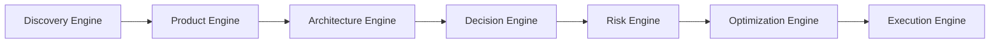
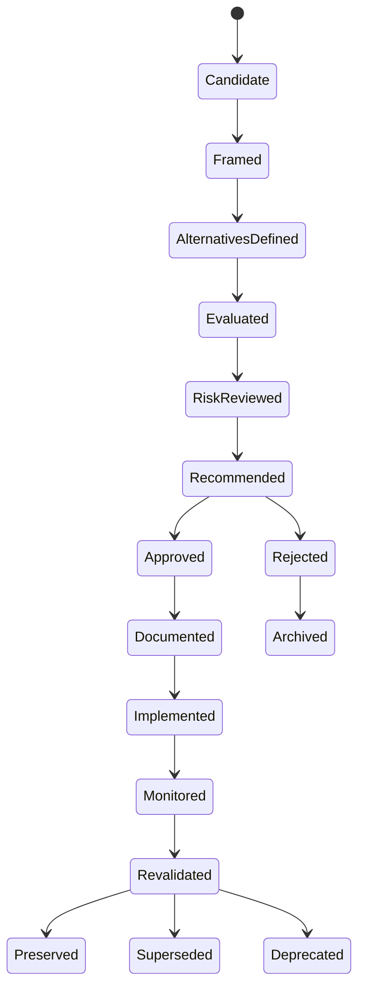
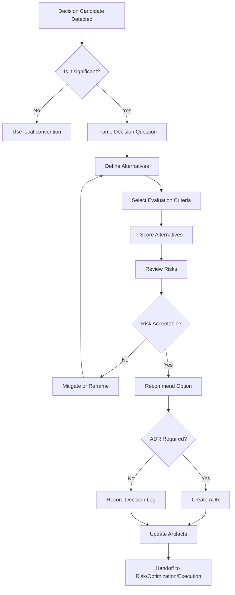

# Decision Engine

## 1. Purpose

The Decision Engine is the official AI-SEOS operating engine responsible for transforming ambiguous options into explicit, traceable, reviewable and reversible engineering decisions.

Its purpose is not to make every decision automatically. Its purpose is to force the system to think clearly before committing to a direction.

The Decision Engine ensures that important product, architecture, security, operational and delivery choices are not hidden inside implementation work, chat history, pull requests or undocumented assumptions.

In AI-SEOS, any meaningful decision must be:

- visible;
- contextualized;
- supported by alternatives;
- evaluated against explicit criteria;
- connected to risks;
- connected to consequences;
- documented in the correct artifact;
- revisitable when conditions change.

The Decision Engine sits after Discovery, Product and Architecture, and before Risk, Optimization and Execution.



## 2. Why the Decision Engine exists

Software projects rarely fail because nobody made decisions.

They fail because decisions were:

- implicit;
- made too early;
- made too late;
- made by the wrong role;
- optimized for the wrong constraint;
- detached from business goals;
- disconnected from risk;
- never revisited;
- undocumented;
- impossible to reverse;
- treated as preferences instead of trade-offs.

AI-assisted engineering increases this risk because AI agents can produce confident recommendations quickly, sometimes without making their assumptions visible.

The Decision Engine exists to prevent architectural and product drift caused by fast but shallow reasoning.

## 3. Scope

The Decision Engine governs significant project decisions, including:

- product scope decisions;
- MVP inclusion and exclusion decisions;
- technical stack choices;
- architecture style choices;
- data model choices;
- integration strategy choices;
- build versus buy decisions;
- vendor selection;
- infrastructure strategy;
- deployment strategy;
- security posture decisions;
- compliance posture decisions;
- cost versus complexity decisions;
- scalability strategy;
- operational model choices;
- AI usage choices;
- documentation and governance decisions.

## 4. Non-scope

The Decision Engine does not govern every trivial implementation detail.

It should not be required for:

- local variable names;
- minor formatting decisions;
- simple refactors with no architectural effect;
- isolated bug fixes;
- purely cosmetic changes;
- decisions already covered by existing conventions;
- reversible implementation choices with low blast radius.

However, a small technical choice should be escalated to the Decision Engine when it:

- affects public contracts;
- creates vendor lock-in;
- changes security posture;
- increases long-term maintenance cost;
- introduces a new dependency;
- changes data ownership;
- affects user experience at product level;
- changes scalability characteristics;
- creates migration cost;
- contradicts existing ADRs.

## 5. Operating principles

### 5.1 Decisions are first-class artifacts

A decision is not complete because someone said yes.

A decision is complete when it has been documented, reviewed and connected to downstream execution.

### 5.2 Alternatives are mandatory

Any meaningful decision must compare at least three alternatives:

1. the recommended option;
2. a simpler or cheaper option;
3. a more scalable or more robust option.

When fewer than three alternatives exist, the Decision Engine must explain why.

### 5.3 Trade-offs are more important than preferences

The Decision Engine must not say only what is best.

It must explain what is being sacrificed.

A decision without trade-offs is usually an opinion.

### 5.4 Reversibility changes decision weight

A reversible decision can be made faster.

An irreversible or expensive-to-reverse decision requires deeper evaluation.

The engine must classify every decision by reversibility.

### 5.5 Context determines correctness

There is rarely a universally correct engineering decision.

A solution can be excellent for a startup MVP and terrible for a regulated enterprise system.

Every decision must be evaluated against project context.

### 5.6 Decision quality is separate from outcome quality

A good decision can produce a bad outcome when reality changes.

A bad decision can occasionally produce a good outcome by luck.

The Decision Engine evaluates the quality of reasoning, not only the eventual result.

## 6. Decision lifecycle



### 6.1 Candidate

A decision candidate is detected.

Triggers include:

- multiple viable paths;
- unresolved disagreement;
- new dependency;
- architectural uncertainty;
- scope ambiguity;
- risk threshold breach;
- cost threshold breach;
- stakeholder conflict;
- irreversible commitment.

### 6.2 Framed

The decision is expressed as a clear decision question.

Bad framing:

> Should we use Firebase?

Better framing:

> For a multi-tenant SaaS MVP with limited engineering capacity and expected early Brazilian market usage, should we use Firebase, Supabase or a custom Postgres backend as the initial application platform?

### 6.3 Alternatives defined

At least three alternatives are listed.

Each alternative must include:

- description;
- assumptions;
- benefits;
- costs;
- risks;
- unknowns;
- reversibility;
- impact on future options.

### 6.4 Evaluated

Alternatives are compared using a decision matrix.

Evaluation must include weighted criteria appropriate to the decision type.

### 6.5 Risk reviewed

The Risk Engine evaluates risks attached to the decision.

If risk is high, decision cannot proceed without explicit mitigation or acceptance.

### 6.6 Recommended

The Decision Engine produces one recommendation.

The recommendation must include:

- chosen alternative;
- why now;
- why not the others;
- consequences;
- monitoring signals;
- reversal strategy;
- owner.

### 6.7 Approved

Approval depends on decision class.

Some decisions can be approved by AI CTO.

Others require human approval.

### 6.8 Documented

Significant decisions must become ADRs.

Lower-level decisions may become decision log entries.

### 6.9 Implemented

The decision is translated into execution artifacts.

### 6.10 Monitored

The decision must include signals that indicate whether it remains valid.

### 6.11 Revalidated

Decision is reviewed when assumptions change.

## 7. Decision classes

| Class | Description | Example | Required Artifact | Approval |
|---|---|---|---|---|
| D0 | Trivial/reversible local choice | Component naming | None or code comment | Implementer |
| D1 | Local design decision | Library usage inside one module | Decision log | Lead agent |
| D2 | Cross-module decision | API style | ADR lite | AI CTO or Architect |
| D3 | Architectural decision | Database, auth, deployment | Full ADR | AI CTO + human review recommended |
| D4 | Strategic/platform decision | Cloud provider, monetization infrastructure | Full ADR + risk review | Human approval required |
| D5 | Regulated/irreversible decision | Compliance architecture, data residency | Full ADR + risk + security review | Human approval mandatory |

## 8. Decision object model

Every decision should be represented as a structured object.

```yaml
decision_id: DEC-0000
title: "Short decision title"
class: D0|D1|D2|D3|D4|D5
status: candidate|framed|evaluated|recommended|approved|rejected|implemented|superseded
owner: "Role or agent"
date_opened: YYYY-MM-DD
date_decided: YYYY-MM-DD
context:
  project:
  phase:
  constraints:
  assumptions:
decision_question: "Question being answered"
alternatives:
  - id: A
    name:
    description:
    benefits:
    costs:
    risks:
    reversibility:
criteria:
  - name:
    weight:
evaluation:
  matrix:
recommendation:
  chosen_alternative:
  rationale:
  trade_offs:
  consequences:
risk_review:
  risk_level:
  mitigations:
approval:
  required_by:
  approved_by:
  date:
artifacts:
  adr:
  related_docs:
monitoring:
  signals:
  revalidation_triggers:
```

## 9. Inputs

The Decision Engine consumes:

- Discovery Document;
- Product Requirements Document;
- MVP Scope Definition;
- Product to Architecture Handoff;
- Architecture Overview;
- Domain Model;
- Integration Model;
- Architecture Decision Candidates;
- constraints;
- assumptions;
- known risks;
- stakeholder priorities;
- cost constraints;
- time constraints;
- compliance constraints.

## 10. Outputs

The Decision Engine produces:

- Decision Record;
- Decision Matrix;
- Architecture Decision Record;
- Decision Log Entry;
- Risk Review Request;
- Optimization Review Request;
- Execution Constraint;
- Revalidation Trigger;
- Handoff Package for Risk Engine.

## 11. Decision quality gates

A decision may not be marked complete unless these gates pass.

### Gate 1: Context Gate

- The decision has a clear project context.
- Business objective is known.
- Product impact is known.
- Technical impact is known.
- Constraints are documented.

### Gate 2: Framing Gate

- The decision question is explicit.
- Scope is clear.
- Non-scope is clear.
- Decision class is assigned.

### Gate 3: Alternatives Gate

- At least three alternatives are included.
- “Do nothing” or “defer” is considered when appropriate.
- Alternatives are meaningfully different.

### Gate 4: Criteria Gate

- Evaluation criteria are explicit.
- Criteria weights are justified.
- Criteria reflect current project priorities.

### Gate 5: Trade-off Gate

- Benefits are documented.
- Costs are documented.
- Sacrifices are documented.
- Future constraints are documented.

### Gate 6: Risk Gate

- Risks have been identified.
- High risks have mitigations or explicit acceptance.
- Security and compliance implications are reviewed when applicable.

### Gate 7: Reversibility Gate

- Reversibility is classified.
- Rollback path is documented where possible.
- Migration cost is estimated qualitatively.

### Gate 8: Documentation Gate

- ADR or decision log entry exists when required.
- Related artifacts are updated.
- Downstream agents can consume the decision.

## 12. Decision anti-patterns

### 12.1 Preference disguised as architecture

Example:

> We chose GraphQL because it is modern.

Correction:

Decision must explain the specific context where GraphQL improves product delivery, API evolution or client needs.

### 12.2 Premature enterprise architecture

Example:

> We need microservices because the product may grow.

Correction:

Growth expectation must be mapped to actual scalability, team, deployment and operational requirements.

### 12.3 Tool-first decision

Example:

> We will use Kubernetes because it is industry standard.

Correction:

Decision must start with operational need, not tool popularity.

### 12.4 False binary choice

Example:

> Firebase or Supabase?

Correction:

Include custom backend, managed Postgres, hybrid, and staged migration alternatives when relevant.

### 12.5 Hidden stakeholder constraint

Example:

> Architecture chosen without considering deadline, budget, legal or team skill.

Correction:

Constraints must be explicit before evaluation.

### 12.6 No reversal strategy

Example:

> Adopt vendor X without migration plan.

Correction:

Vendor decisions require exit strategy proportional to lock-in.

## 13. Best practices

- Write the decision question before brainstorming solutions.
- Include at least one intentionally simple alternative.
- Include at least one intentionally robust alternative.
- Treat “defer” as a valid alternative when information is insufficient.
- Use weighted matrices, but do not pretend they are objective truth.
- Record dissent when meaningful.
- Prefer reversible decisions early.
- Prefer explicit constraints over implicit assumptions.
- Connect decisions to execution tasks.
- Revalidate decisions after major project changes.

## 14. Mermaid decision flow



## 15. Implementation requirements for Sprint 3

Codex must create the following canonical files from this part:

- `operating-system/decision/README.md`
- `operating-system/decision/decision-engine.md`
- `operating-system/decision/decision-lifecycle.md`
- `operating-system/decision/decision-object-model.md`
- `operating-system/decision/decision-quality-gates.md`
- `operating-system/decision/decision-anti-patterns.md`
- `frameworks/decision-framework/README.md`
- `protocols/decision-review/README.md`

It must also connect the Decision Engine to:

- Product Engine;
- Architecture Engine;
- Risk Engine;
- Optimization Engine;
- ADR process;
- Execution Engine future sprint.

## 16. Definition of Done

The Decision Engine is done when:

- decision lifecycle exists;
- decision object model exists;
- decision classes D0-D5 exist;
- quality gates exist;
- decision matrix standard exists;
- ADR integration exists;
- risk handoff exists;
- optimization handoff exists;
- README links are updated;
- ADR 0019 exists;
- Sprint 3 validation report confirms the engine is operational.
