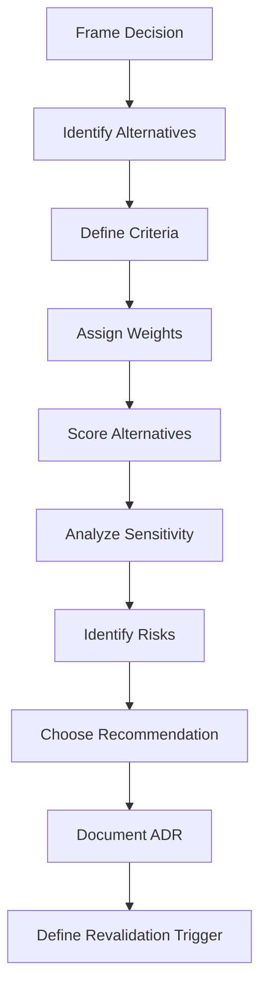

# Decision Framework and Matrix

## 1. Purpose

The AI-SEOS Decision Framework standardizes how the system compares alternatives and selects a direction.

The framework does not remove human judgment. It improves judgment by making criteria, weights, assumptions and trade-offs explicit.

The Decision Framework is used when a project must choose between meaningful alternatives.

Examples:

- Firebase vs Supabase vs custom backend;
- monolith vs modular monolith vs microservices;
- REST vs GraphQL vs event-driven API;
- build vs buy vs integrate;
- synchronous vs asynchronous processing;
- SQL vs NoSQL vs hybrid persistence;
- serverless vs containers vs managed platform;
- single-tenant vs multi-tenant architecture;
- direct AI API calls vs RAG vs fine-tuning vs agentic workflow.

## 2. Framework overview



## 3. Decision framing

Every decision begins with a decision question.

### 3.1 Decision question pattern

```text
For [project/system/module/context], given [constraints], should we choose [option category] among [alternatives] in order to achieve [goal] while optimizing for [priority]?
```

### 3.2 Examples

Poor:

```text
Should we use microservices?
```

Strong:

```text
For a two-person team building the first production version of a multi-tenant SaaS, given limited DevOps capacity and uncertain product-market fit, should we use a modular monolith, microservices or serverless function-based decomposition to maximize delivery speed while preserving future modularity?
```

Poor:

```text
Which database is best?
```

Strong:

```text
For a SaaS product with tenant-scoped operational data, financial records and expected reporting needs, should we use Firestore, Supabase Postgres or a custom managed PostgreSQL backend to balance time-to-market, query flexibility, security rules and future reporting requirements?
```

## 4. Alternative design

A valid alternative must be plausible.

The framework rejects fake alternatives created only to justify a preferred option.

### 4.1 Required alternatives

Whenever possible, include:

1. **Baseline alternative** — the simplest viable option.
2. **Recommended candidate** — the option likely to be chosen.
3. **Robust alternative** — the option optimized for scale, control or enterprise readiness.
4. **Defer/no-decision alternative** — when uncertainty is high.
5. **Hybrid/staged alternative** — when migration path matters.

### 4.2 Alternative profile

Each alternative must include:

```yaml
id: A
name:
description:
when_to_choose:
when_not_to_choose:
assumptions:
benefits:
limitations:
costs:
risks:
operational_impact:
security_impact:
scalability_impact:
reversibility:
migration_path:
unknowns:
```

## 5. Criteria model

The Decision Matrix uses criteria categories.

### 5.1 Standard criteria

| Criterion | Meaning |
|---|---|
| Product Fit | How well the alternative supports the product need |
| Delivery Speed | How quickly the team can deliver safely |
| Simplicity | How easy it is to understand and operate |
| Maintainability | Long-term ability to modify and support |
| Scalability | Ability to grow with demand |
| Reliability | Ability to remain available and correct |
| Security | Ability to protect data and reduce attack surface |
| Compliance | Fit with legal/regulatory obligations |
| Cost | Financial cost now and later |
| Team Fit | Fit with current team skills |
| Observability | Ability to debug and operate |
| Vendor Lock-in | Dependency and exit difficulty |
| Reversibility | Ease of changing later |
| Ecosystem | Libraries, community and support |
| Strategic Optionality | Whether it preserves future choices |

### 5.2 Context-specific criteria

The engine may add criteria for:

- AI latency;
- model cost;
- data residency;
- offline capability;
- mobile constraints;
- marketplace network effects;
- payment compliance;
- tenant isolation;
- auditability;
- localization;
- accessibility;
- interoperability;
- migration complexity.

## 6. Weighting model

Weights express project priorities.

They must not be arbitrary.

### 6.1 Weight scale

| Weight | Meaning |
|---|---|
| 1 | Low importance |
| 2 | Useful but not decisive |
| 3 | Important |
| 4 | Very important |
| 5 | Critical |

### 6.2 Scoring scale

| Score | Meaning |
|---|---|
| 1 | Poor fit |
| 2 | Weak fit |
| 3 | Acceptable fit |
| 4 | Strong fit |
| 5 | Excellent fit |

### 6.3 Weighted score

```text
weighted_score = criterion_weight * alternative_score
```

Total score:

```text
total_score = sum(weighted_scores)
```

### 6.4 Interpretation warning

The highest score is not automatically the correct decision.

The matrix informs the recommendation. It does not replace architectural judgment.

A lower-scoring option may be chosen when:

- it is safer;
- it is more reversible;
- it avoids unacceptable risk;
- it better fits constraints not captured numerically;
- it preserves critical future optionality.

## 7. Standard decision matrix template

| Criteria | Weight | Alternative A | A Weighted | Alternative B | B Weighted | Alternative C | C Weighted |
|---|---:|---:|---:|---:|---:|---:|---:|
| Product Fit | 5 |  |  |  |  |  |  |
| Delivery Speed | 4 |  |  |  |  |  |  |
| Simplicity | 4 |  |  |  |  |  |  |
| Maintainability | 5 |  |  |  |  |  |  |
| Scalability | 3 |  |  |  |  |  |  |
| Security | 5 |  |  |  |  |  |  |
| Cost | 4 |  |  |  |  |  |  |
| Team Fit | 4 |  |  |  |  |  |  |
| Reversibility | 3 |  |  |  |  |  |  |
| Vendor Lock-in | 3 |  |  |  |  |  |  |
| **Total** |  |  |  |  |  |  |  |

## 8. Decision confidence

The framework assigns a confidence level.

| Confidence | Meaning |
|---|---|
| Low | Many unknowns, weak evidence, high uncertainty |
| Medium | Reasonable evidence but still material assumptions |
| High | Strong evidence, clear constraints, stable context |
| Conditional | Decision is acceptable only while assumptions hold |

Confidence must include rationale.

## 9. Sensitivity analysis

The Decision Engine must ask:

- If delivery speed weight changes, does the recommendation change?
- If security weight increases, does the recommendation change?
- If team size changes, does the recommendation change?
- If scale increases 10x, does the recommendation change?
- If budget decreases 50%, does the recommendation change?
- If compliance becomes stricter, does the recommendation change?

When small weight changes drastically change the recommendation, the decision is unstable.

## 10. Tie-breaking rules

When alternatives are close, prefer:

1. safer option;
2. simpler option;
3. more reversible option;
4. lower operational burden;
5. better aligned with current team;
6. option with clearer migration path;
7. option that preserves strategic optionality.

Do not choose a complex option only because it scores slightly higher.

## 11. Decision matrix examples

### 11.1 Architecture style example

Decision question:

```text
For a new SaaS MVP with uncertain product-market fit and a small engineering team, should the system start as a modular monolith, microservices architecture or serverless function-based architecture?
```

Alternatives:

- A: Modular Monolith
- B: Microservices
- C: Serverless Functions

| Criteria | Weight | Modular Monolith | Weighted | Microservices | Weighted | Serverless Functions | Weighted |
|---|---:|---:|---:|---:|---:|---:|---:|
| Delivery Speed | 5 | 5 | 25 | 2 | 10 | 4 | 20 |
| Simplicity | 5 | 5 | 25 | 1 | 5 | 3 | 15 |
| Maintainability | 5 | 4 | 20 | 3 | 15 | 3 | 15 |
| Scalability | 3 | 3 | 9 | 5 | 15 | 4 | 12 |
| Operational Burden | 5 | 5 | 25 | 1 | 5 | 3 | 15 |
| Team Fit | 5 | 5 | 25 | 2 | 10 | 3 | 15 |
| Future Modularity | 4 | 4 | 16 | 5 | 20 | 3 | 12 |
| Cost Control | 4 | 4 | 16 | 2 | 8 | 3 | 12 |
| **Total** |  |  | **161** |  | **88** |  | **116** |

Recommendation:

Use Modular Monolith as initial architecture, with explicit module boundaries and ADR-defined extraction criteria.

### 11.2 Vendor choice example

Decision question:

```text
For a Brazilian SaaS MVP that needs authentication, database, serverless backend and fast iteration, should the project use Firebase, Supabase or a custom managed Postgres + API backend?
```

Criteria should include:

- time-to-market;
- auth maturity;
- query flexibility;
- local payment integration fit;
- security rules complexity;
- reporting needs;
- lock-in;
- cost predictability;
- team familiarity.

## 12. Decision record template

```markdown
# Decision Record: [Title]

## Metadata

- Decision ID:
- Status:
- Decision Class:
- Owner:
- Date Opened:
- Date Decided:
- Related ADR:
- Related Product Artifact:
- Related Architecture Artifact:

## Decision Question

[Write the exact question.]

## Context

[Describe business, product, technical and operational context.]

## Constraints

- [Constraint 1]
- [Constraint 2]

## Assumptions

- [Assumption 1]
- [Assumption 2]

## Alternatives

### Alternative A: [Name]

Description:

Benefits:

Costs:

Risks:

Reversibility:

### Alternative B: [Name]

...

### Alternative C: [Name]

...

## Evaluation Matrix

[Insert matrix]

## Sensitivity Analysis

[Explain whether recommendation changes under different weights.]

## Recommendation

[Chosen alternative]

## Rationale

[Why this option wins in this context.]

## Trade-offs

[What is sacrificed.]

## Risk Review

[Summarize risks and mitigations.]

## Consequences

[Positive and negative consequences.]

## Revalidation Triggers

- [Trigger 1]
- [Trigger 2]

## Handoff

[What downstream agents must know.]
```

## 13. Matrix quality checklist

- [ ] Decision question is context-rich.
- [ ] At least three alternatives are real.
- [ ] Criteria are appropriate to decision type.
- [ ] Weights are justified.
- [ ] Scores are explained.
- [ ] Highest score is not blindly accepted.
- [ ] Sensitivity analysis is included.
- [ ] Risks are connected to Risk Engine.
- [ ] Reversibility is assessed.
- [ ] Recommendation includes trade-offs.
- [ ] ADR is created when required.

## 14. Implementation requirements for Sprint 3

Codex must create:

- `frameworks/decision-framework/decision-framework.md`
- `frameworks/decision-framework/weighted-decision-matrix.md`
- `frameworks/decision-framework/decision-confidence-model.md`
- `templates/decision/decision-record-template.md`
- `templates/decision/decision-matrix-template.md`
- `templates/decision/decision-log-template.md`
- `templates/decision/README.md`

Codex must update:

- `frameworks/README.md`
- `templates/README.md`
- `operating-system/decision/README.md`

Codex must create ADR 0020:

- `adr/0020-adopt-weighted-decision-matrix.md`
