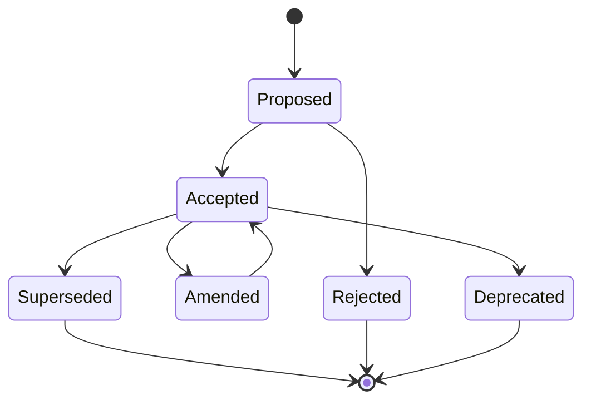

# ADR Decision Protocol

## 1. Purpose

The ADR Decision Protocol defines when and how AI-SEOS creates, updates, supersedes and references Architecture Decision Records.

An ADR is not just a historical note. In AI-SEOS, an ADR is a governance artifact that protects the project from undocumented architectural drift.

This protocol connects the Decision Engine to the repository's decision memory.

## 2. ADR philosophy

AI-SEOS treats decisions as part of the architecture.

Code shows what exists.

ADRs explain why it exists.

Without ADRs, future agents and contributors inherit implementation but lose reasoning.

A project with no decision memory becomes dependent on oral tradition, chat history or assumptions. AI-SEOS rejects that model.

## 3. When an ADR is required

An ADR is required when a decision:

- affects system architecture;
- changes technology stack;
- introduces or removes a major dependency;
- changes data ownership;
- changes security posture;
- affects scalability characteristics;
- changes deployment model;
- changes integration strategy;
- creates vendor lock-in;
- changes compliance posture;
- establishes a cross-module convention;
- supersedes a previous ADR;
- creates long-term maintenance consequences;
- will be difficult or expensive to reverse.

## 4. ADR not required

An ADR is usually not required for:

- local implementation details;
- minor refactors;
- formatting rules already covered by conventions;
- temporary experiments not merged into main architecture;
- small bug fixes;
- local naming choices.

When uncertain, create an ADR-lite or decision log entry.

## 5. ADR levels

| Level | Artifact | Use case |
|---|---|---|
| ADR-L0 | None | Trivial local choice |
| ADR-L1 | Decision Log Entry | Small but noteworthy choice |
| ADR-L2 | ADR Lite | Cross-module or recurring convention |
| ADR-L3 | Full ADR | Architecture-impacting decision |
| ADR-L4 | Full ADR + Risk Review | Strategic, vendor, security, compliance decision |
| ADR-L5 | Full ADR + Risk + Human Approval | Irreversible or regulated decision |

## 6. ADR statuses

| Status | Meaning |
|---|---|
| Proposed | Under discussion |
| Accepted | Approved and active |
| Rejected | Considered but not adopted |
| Superseded | Replaced by a newer ADR |
| Deprecated | Still historical but no longer recommended |
| Amended | Updated with minor clarification |

## 7. ADR naming convention

ADR files must use:

```text
adr/NNNN-kebab-case-title.md
```

Examples:

```text
adr/0019-adopt-decision-engine.md
adr/0020-adopt-weighted-decision-matrix.md
adr/0021-adopt-adr-decision-lifecycle.md
```

Numbers must be sequential.

Do not reuse deleted ADR numbers.

## 8. Full ADR template

```markdown
# ADR NNNN: [Decision Title]

## Status

Proposed | Accepted | Rejected | Superseded | Deprecated | Amended

## Date

YYYY-MM-DD

## Decision Class

D1 | D2 | D3 | D4 | D5

## Context

[Describe the situation that forced the decision.]

## Problem

[Describe the problem being solved.]

## Decision Drivers

- [Driver 1]
- [Driver 2]

## Considered Options

### Option A: [Name]

Description:

Pros:

Cons:

Risks:

### Option B: [Name]

...

### Option C: [Name]

...

## Decision Matrix

[Insert weighted comparison or link to decision record.]

## Decision

[State chosen option clearly.]

## Rationale

[Explain why this option was chosen in this context.]

## Consequences

### Positive Consequences

- [Consequence]

### Negative Consequences

- [Consequence]

### Neutral Consequences

- [Consequence]

## Trade-offs

[What the decision optimizes and what it sacrifices.]

## Risk Assessment

[Connect to Risk Engine.]

## Reversibility

- Reversibility: Low | Medium | High
- Reversal strategy:
- Migration cost:

## Implementation Notes

[How this decision affects implementation.]

## Revalidation Triggers

- [Trigger 1]
- [Trigger 2]

## Related Artifacts

- Discovery:
- Product:
- Architecture:
- Risk:
- Execution:

## Supersedes

- [ADR number if applicable]

## Superseded By

- [ADR number if applicable]
```

## 9. ADR Lite template

ADR Lite is used for smaller decisions that deserve traceability but not full analysis.

```markdown
# ADR NNNN: [Decision Title]

## Status

Accepted

## Context

[Short context.]

## Decision

[What was decided.]

## Rationale

[Why.]

## Consequences

[Expected impact.]

## Revalidation Trigger

[When to revisit.]
```

## 10. Decision log entry

For smaller decisions, use a decision log.

```markdown
## DEC-YYYYMMDD-NNN: [Title]

- Status:
- Owner:
- Context:
- Decision:
- Rationale:
- Consequence:
- Revisit when:
```

## 11. ADR lifecycle



## 12. ADR update rules

An accepted ADR should not be rewritten to hide historical reasoning.

Allowed updates:

- fix typo;
- clarify wording;
- add links to related artifacts;
- mark as superseded;
- add superseding ADR reference;
- add post-decision notes clearly marked.

Not allowed:

- change original decision silently;
- remove rejected options;
- remove trade-offs;
- rewrite context to make decision look better;
- delete consequences that became inconvenient.

## 13. Superseding an ADR

To supersede an ADR:

1. Create a new ADR.
2. Reference old ADR in `Supersedes`.
3. Update old ADR status to `Superseded`.
4. Add `Superseded By` link to old ADR.
5. Update ADR index.
6. Update impacted documentation.

## 14. ADR review checklist

- [ ] Decision title is clear.
- [ ] Status is correct.
- [ ] Decision class is assigned.
- [ ] Context is sufficient.
- [ ] Problem is explicit.
- [ ] At least three options are considered when meaningful.
- [ ] Decision drivers are stated.
- [ ] Rationale is specific to project context.
- [ ] Consequences include negative consequences.
- [ ] Trade-offs are explicit.
- [ ] Risk assessment is included.
- [ ] Reversibility is described.
- [ ] Related artifacts are linked.
- [ ] Revalidation triggers exist.

## 15. ADR integration with engines

### Discovery Engine

Provides:

- problem context;
- stakeholder constraints;
- assumptions;
- domain uncertainty.

### Product Engine

Provides:

- product requirements;
- MVP scope;
- user value;
- priorities.

### Architecture Engine

Provides:

- architecture alternatives;
- system constraints;
- technical model.

### Decision Engine

Provides:

- comparison;
- recommendation;
- decision classification.

### Risk Engine

Provides:

- risk classification;
- mitigation;
- acceptance requirements.

### Optimization Engine

Provides:

- simplification options;
- cost reduction options;
- scalability adjustment.

## 16. Required ADRs for Sprint 3

Codex must create these ADRs:

- `adr/0019-adopt-decision-engine.md`
- `adr/0020-adopt-weighted-decision-matrix.md`
- `adr/0021-adopt-adr-decision-lifecycle.md`
- `adr/0022-adopt-risk-engine.md`
- `adr/0023-adopt-risk-register-standard.md`
- `adr/0024-adopt-risk-classification-model.md`
- `adr/0025-adopt-optimization-engine.md`
- `adr/0026-adopt-cost-complexity-scalability-optimization.md`

## 17. Implementation requirements for Sprint 3

Codex must create or update:

- `protocols/decision-review/adr-decision-protocol.md`
- `templates/adr/adr-template.md`
- `templates/adr/adr-lite-template.md`
- `templates/adr/decision-log-entry-template.md`
- `docs/architecture/decision-log.md`
- `adr/README.md`

## 18. Definition of Done

The ADR Decision Protocol is complete when:

- ADR levels exist;
- ADR statuses exist;
- ADR lifecycle exists;
- full ADR template exists;
- ADR lite template exists;
- decision log template exists;
- ADR update rules exist;
- superseding process exists;
- Sprint 3 ADRs are created;
- ADR README is updated.
