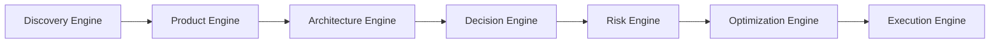
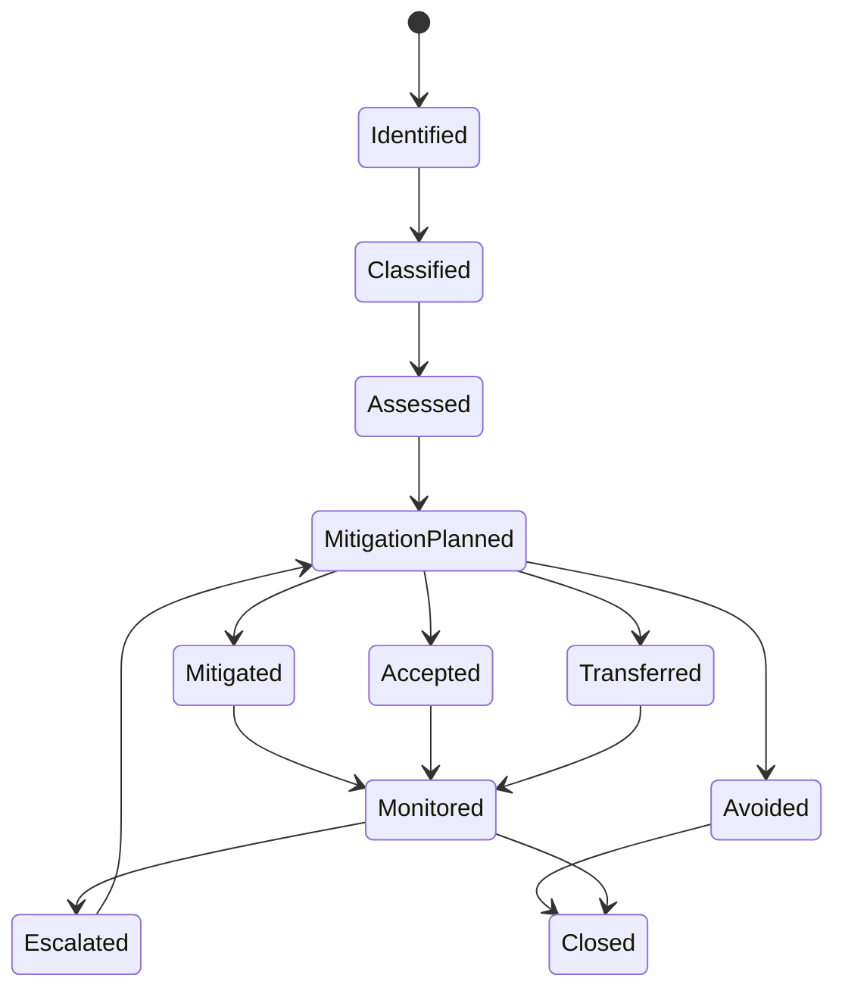
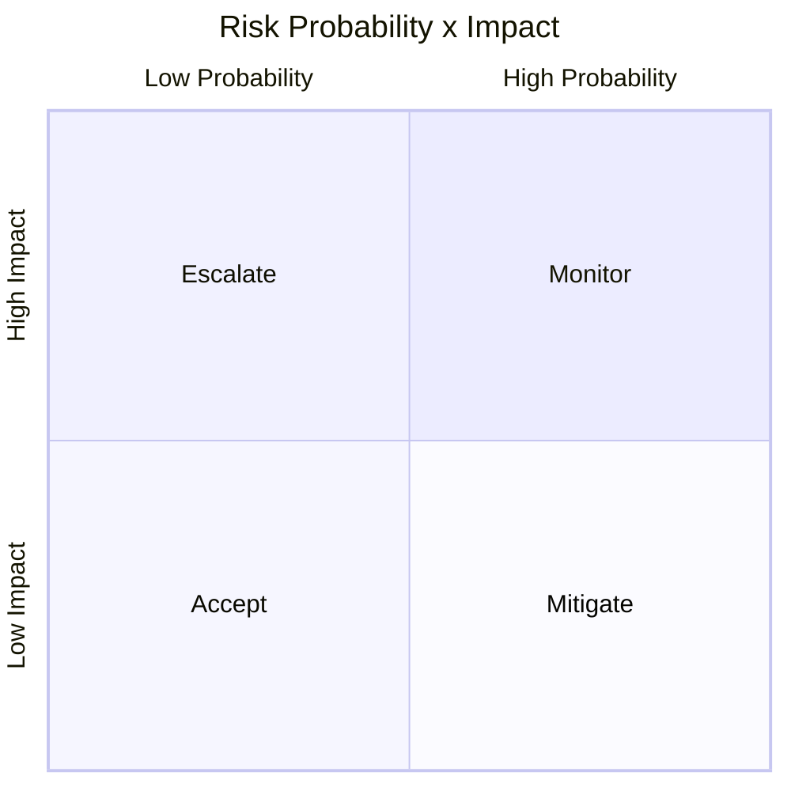

# Risk Engine

## 1. Purpose

The Risk Engine is the AI-SEOS operating engine responsible for identifying, classifying, prioritizing, mitigating, accepting and monitoring project risks.

The purpose of the Risk Engine is not to eliminate risk.

Risk cannot be eliminated from meaningful software work.

The purpose is to make risk visible, intentional, manageable and connected to decisions.

In AI-SEOS, a risk that is not documented is not controlled.

## 2. Why the Risk Engine exists

AI-assisted engineering can accelerate planning and implementation, but speed can hide risk.

Common failures include:

- security risk discovered too late;
- cost risk ignored until scale;
- compliance risk discovered after launch;
- vendor lock-in accepted accidentally;
- operational risk ignored during architecture;
- performance risk postponed until users complain;
- product risk separated from technical decisions;
- unclear ownership of mitigations;
- risk accepted without authority.

The Risk Engine prevents hidden fragility.

## 3. Position in AI-SEOS



The Risk Engine receives decisions and architecture candidates. It outputs mitigations, acceptances, blockers and monitoring requirements.

## 4. Risk definition

A risk is a possible future event, condition or uncertainty that can negatively affect project outcomes.

A risk must include:

- event or condition;
- cause;
- impact;
- probability;
- owner;
- mitigation;
- trigger;
- status.

Bad risk:

> Security could be bad.

Good risk:

> If tenant isolation is implemented only through client-side filtering, one tenant may access another tenant's data, causing data breach, legal exposure and loss of trust.

## 5. Risk lifecycle



## 6. Risk taxonomy

AI-SEOS classifies risks by category.

### 6.1 Product risk

Risk that the product does not solve a meaningful problem or does not deliver sufficient value.

Examples:

- wrong user segment;
- unclear willingness to pay;
- MVP too broad;
- feature does not map to user pain;
- weak activation path.

### 6.2 Technical risk

Risk related to system design, implementation or technology choices.

Examples:

- poor architecture fit;
- immature dependency;
- data model cannot support reporting;
- scalability bottleneck;
- integration complexity.

### 6.3 Security risk

Risk related to confidentiality, integrity, availability, authentication, authorization or abuse.

Examples:

- broken access control;
- secret leakage;
- weak authentication;
- insecure webhook validation;
- over-permissive database rules.

### 6.4 Compliance and legal risk

Risk related to laws, regulations, contracts or policy obligations.

Examples:

- personal data processing without legal basis;
- data residency issue;
- missing retention policy;
- payment compliance issue;
- audit requirements ignored.

### 6.5 Operational risk

Risk related to running the system in production.

Examples:

- no observability;
- no backup strategy;
- no incident response;
- deployment process fragile;
- manual operational dependency.

### 6.6 Cost risk

Risk related to unexpected or unsustainable cost.

Examples:

- cloud cost increases with usage;
- AI token cost grows with traffic;
- vendor pricing changes;
- inefficient storage model;
- overengineered infrastructure.

### 6.7 Delivery risk

Risk related to time, coordination, team capacity and execution.

Examples:

- scope too large for sprint;
- critical dependency unavailable;
- unclear ownership;
- agent handoff incomplete;
- requirements unstable.

### 6.8 Vendor and lock-in risk

Risk related to dependency on external providers.

Examples:

- proprietary database APIs;
- hard-to-migrate auth provider;
- vendor-specific serverless functions;
- pricing dependency;
- limited export capabilities.

### 6.9 AI-specific risk

Risk related to artificial intelligence behavior, cost, accuracy or governance.

Examples:

- hallucinated recommendations;
- prompt injection;
- model drift;
- privacy leakage to model provider;
- nondeterministic outputs;
- hidden token cost;
- agent overreach.

## 7. Probability scale

| Probability | Meaning |
|---|---|
| 1 Very Low | Unlikely under normal conditions |
| 2 Low | Possible but not expected |
| 3 Medium | Plausible and should be planned for |
| 4 High | Likely without mitigation |
| 5 Very High | Expected or already happening |

## 8. Impact scale

| Impact | Meaning |
|---|---|
| 1 Very Low | Minor inconvenience |
| 2 Low | Local issue with limited impact |
| 3 Medium | Meaningful project impact |
| 4 High | Major delay, cost, security or customer impact |
| 5 Critical | Business-critical, legal, security or existential impact |

## 9. Risk score

```text
risk_score = probability * impact
```

| Score | Level |
|---:|---|
| 1-4 | Low |
| 5-9 | Medium |
| 10-16 | High |
| 17-25 | Critical |

## 10. Risk response strategies

### 10.1 Avoid

Change plan to remove risk.

Example:

Avoid handling card data directly by using a payment provider.

### 10.2 Mitigate

Reduce probability or impact.

Example:

Mitigate tenant isolation risk by enforcing server-side authorization tests.

### 10.3 Transfer

Move risk to another party.

Example:

Use managed infrastructure with SLA instead of self-hosting.

### 10.4 Accept

Explicitly accept risk.

Risk acceptance must be documented.

High or critical risk acceptance requires owner and approval.

### 10.5 Monitor

Track risk indicators.

Example:

Monitor AI cost per user weekly during beta.

## 11. Risk object model

```yaml
risk_id: RISK-0000
title:
category: product|technical|security|compliance|operational|cost|delivery|vendor|ai
status: identified|classified|assessed|mitigation_planned|mitigated|accepted|transferred|avoided|monitored|closed|escalated
owner:
source:
related_decision:
related_adr:
description:
cause:
impact_statement:
probability: 1-5
impact: 1-5
score:
level: low|medium|high|critical
detection_signal:
trigger:
response_strategy: avoid|mitigate|transfer|accept|monitor
mitigation_plan:
acceptance_rationale:
approval_required:
approved_by:
due_date:
review_cadence:
notes:
```

## 12. Risk quality gates

### Gate 1: Identification Gate

- Risk is stated as a future event or condition.
- Risk has a cause.
- Risk has an impact statement.

### Gate 2: Classification Gate

- Category is assigned.
- Source artifact is linked.
- Owner is assigned.

### Gate 3: Assessment Gate

- Probability is scored.
- Impact is scored.
- Level is calculated.
- Rationale is documented.

### Gate 4: Response Gate

- Strategy is selected.
- Mitigation or acceptance is documented.
- Due date exists when action is needed.

### Gate 5: Approval Gate

- High and critical risks have approval or escalation.
- Accepted risks have explicit owner.

### Gate 6: Monitoring Gate

- Trigger signals exist.
- Review cadence exists.
- Risk status can be updated.

## 13. Risk escalation rules

Escalate when:

- risk level is critical;
- security risk is high or critical;
- compliance risk is medium or above;
- no owner exists;
- mitigation is overdue;
- risk affects launch readiness;
- risk contradicts accepted ADR;
- risk requires human business decision;
- risk acceptance exceeds AI agent authority.

## 14. Risk matrix



## 15. Example risk register entries

### Example 1: Tenant isolation

```yaml
risk_id: RISK-0001
title: Weak tenant isolation may expose data across organizations
category: security
status: assessed
owner: Chief Security Agent
source: Architecture Engine
related_adr: adr/xxxx
description: Multi-tenant records may be queried without strict tenant scoping.
cause: Access control implemented inconsistently across application paths.
impact_statement: A tenant could access another tenant's data, causing breach and legal exposure.
probability: 3
impact: 5
score: 15
level: high
detection_signal: Authorization tests fail or queries without tenant_id are detected.
response_strategy: mitigate
mitigation_plan: Enforce tenant scoping at repository/service layer and add automated tests.
approval_required: true
review_cadence: every sprint until mitigated
```

### Example 2: AI token cost

```yaml
risk_id: RISK-0002
title: AI usage cost may scale faster than revenue
category: ai
status: mitigation_planned
owner: AI CTO
source: Product Engine
impact_statement: Per-user inference cost may make pricing unsustainable.
probability: 3
impact: 4
score: 12
level: high
response_strategy: mitigate
mitigation_plan: Add usage limits, caching, model routing and cost dashboards.
```

## 16. Risk anti-patterns

- Risk list without owners.
- Risk scoring without rationale.
- Security risk treated as generic technical risk.
- Compliance risk postponed until launch.
- Vendor risk ignored because tool is convenient.
- Accepted risk without approver.
- Mitigation plan that is only “be careful”.
- Risk register never reviewed.
- Risk hidden inside ADR consequences only.
- AI risk treated as normal software risk without model-specific analysis.

## 17. Implementation requirements for Sprint 3

Codex must create:

- `operating-system/risk/README.md`
- `operating-system/risk/risk-engine.md`
- `operating-system/risk/risk-lifecycle.md`
- `operating-system/risk/risk-taxonomy.md`
- `operating-system/risk/risk-object-model.md`
- `operating-system/risk/risk-quality-gates.md`
- `frameworks/risk-framework/README.md`
- `frameworks/risk-framework/risk-assessment-framework.md`
- `protocols/risk-assessment/README.md`

Codex must create ADR 0022.

## 18. Definition of Done

The Risk Engine is done when:

- risk lifecycle exists;
- risk taxonomy exists;
- risk object model exists;
- probability and impact scales exist;
- risk matrix exists;
- response strategies exist;
- escalation rules exist;
- quality gates exist;
- templates exist;
- ADR 0022 exists;
- ADR 0023 and 0024 connect risk register and classification model.
