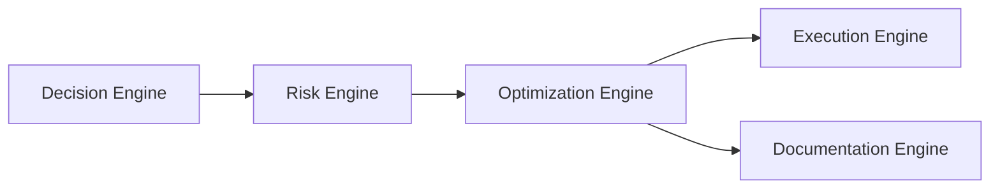
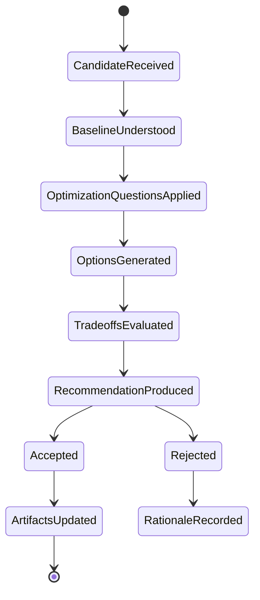

# Optimization Engine

## 1. Purpose

The Optimization Engine is the AI-SEOS operating engine responsible for improving decisions, architectures, product scope and execution plans before they become expensive commitments.

It asks one core question:

> Can this be made simpler, safer, cheaper, faster to deliver, easier to maintain, more scalable, or more reversible without sacrificing essential value?

The Optimization Engine is not premature performance tuning.

It is a structured review layer that prevents avoidable complexity.

## 2. Why the Optimization Engine exists

Software systems often accumulate unnecessary complexity before implementation begins.

Common causes:

- architecture designed for imaginary scale;
- MVP inflated by stakeholder enthusiasm;
- tools chosen for popularity;
- security bolted on later;
- costly vendors adopted without cost model;
- unnecessary microservices;
- unclear module boundaries;
- over-automation;
- insufficient reversibility;
- AI added where deterministic logic is better.

The Optimization Engine protects the project from both underengineering and overengineering.

## 3. Position in AI-SEOS



Optimization happens after risk review and before execution planning.

This prevents the Execution Engine from turning an avoidably complex design into a backlog.

## 4. Optimization dimensions

### 4.1 Simplicity optimization

Can the solution be easier to understand?

Questions:

- Can one component be removed?
- Can one workflow be simplified?
- Can a custom implementation be replaced by convention?
- Can synchronous flow replace asynchronous flow for now?
- Can a modular monolith replace distributed services?

### 4.2 Cost optimization

Can the solution reduce financial cost without unacceptable trade-offs?

Questions:

- What are the main cost drivers?
- Does cost scale with users, data, requests, tokens or storage?
- Can caching reduce repeated cost?
- Can model routing reduce AI cost?
- Can managed service cost be justified by team savings?

### 4.3 Complexity optimization

Can accidental complexity be removed?

Questions:

- Is complexity essential or accidental?
- Does the team have the skill to maintain it?
- Does complexity reduce or increase risk?
- Is complexity being added for future scenarios that may never happen?

### 4.4 Maintainability optimization

Can future changes be easier?

Questions:

- Are module boundaries clear?
- Are responsibilities cohesive?
- Are names understandable?
- Are decisions documented?
- Are tests aligned with risk?

### 4.5 Scalability optimization

Can the system grow appropriately without premature scale design?

Questions:

- What scale is actually expected in the next 3 months?
- What scale is expected in 12 months?
- What scale would require redesign?
- Can the current architecture degrade gracefully?
- Are extraction points documented?

### 4.6 Security optimization

Can the solution reduce attack surface?

Questions:

- Can permissions be narrower?
- Can secrets be removed from runtime paths?
- Can sensitive data be minimized?
- Can risky integration be isolated?
- Can defaults be safer?

### 4.7 Reversibility optimization

Can the decision be easier to undo?

Questions:

- Can dependency be wrapped?
- Can data export be preserved?
- Can migration path be documented?
- Can feature be launched behind a flag?
- Can rollout be staged?

### 4.8 AI optimization

Can AI usage be safer, cheaper or more deterministic?

Questions:

- Is AI necessary?
- Can deterministic rules solve this?
- Can smaller model solve this?
- Can retrieval reduce hallucination?
- Can prompt/output validation reduce risk?
- Can human review be inserted for high-impact actions?

## 5. Optimization lifecycle



## 6. Optimization levels

| Level | Description | Use case |
|---|---|---|
| O0 | No optimization needed | Local decision, low impact |
| O1 | Checklist optimization | Small module or template |
| O2 | Structured optimization review | MVP scope, architecture component |
| O3 | Full optimization analysis | Major architecture/product decision |
| O4 | Strategic optimization | Cost, scale, vendor or AI strategy |
| O5 | Human-reviewed optimization | High-risk or irreversible optimization |

## 7. Optimization object model

```yaml
optimization_id: OPT-0000
title:
source_decision:
source_adr:
source_risk:
level: O0|O1|O2|O3|O4|O5
owner:
status: candidate|reviewed|recommended|accepted|rejected|implemented
baseline:
  description:
  cost_drivers:
  complexity_drivers:
  risk_drivers:
optimization_dimensions:
  simplicity:
  cost:
  complexity:
  maintainability:
  scalability:
  security:
  reversibility:
  ai:
options:
  - name:
    description:
    benefits:
    tradeoffs:
    risks:
recommendation:
  selected_option:
  rationale:
  expected_benefit:
  accepted_tradeoffs:
artifact_updates:
  - path:
revalidation_triggers:
```

## 8. Optimization quality gates

### Gate 1: Baseline Gate

- Current decision/design is understood.
- Optimization target is clear.
- Baseline cost/complexity/risk is described.

### Gate 2: Dimension Gate

- Relevant optimization dimensions are selected.
- Irrelevant dimensions are explicitly skipped.

### Gate 3: Option Gate

- At least two optimization options are considered when meaningful.
- “Keep current design” is considered.

### Gate 4: Trade-off Gate

- Optimization benefit is clear.
- New risks are identified.
- Sacrifices are explicit.

### Gate 5: Artifact Gate

- Updated decisions are reflected in ADRs/templates/docs.
- Execution constraints are updated.

## 9. Optimization review questions

### 9.1 Simplicity

- What can be removed?
- What can be postponed?
- What can be merged?
- What can use a convention?
- What can become a manual process temporarily?

### 9.2 Cost

- What costs grow with usage?
- What costs grow with data?
- What costs grow with AI tokens?
- What costs are fixed?
- What costs are hidden in operations?

### 9.3 Complexity

- What requires specialized knowledge?
- What increases debugging difficulty?
- What increases deployment complexity?
- What increases coordination overhead?

### 9.4 Maintainability

- What will future maintainers misunderstand?
- What code or document will be hard to change?
- What decisions are not documented?

### 9.5 Scalability

- What is the first bottleneck?
- What is the second bottleneck?
- What scale invalidates the design?
- Can the system evolve incrementally?

### 9.6 Security

- What permission can be narrowed?
- What sensitive data can be removed?
- What external surface can be reduced?

### 9.7 Reversibility

- What decision is hardest to undo?
- What migration path should exist?
- What abstraction protects future options?

### 9.8 AI

- What AI calls can be avoided?
- What AI outputs require validation?
- What user impact requires human review?
- What context should not be sent to models?

## 10. Optimization anti-patterns

- Optimizing performance before product fit.
- Reducing cost by increasing unacceptable operational risk.
- Simplifying by removing essential security controls.
- Choosing complex architecture to appear enterprise-ready.
- Treating AI as default solution.
- Ignoring human operational cost.
- Optimizing one metric while damaging maintainability.
- Optimizing without updating artifacts.
- Rejecting optimization because implementation already started.

## 11. Optimization outputs

The Optimization Engine produces:

- Optimization Review;
- Simplification Recommendation;
- Cost Reduction Recommendation;
- Scalability Adjustment;
- Security Hardening Recommendation;
- Reversibility Improvement;
- AI Usage Optimization;
- Updated ADR;
- Updated Architecture Overview;
- Updated Product Scope;
- Execution Constraints.

## 12. Implementation requirements for Sprint 3

Codex must create:

- `operating-system/optimization/README.md`
- `operating-system/optimization/optimization-engine.md`
- `operating-system/optimization/optimization-lifecycle.md`
- `operating-system/optimization/optimization-object-model.md`
- `operating-system/optimization/optimization-quality-gates.md`
- `frameworks/optimization-framework/README.md`
- `frameworks/optimization-framework/optimization-framework.md`
- `protocols/optimization-review/README.md`

Codex must create ADR 0025:

- `adr/0025-adopt-optimization-engine.md`

## 13. Definition of Done

The Optimization Engine is done when:

- optimization dimensions exist;
- lifecycle exists;
- levels O0-O5 exist;
- object model exists;
- quality gates exist;
- optimization review questions exist;
- anti-patterns exist;
- templates exist;
- ADR 0025 exists;
- engine is connected to Decision, Risk and future Execution.
