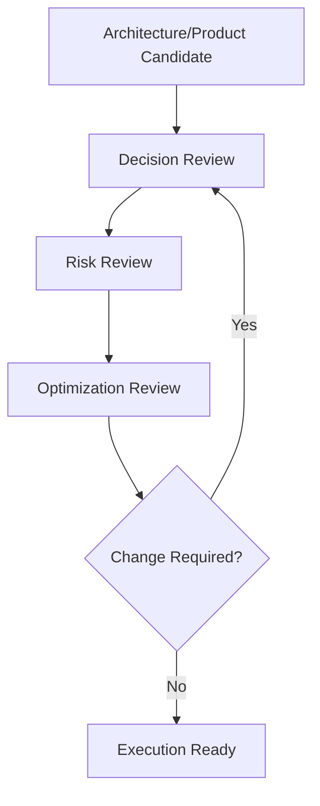

# Decision, Risk and Optimization Playbook

## 1. Purpose

This playbook defines how AI-SEOS applies Decision Engine, Risk Engine and Optimization Engine together during real project work.

These engines must not operate as isolated documents.

They form a review loop:



## 2. When to use this playbook

Use this playbook when:

- choosing architecture;
- defining MVP scope;
- introducing vendor dependency;
- designing multi-tenant model;
- designing payment flow;
- designing AI feature;
- choosing database or backend platform;
- defining deployment strategy;
- accepting high/critical risk;
- moving from planning to execution.

## 3. Roles

| Role | Responsibility |
|---|---|
| AI CTO | Owns overall recommendation and trade-offs |
| Product Agent | Confirms product value and MVP scope |
| Architecture Agent | Provides technical alternatives |
| Risk Agent | Identifies and scores risk |
| Optimization Agent | Simplifies and improves solution |
| Security Agent | Reviews security and compliance risks |
| Human Owner | Approves strategic or high-risk decisions |

## 4. Inputs

- Discovery Document;
- PRD;
- MVP Scope;
- Product Backlog;
- Architecture Overview;
- Domain Model;
- Integration Model;
- Decision Candidates;
- Known constraints;
- Existing ADRs;
- Existing Risk Register.

## 5. Outputs

- Decision Record;
- Decision Matrix;
- ADR;
- Risk Assessment;
- Risk Register Update;
- Optimization Review;
- Updated Architecture/Product artifacts;
- Execution constraints;
- Handoff to Execution Engine.

## 6. Playbook flow

### Step 1: Confirm decision candidate

Ask:

- What decision must be made?
- Why now?
- What happens if we defer?
- What artifact created this decision?
- Who owns the decision?

Output:

- decision candidate created;
- decision class assigned.

### Step 2: Frame decision question

Use the decision question pattern:

```text
For [context], given [constraints], should we choose [category] among [alternatives] to achieve [goal] while optimizing for [priority]?
```

Output:

- framed decision question.

### Step 3: Generate alternatives

Generate at least three real alternatives.

Include:

- simple option;
- recommended candidate;
- robust option;
- defer/no-decision option when uncertainty is high;
- hybrid option when migration matters.

Output:

- alternatives profile.

### Step 4: Build decision matrix

Select criteria and weights.

Score alternatives.

Explain scores.

Output:

- weighted decision matrix.

### Step 5: Produce preliminary recommendation

Recommendation must include:

- chosen option;
- rationale;
- trade-offs;
- reversibility;
- implementation consequences.

Output:

- preliminary decision record.

### Step 6: Run risk review

Identify risks from recommendation.

Classify risks.

Score probability and impact.

Assign owners.

Output:

- risk assessments;
- risk register updates.

### Step 7: Decide risk response

For each high/critical risk:

- avoid;
- mitigate;
- transfer;
- accept;
- monitor.

Accepted high/critical risk requires explicit approval.

Output:

- mitigation plan or acceptance record.

### Step 8: Run optimization review

Ask:

- Can this be simpler?
- Can this be cheaper?
- Can this be safer?
- Can this be more maintainable?
- Can this be more reversible?
- Can this scale appropriately without overengineering?
- Can AI usage be reduced or made safer?

Output:

- optimization review.

### Step 9: Reconcile changes

If optimization materially changes the recommendation, return to decision review.

If risk is unacceptable, return to alternatives.

If artifacts change, update all dependent docs.

Output:

- final recommendation.

### Step 10: Create ADR

Create ADR when required.

Output:

- ADR accepted/proposed.

### Step 11: Handoff to Execution

Execution handoff must include:

- final decision;
- ADR links;
- risk mitigations;
- optimization constraints;
- implementation guardrails;
- validation requirements;
- revalidation triggers.

## 7. Decision review checklist

- [ ] Decision question is explicit.
- [ ] Decision class assigned.
- [ ] At least three alternatives included.
- [ ] Criteria and weights are explicit.
- [ ] Matrix completed.
- [ ] Trade-offs documented.
- [ ] Reversibility assessed.
- [ ] ADR requirement evaluated.

## 8. Risk review checklist

- [ ] Risks identified by category.
- [ ] Probability scored.
- [ ] Impact scored.
- [ ] Risk level calculated.
- [ ] Owners assigned.
- [ ] High/critical risks mitigated or accepted.
- [ ] Accepted risks approved.
- [ ] Risk register updated.

## 9. Optimization review checklist

- [ ] Simplicity reviewed.
- [ ] Cost reviewed.
- [ ] Complexity reviewed.
- [ ] Maintainability reviewed.
- [ ] Scalability reviewed.
- [ ] Security reviewed.
- [ ] Reversibility reviewed.
- [ ] AI usage reviewed when applicable.
- [ ] Artifact updates listed.

## 10. Example: choosing architecture style

### Context

Small team building early SaaS MVP.

### Decision

Modular monolith vs microservices vs serverless functions.

### Risk findings

- Microservices increase operational risk.
- Serverless functions may fragment domain logic.
- Modular monolith may require discipline to preserve boundaries.

### Optimization findings

- Modular monolith provides best simplicity/delivery balance.
- Add module boundary documentation.
- Define future service extraction criteria.

### Final recommendation

Adopt modular monolith with explicit module boundaries and ADR-defined extraction triggers.

## 11. Example: choosing AI feature approach

### Context

Product wants automated recommendations.

### Alternatives

- deterministic rules;
- LLM prompt-based recommendations;
- RAG-assisted recommendations;
- fine-tuned model.

### Risk findings

- hallucination risk;
- privacy risk;
- cost risk;
- explainability risk.

### Optimization findings

- deterministic rules may solve MVP need.
- LLM can be added later for advanced cases.

### Final recommendation

Start with deterministic rules and instrument outcomes. Revisit AI after evidence shows rules are insufficient.

## 12. Required canonical files

Codex must create:

- `playbooks/decision-risk-optimization/README.md`
- `playbooks/decision-risk-optimization/decision-review-playbook.md`
- `playbooks/decision-risk-optimization/risk-review-playbook.md`
- `playbooks/decision-risk-optimization/optimization-review-playbook.md`
- `playbooks/decision-risk-optimization/execution-readiness-review.md`

## 13. Definition of Done

The playbook is done when:

- integrated flow exists;
- roles are defined;
- inputs and outputs are defined;
- review steps are documented;
- checklists exist;
- examples exist;
- handoff to Execution Engine exists.
