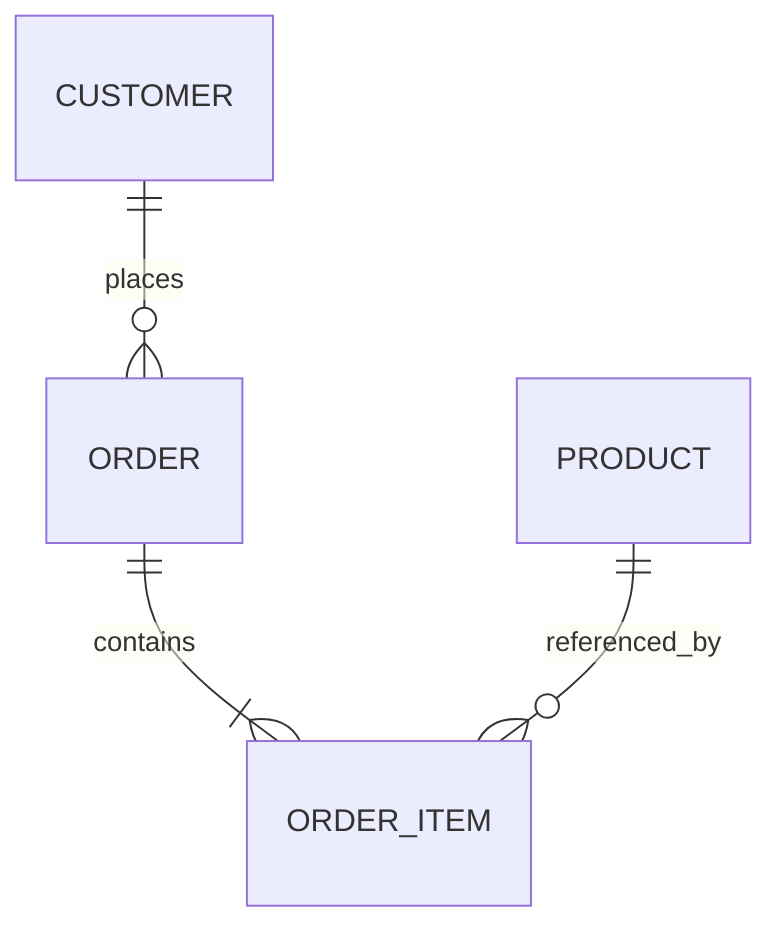

# pt74 — Professional Engineer Template Pack

## 1. Purpose

The Professional Engineer Template Pack provides rigorous artifacts for developers, architects, tech leads, staff engineers and engineering teams. It must support traceability, design review, implementation readiness, architecture evolution and long-term maintainability.

This pack assumes technical literacy. It can use terms such as domain model, aggregate, bounded context, NFR, ADR, API contract, deployment topology, SLO, idempotency, eventing, observability and tenancy.

## 2. User Profile

The Professional Engineer:

- expects clear technical artifacts;
- wants decision traceability;
- needs implementation-ready backlog;
- may work with teams, pull requests and CI/CD;
- cares about maintainability, security and scalability;
- needs explicit trade-offs;
- may use AI agents as collaborators.

## 3. Required Templates

Sprint 6 must create:

```text
templates/packs/professional-engineer-pack/README.md
templates/intake/professional-engineer/technical-discovery-intake.md
templates/intake/professional-engineer/requirements-capture-template.md
templates/intake/professional-engineer/non-functional-requirements-template.md
templates/intake/professional-engineer/domain-model-template.md
templates/intake/professional-engineer/architecture-options-template.md
templates/intake/professional-engineer/architecture-review-template.md
templates/intake/professional-engineer/technical-adr-template.md
templates/intake/professional-engineer/risk-register-template.md
templates/intake/professional-engineer/execution-readiness-template.md
templates/intake/professional-engineer/engineering-handoff-template.md
templates/examples-filled/professional-engineer/marketplace-platform-example.md
```

## 4. Technical Discovery Intake

Create a template with these sections:

```markdown
# Technical Discovery Intake

## 1. Project Context

## 2. Business Goals

## 3. User Segments

## 4. Functional Scope

## 5. Non-Functional Requirements

## 6. Constraints

## 7. Existing Systems

## 8. Integrations

## 9. Data and Domain Concepts

## 10. Security and Compliance Requirements

## 11. Operational Requirements

## 12. Delivery Constraints

## 13. Known Risks

## 14. Open Questions

## 15. Required Decisions
```

## 5. Non-Functional Requirements Template

The NFR template must cover:

- performance;
- availability;
- scalability;
- security;
- compliance;
- reliability;
- observability;
- maintainability;
- portability;
- accessibility;
- data retention;
- disaster recovery;
- privacy;
- operational support.

Each NFR must include:

```text
Requirement:
Rationale:
Target:
Measurement:
Priority:
Risk if unmet:
Validation method:
```

## 6. Domain Model Template

The domain model template must include:

- business capabilities;
- entities;
- value objects;
- aggregates;
- relationships;
- bounded contexts;
- domain events;
- lifecycle states;
- invariants;
- permissions;
- data ownership;
- open modeling questions.

Include Mermaid examples:



## 7. Architecture Options Template

Must include at least three alternatives:

```markdown
# Architecture Options

## Context

## Decision Drivers

## Option A

## Option B

## Option C

## Comparison Matrix

| Criterion | Weight | Option A | Option B | Option C |
|---|---:|---:|---:|---:|
| Maintainability |  |  |  |  |
| Cost |  |  |  |  |
| Scalability |  |  |  |  |
| Security |  |  |  |  |
| Delivery Speed |  |  |  |  |
| Operational Complexity |  |  |  |  |

## Recommendation

## ADRs Required
```

## 8. Architecture Review Template

Must include:

- architecture overview;
- C4-inspired views;
- data flow;
- trust boundaries;
- failure modes;
- scalability path;
- cost model;
- observability;
- security review;
- decision log;
- unresolved risks;
- review outcome.

## 9. Execution Readiness Template

The template must determine whether a project is ready for implementation.

Readiness dimensions:

- Product readiness;
- Architecture readiness;
- Decision readiness;
- Risk readiness;
- Security readiness;
- Delivery readiness;
- Documentation readiness;
- Team/agent readiness.

## 10. Output Contract

The Professional Engineer Pack must produce:

- Technical Discovery Intake;
- Requirements Document;
- NFR Spec;
- Domain Model;
- Architecture Options;
- ADRs;
- Risk Register;
- Execution Readiness Report;
- Engineering Handoff.

## 11. Definition of Done

The pack is complete when it can support a professional architecture review and handoff to implementation.
