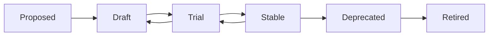

# Protocol System and Lifecycle

## Purpose

This document defines the final protocol system for Sprint 7.

Sprints 0 through 6 created the foundation, operating engines, cross-engine integration, entry modes and template packs. Sprint 7 must make the framework operationally usable by standardizing how protocols are catalogued, executed, reviewed, versioned, deprecated and applied in real projects.

A protocol in AI-SEOS is not a casual checklist. A protocol is an operational contract that defines how a repeated engineering activity is performed, what inputs it requires, what outputs it must produce, which quality gates apply and which downstream artifacts depend on it.

## Why this belongs in Sprint 7

Sprint 7 is the consolidation sprint. At this stage, the framework must stop being only a set of well-structured documents and become a usable operating system. Protocols are the operational layer that allows the framework to be executed consistently.

Without a protocol system:

- engines may produce inconsistent artifacts;
- agents may interpret the same lifecycle differently;
- templates may be used without context;
- handoffs may lose traceability;
- users may not know which process to follow;
- future contributors may create incompatible protocols.

With a protocol system:

- every recurring activity has an official path;
- every path has a clear input and output;
- every output can be validated;
- every protocol can evolve safely;
- the framework becomes teachable and repeatable.

## Protocol Categories

AI-SEOS must organize protocols into the following categories.

### 1. Intake Protocols

Used before formal discovery.

Examples:

- Mode Router Protocol
- Builder Intake Protocol
- Non-Technical Builder Interview Protocol
- Vibe Coder Intake Protocol
- Professional Engineer Intake Protocol

### 2. Discovery Protocols

Used to understand the problem, domain, users, constraints and opportunity.

Examples:

- Project Discovery Protocol
- Stakeholder Discovery Protocol
- Domain Discovery Protocol
- Constraint Discovery Protocol
- Problem Validation Protocol

### 3. Product Protocols

Used to transform discovery into product definition.

Examples:

- PRD Creation Protocol
- MVP Definition Protocol
- Scope Control Protocol
- Feature Prioritization Protocol
- Roadmap Definition Protocol

### 4. Architecture Protocols

Used to transform product requirements into technical shape.

Examples:

- Architecture Review Protocol
- Domain Modeling Protocol
- Integration Modeling Protocol
- Architecture Decision Protocol
- Technical Constraint Review Protocol

### 5. Decision Protocols

Used to compare options and record decisions.

Examples:

- Decision Review Protocol
- Weighted Decision Matrix Protocol
- ADR Lifecycle Protocol
- Decision Escalation Protocol
- Reversal Planning Protocol

### 6. Risk Protocols

Used to identify, classify, score and mitigate risk.

Examples:

- Risk Assessment Protocol
- Security Risk Protocol
- Vendor Risk Protocol
- Compliance Review Protocol
- Operational Risk Review Protocol

### 7. Optimization Protocols

Used to reduce cost, complexity, latency, coupling and operational burden.

Examples:

- Cost Optimization Protocol
- Complexity Reduction Protocol
- Scalability Review Protocol
- AI Cost Review Protocol
- Maintainability Optimization Protocol

### 8. Execution Protocols

Used to convert validated plans into implementation work.

Examples:

- Execution Planning Protocol
- Sprint Planning Protocol
- Milestone Protocol
- Work Package Protocol
- Release Candidate Protocol

### 9. Documentation Protocols

Used to keep documentation accurate, useful and versioned.

Examples:

- Documentation Maintenance Protocol
- Documentation Drift Review Protocol
- Template Maintenance Protocol
- Docs Information Architecture Protocol
- Public Documentation Review Protocol

### 10. Handoff Protocols

Used to pass artifacts between agents or humans.

Examples:

- Agent Handoff Protocol
- Context Package Protocol
- Handoff Receipt Protocol
- Gap Escalation Protocol
- Implementation Handoff Protocol

### 11. Reflection Protocols

Used after execution to learn and improve.

Examples:

- Retrospective Protocol
- System Review Protocol
- Improvement Backlog Protocol
- Decision Outcome Review Protocol
- Framework Learning Protocol

### 12. Release and Community Protocols

Used to publish, maintain and evolve the open-source project.

Examples:

- Release Readiness Protocol
- Versioning Protocol
- Contributor Review Protocol
- Issue Triage Protocol
- Community Adoption Protocol

## Standard Protocol Document Structure

Every protocol must include:

```markdown
# Protocol Name

## Metadata
- Version
- Status
- Owner
- Related Engines
- Related Templates
- Related ADRs
- Review Cycle

## Purpose

## When To Use

## When Not To Use

## Input Contract

## Output Contract

## Actors

## Preconditions

## Execution Steps

## Quality Gates

## Failure Modes

## Escalation Rules

## Examples

## Checklist

## Related Artifacts

## Change History
```

## Protocol Lifecycle



## Protocol Status Definitions

### Proposed

A protocol idea has been identified but not yet written.

### Draft

The protocol exists but has not been validated in real examples.

### Trial

The protocol is usable but should be tested in at least one reference implementation.

### Stable

The protocol is officially recommended.

### Deprecated

The protocol remains available but should not be used for new work.

### Retired

The protocol is removed from active usage and preserved only for historical reference.

## Protocol Quality Gates

A protocol may be considered complete only when:

- it has a clear purpose;
- it defines when to use and when not to use it;
- it has explicit inputs and outputs;
- it includes quality gates;
- it has at least one example;
- it links to related templates;
- it can be executed by a human or AI agent;
- it does not duplicate another protocol;
- it has a documented lifecycle status.

## Required Sprint 7 Outputs

Codex must create or update:

- `docs/protocols/protocol-system.md`
- `docs/protocols/protocol-lifecycle.md`
- `docs/protocols/protocol-registry.md`
- `docs/protocols/protocol-taxonomy.md`
- `protocols/README.md`
- `templates/protocols/protocol-template.md`
- `templates/protocols/protocol-review-checklist.md`

## Definition of Done

Sprint 7 must not be considered complete until the protocol system is documented, indexed and connected to the lifecycle, template packs and reference examples.

