# Phase 2 — First End-to-End Validation Case

## 1. Purpose

This document defines how AI-SEOS must be validated through its first complete end-to-end project run.

The purpose is not to add more documentation for its own sake.

The purpose is to prove that AI-SEOS can actually take a raw idea through the full lifecycle:

```mermaid
flowchart LR
    A[Raw Idea] --> B[Entry Mode]
    B --> C[Builder Intake]
    C --> D[Discovery]
    D --> E[Product]
    E --> F[Architecture]
    F --> G[Decision]
    G --> H[Risk]
    H --> I[Optimization]
    I --> J[Execution]
    J --> K[Documentation]
    K --> L[Handoff]
    L --> M[Reflection]
```



## 2. Why This Exists After Sprint 7

Sprints 0-7 created a strong framework. However, a framework is not proven by its number of files.

A framework is proven when it helps a real user produce a better result than they would have produced without it.

The first end-to-end validation case must answer:

- Does the Entry Modes Layer route users correctly?
- Does the Builder Intake Protocol produce useful context?
- Does Discovery produce complete enough outputs?
- Does Product Engine generate a clear MVP?
- Does Architecture Engine produce usable design guidance?
- Does Decision Engine produce traceable ADRs?
- Does Risk Engine identify real risks?
- Does Optimization Engine reduce complexity and cost?
- Does Execution Engine create buildable work packages?
- Does Documentation Engine keep artifacts organized?
- Does Handoff Engine produce usable context for another agent?
- Does Reflection Engine identify improvements?

## 3. Validation Case Selection Criteria

The first validation case must be:

1. concrete enough to test real artifacts;
2. familiar enough to understand without deep domain research;
3. complex enough to require multiple engines;
4. simple enough to complete in public-alpha scope;
5. useful for all three user profiles;
6. able to demonstrate business, product, architecture, security and execution trade-offs.

## 4. Recommended First Case

The recommended first case is:

```text
A SaaS for martial arts academies to manage students, payments, attendance and retention.
```

This case is ideal because it includes:

- non-technical business owner persona;
- real operational pain;
- student management;
- payment flows;
- attendance tracking;
- retention workflows;
- basic dashboarding;
- multi-user access;
- privacy and LGPD implications;
- integration potential;
- clear MVP boundaries.

This case can be used across the three entry modes:

1. Non-Technical Builder: academy owner wants to solve a daily management problem.
2. Vibe Coder: builder wants to create the MVP with AI coding tools.
3. Professional Engineer: engineer wants architecture, ADRs and execution plan.

## 5. Required Validation Outputs

The first end-to-end validation must generate the following artifacts.

### 5.1 Entry Mode Artifacts

```text
examples/validation/first-end-to-end-validation-case/00-entry-mode/
    mode-selection.md
    builder-intake.md
    problem-to-software-translation.md
```

### 5.2 Discovery Artifacts

```text
examples/validation/first-end-to-end-validation-case/01-discovery/
    discovery-brief.md
    stakeholder-map.md
    problem-framing.md
    assumptions-register.md
    discovery-readiness-score.md
```

### 5.3 Product Artifacts

```text
examples/validation/first-end-to-end-validation-case/02-product/
    prd.md
    mvp-scope.md
    user-stories.md
    feature-prioritization.md
    product-roadmap.md
```

### 5.4 Architecture Artifacts

```text
examples/validation/first-end-to-end-validation-case/03-architecture/
    architecture-overview.md
    domain-model.md
    integration-model.md
    data-model.md
    c4-context.md
    c4-container.md
```

### 5.5 Decision Artifacts

```text
examples/validation/first-end-to-end-validation-case/04-decisions/
    decision-matrix.md
    adr-0001-platform-approach.md
    adr-0002-data-storage.md
    adr-0003-payment-provider.md
    adr-0004-deployment-strategy.md
```

### 5.6 Risk Artifacts

```text
examples/validation/first-end-to-end-validation-case/05-risk/
    risk-register.md
    security-risk-review.md
    compliance-risk-review.md
    vendor-risk-review.md
```

### 5.7 Optimization Artifacts

```text
examples/validation/first-end-to-end-validation-case/06-optimization/
    cost-optimization.md
    complexity-optimization.md
    scalability-review.md
    mvp-simplification-review.md
```

### 5.8 Execution Artifacts

```text
examples/validation/first-end-to-end-validation-case/07-execution/
    execution-plan.md
    milestones.md
    sprint-plan.md
    technical-backlog.md
    implementation-sequence.md
```

### 5.9 Documentation and Handoff Artifacts

```text
examples/validation/first-end-to-end-validation-case/08-documentation/
    documentation-index.md
    project-readme.md
    docs-map.md

examples/validation/first-end-to-end-validation-case/09-handoff/
    handoff-to-implementation-agent.md
    handoff-to-security-agent.md
    handoff-to-qa-agent.md
```

### 5.10 Reflection Artifacts

```text
examples/validation/first-end-to-end-validation-case/10-reflection/
    validation-retrospective.md
    framework-improvement-backlog.md
    template-improvement-backlog.md
```

## 6. End-to-End Validation Protocol

The validation protocol must follow this sequence.

### Step 1 — Select Case

Pick the project scenario.

### Step 2 — Select Entry Mode

Run mode routing and document why the selected mode was chosen.

### Step 3 — Run Builder Intake

Use the appropriate intake template.

### Step 4 — Run Discovery

Transform intake into discovery outputs.

### Step 5 — Run Product Engine

Generate PRD, MVP and roadmap.

### Step 6 — Run Architecture Engine

Generate architecture overview, domain model and system views.

### Step 7 — Run Decision Engine

Generate at least 3 decision alternatives for major decisions and create ADRs.

### Step 8 — Run Risk Engine

Create risk register and specialized risk reviews.

### Step 9 — Run Optimization Engine

Simplify, reduce cost and reduce unnecessary complexity.

### Step 10 — Run Execution Engine

Create execution plan and implementation-ready backlog.

### Step 11 — Run Documentation and Handoff

Create documentation index and handoff packages.

### Step 12 — Run Reflection

Identify what worked, what failed and what must improve in AI-SEOS.

## 7. Validation Metrics

Use the following metrics.

| Metric | Target |
|---|---:|
| Entry mode clarity | >= 4/5 |
| Discovery completeness | >= 4/5 |
| MVP clarity | >= 4/5 |
| Architecture usability | >= 4/5 |
| Decision traceability | >= 4/5 |
| Risk usefulness | >= 4/5 |
| Execution readiness | >= 4/5 |
| Documentation navigability | >= 4/5 |
| Handoff usability | >= 4/5 |
| Framework improvement insights | >= 5 insights |

## 8. Required Canonical Artifacts

Codex must create or update:

```text
docs/validation/first-end-to-end-validation-case.md
protocols/end-to-end-validation/end-to-end-validation-protocol.md
templates/validation/end-to-end-validation-report-template.md
examples/validation/first-end-to-end-validation-case/README.md
```

And ADR:

```text
adr/0072-adopt-end-to-end-validation-before-alpha-release.md
```

## 9. Quality Gates

This workstream passes only if:

- a complete end-to-end validation structure exists;
- the selected scenario is documented;
- required artifacts are created as files, not merely described;
- the validation protocol is repeatable;
- the validation report template exists;
- ADR 0072 exists;
- improvement backlog is generated.

## 10. Definition of Done

The first end-to-end validation case is done when AI-SEOS has been exercised from raw idea to implementation handoff using a real scenario and the results produce concrete evidence for framework improvement.
