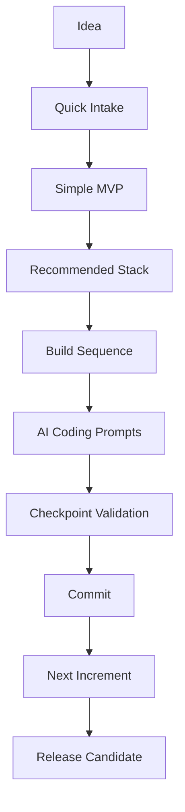

# Phase 2 — Vibe Coder Validation

## 1. Purpose

This document defines how AI-SEOS must be validated with vibe coders.

A vibe coder is a person who uses AI coding tools to build software, but may not have deep engineering experience.

They may use:

- Codex;
- Cursor;
- Claude Code;
- Gemini CLI;
- Replit;
- Lovable;
- Bolt;
- VS Code with AI agents.

They often can prompt, inspect, run and iterate, but may not know how to design maintainable systems.

## 2. Why This Mode Matters

Vibe coding has a powerful advantage: it lowers the barrier to building software.

But without structure, it can produce:

- fragile systems;
- hidden security problems;
- unclear architecture;
- inconsistent files;
- duplicated logic;
- untracked decisions;
- poor deploy hygiene;
- broken handoffs;
- projects that work once but cannot evolve.

AI-SEOS should not kill vibe coding.

It should make vibe coding safer, clearer and more maintainable.

## 3. Validation Goal

The Vibe Coder Mode must prove that it can:

1. turn a user idea into a practical AI coding plan;
2. produce prompts that coding agents can execute;
3. break implementation into safe increments;
4. prevent overengineering;
5. prevent blind copy-paste coding;
6. encourage commits, checkpoints and rollback;
7. provide validation checklists;
8. escalate to professional engineering when risk is high.

## 4. Vibe Coder Operating Style

The tone must be:

- practical;
- direct;
- structured;
- non-condescending;
- action-oriented;
- protective against chaos.

It should say:

```text
Start here.
Build this first.
Do not add this yet.
Test this before continuing.
Commit after this works.
Ask the AI to inspect these files.
```

It should avoid:

```text
Just build everything.
Add microservices.
Add Kubernetes.
Add AI agents everywhere.
Refactor the whole system.
Use every trendy tool.
```

## 5. Required Vibe Coder Workflow

The workflow must include:



## 6. Required AI Coding Guardrails

Every vibe-coder output must include:

1. build one slice at a time;
2. do not skip authentication/security warnings;
3. do not add complex features before core CRUD works;
4. validate after each step;
5. commit working checkpoints;
6. keep secrets out of code;
7. inspect generated code before running unknown commands;
8. avoid deleting large parts of the project without review;
9. document major decisions;
10. create handoff notes.

## 7. Required Template

Create:

```text
templates/validation/vibe-coder-test-script.md
templates/validation/ai-coding-session-report-template.md
```

The AI coding session report must include:

```markdown
# AI Coding Session Report

## Goal

## Tool Used

## Starting State

## Prompt Used

## Files Changed

## Commands Run

## What Worked

## What Failed

## Errors Encountered

## Fixes Applied

## Security Notes

## Validation Checklist

## Commit Hash

## Next Prompt
```

## 8. Validation Scenario

The primary validation scenario should be SenseiHub MVP slice:

```text
Create the first working student management slice:
- authentication stub or real auth depending on project state;
- student list;
- create student;
- edit student;
- basic validation;
- local or remote persistence depending on chosen stack;
- README update;
- commit checkpoint.
```

## 9. Prompt Quality Standard

Vibe Coder prompts must be:

- scoped;
- file-aware;
- incremental;
- testable;
- reversible;
- explicit about constraints;
- explicit about not overbuilding.

Example:

```text
Implement only the Student Management MVP slice.
Do not add payments, attendance, reports or AI features yet.
Before editing, inspect the existing project structure.
Create or update only the necessary files.
After implementation, run the available checks.
Summarize changed files and risks.
```

## 10. Validation Metrics

| Metric | Target |
|---|---:|
| Prompt clarity | >= 4/5 |
| Increment size control | >= 4/5 |
| Build success | >= 1 working slice |
| Error recovery quality | >= 4/5 |
| Security awareness | >= 4/5 |
| Commit discipline | >= 1 checkpoint commit |
| Documentation update | yes |
| Overengineering avoided | yes |

## 11. Required Example Cases

Create:

```text
examples/validation/vibe-coder/
    senseihub-student-slice/
    simple-order-tracker/
    personal-expense-dashboard/
```

Each case must include:

- raw idea;
- simplified MVP;
- build sequence;
- prompt pack;
- expected files;
- validation checklist;
- common failure modes;
- recovery prompt.

## 12. Required Canonical Artifacts

Create or update:

```text
docs/validation/vibe-coder-validation.md
protocols/user-validation/vibe-coder-validation-protocol.md
templates/validation/vibe-coder-test-script.md
templates/validation/ai-coding-session-report-template.md
examples/validation/vibe-coder/
```

ADR:

```text
adr/0075-adopt-vibe-coder-validation.md
```

## 13. Quality Gates

This validation passes only if:

- vibe-coder workflow exists;
- at least three examples exist;
- prompt packs are executable by AI coding tools;
- guardrails are explicit;
- session report template exists;
- ADR 0075 exists.

## 14. Definition of Done

Vibe Coder validation is done when AI-SEOS can guide an AI-assisted builder from idea to a working, validated and committed software slice without creating uncontrolled architectural chaos.
