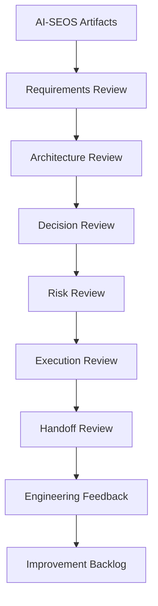

# Phase 2 — Professional Engineer Validation

## 1. Purpose

This document defines how AI-SEOS must be validated with professional engineers.

Professional engineers include:

- software engineers;
- senior engineers;
- staff engineers;
- architects;
- technical leads;
- engineering managers;
- security engineers;
- platform engineers.

This audience expects rigor, traceability, explicit trade-offs, actionable artifacts and technical consistency.

## 2. Validation Goal

Professional Engineer validation must prove that AI-SEOS can produce artifacts that a real engineering team can use.

The validation must answer:

1. Are requirements clear enough?
2. Is the MVP scope technically coherent?
3. Is the architecture understandable?
4. Are alternatives compared fairly?
5. Are ADRs useful?
6. Are risks meaningful?
7. Is the execution plan implementable?
8. Are handoffs complete?
9. Is the documentation navigable?
10. Would a senior engineer trust this as project input?

## 3. Expected Professional Outputs

Professional Engineer Mode must produce:

- Discovery brief;
- PRD;
- MVP scope;
- domain model;
- architecture overview;
- architecture views;
- integration model;
- decision matrix;
- ADRs;
- risk register;
- security review;
- scalability review;
- execution plan;
- backlog;
- handoff package;
- readiness scorecards.

## 4. Validation Review Process

Use a structured review.



## 5. Required Review Criteria

### 5.1 Product Criteria

- problem is clearly framed;
- user/persona is specific;
- MVP has clear boundaries;
- non-goals are explicit;
- success metrics exist;
- assumptions are visible.

### 5.2 Architecture Criteria

- architecture matches product needs;
- complexity is justified;
- alternatives are compared;
- integration points are clear;
- data ownership is clear;
- security implications are considered;
- operational concerns are considered.

### 5.3 Decision Criteria

- ADRs include context;
- alternatives are not strawmen;
- trade-offs are explicit;
- consequences are realistic;
- reversal plans exist where relevant;
- confidence is stated.

### 5.4 Risk Criteria

- risks are specific;
- probability and impact are clear;
- mitigations are actionable;
- security and compliance are not ignored;
- vendor risks are considered;
- operational risks are considered.

### 5.5 Execution Criteria

- milestones are coherent;
- dependencies are clear;
- backlog is implementable;
- acceptance criteria exist;
- validation steps exist;
- handoff is complete.

## 6. Required Templates

Create:

```text
templates/validation/professional-engineer-review-template.md
templates/validation/architecture-review-scorecard.md
```

The professional review template must include:

```markdown
# Professional Engineer Validation Review

## Reviewer Context

## Scope Reviewed

## Overall Assessment

## Product Review

## Architecture Review

## Decision Review

## Risk Review

## Execution Review

## Handoff Review

## Critical Issues

## Non-Blocking Improvements

## Missing Artifacts

## Engineering Trust Score

## Recommendation
- Accept
- Accept with changes
- Rework required
- Not acceptable
```

## 7. Engineering Trust Score

Use a 50-point model.

| Dimension | Max |
|---|---:|
| Product clarity | 5 |
| Requirement quality | 5 |
| Architecture quality | 5 |
| Decision traceability | 5 |
| Risk quality | 5 |
| Security awareness | 5 |
| Execution readiness | 5 |
| Documentation quality | 5 |
| Handoff quality | 5 |
| Maintainability | 5 |

Interpretation:

| Score | Meaning |
|---:|---|
| 0-20 | Not usable |
| 21-30 | Weak draft |
| 31-40 | Usable with review |
| 41-45 | Strong alpha |
| 46-50 | Professional-grade input |

## 8. Required Validation Cases

Create:

```text
examples/validation/professional-engineer/
    senseihub-architecture-review/
    marketplace-architecture-review/
    internal-automation-tool-review/
```

Each case must include:

- artifact set;
- review scorecard;
- reviewer notes;
- improvement backlog;
- final recommendation.

## 9. Required Canonical Artifacts

Create or update:

```text
docs/validation/professional-engineer-validation.md
protocols/user-validation/professional-engineer-validation-protocol.md
templates/validation/professional-engineer-review-template.md
templates/validation/architecture-review-scorecard.md
examples/validation/professional-engineer/
```

ADR:

```text
adr/0076-adopt-professional-engineer-validation.md
```

## 10. Quality Gates

This validation passes only if:

- review protocol exists;
- engineering trust score exists;
- at least three review cases exist;
- professional review templates exist;
- architecture review scorecard exists;
- ADR 0076 exists;
- SenseiHub receives a professional engineering review.

## 11. Definition of Done

Professional Engineer validation is done when a real or simulated senior engineering review can use AI-SEOS outputs to assess whether a project is ready for implementation.
