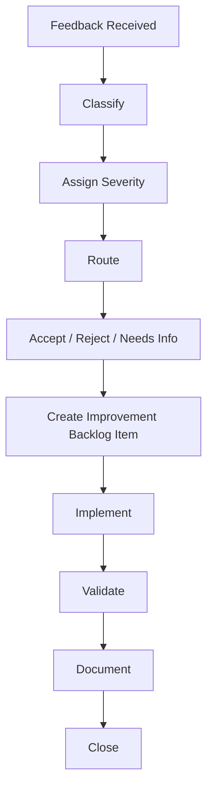

# Phase 2 — Feedback and Improvement Loop

## 1. Purpose

This document defines how AI-SEOS will collect, classify, prioritize and act on feedback.

After public alpha, the project must not evolve randomly.

It must use a structured improvement loop.

## 2. Why Feedback Governance Matters

AI-SEOS serves different audiences:

- non-technical builders;
- vibe coders;
- professional engineers;
- maintainers;
- contributors;
- organizations.

These groups will provide different types of feedback.

Without triage, the project may become incoherent.

The feedback loop protects the framework from:

- random feature creep;
- template sprawl;
- inconsistent terminology;
- overfitting to a single user type;
- ignoring beginner usability;
- ignoring engineering rigor;
- untracked changes;
- undocumented decisions.

## 3. Feedback Sources

AI-SEOS feedback may come from:

- GitHub issues;
- discussions;
- pull requests;
- validation sessions;
- user interviews;
- real-world projects;
- internal retrospectives;
- release feedback;
- template usage reports;
- AI coding session reports.

## 4. Feedback Categories

Classify feedback into these categories.

| Category | Description |
|---|---|
| Clarity | User does not understand something |
| Navigation | User cannot find something |
| Template | Template is missing, confusing or too verbose |
| Protocol | Protocol is incomplete or impractical |
| Engine | Engine behavior needs improvement |
| Entry Mode | User profile routing/language issue |
| Example | More examples or better examples needed |
| Quality | Broken link, inconsistent metadata, stale doc |
| Governance | Decision, contribution or lifecycle issue |
| Automation | Need scripts, CI, validation or tooling |
| Security | Security concern |
| Release | Release readiness, notes or versioning issue |

## 5. Triage Severity

Use severity levels.

| Severity | Meaning |
|---|---|
| S0 | Critical trust/security/release blocker |
| S1 | Major usability or correctness issue |
| S2 | Important improvement |
| S3 | Useful enhancement |
| S4 | Nice-to-have |

## 6. Feedback Lifecycle



## 7. Required Protocol

Create:

```text
protocols/feedback/feedback-triage-protocol.md
```

The protocol must define:

- how to receive feedback;
- how to label it;
- how to classify severity;
- how to determine ownership;
- when to create ADRs;
- when to update roadmap;
- when to reject feedback;
- how to close the loop with the reporter.

## 8. Required Templates

Create:

```text
templates/feedback/user-feedback-template.md
templates/feedback/framework-improvement-proposal.md
```

### 8.1 User Feedback Template

Must include:

```markdown
# User Feedback

## User Profile
- Non-Technical Builder
- Vibe Coder
- Professional Engineer
- Maintainer
- Other

## What Were You Trying To Do?

## Where Did You Get Stuck?

## What Was Confusing?

## What Worked Well?

## What Should Improve?

## Severity From Your Perspective

## Suggested Change
```

### 8.2 Framework Improvement Proposal

Must include:

```markdown
# Framework Improvement Proposal

## Summary

## Problem

## Affected Area

## User Profile Impact

## Proposed Change

## Alternatives Considered

## Risks

## Required Documentation Updates

## Required ADR?

## Validation Plan
```

## 9. GitHub Labels

Create or document recommended labels:

```text
type:clarity
type:navigation
type:template
type:protocol
type:engine
type:entry-mode
type:example
type:quality
type:governance
type:automation
severity:s0
severity:s1
severity:s2
severity:s3
severity:s4
profile:non-technical-builder
profile:vibe-coder
profile:professional-engineer
status:needs-triage
status:accepted
status:needs-info
status:blocked
status:ready
```

## 10. Improvement Backlog

Create:

```text
docs/community/improvement-backlog.md
```

The backlog must group improvements by:

- release blockers;
- high-impact usability;
- template improvements;
- validation needs;
- automation;
- documentation site;
- future engines or agents.

## 11. When Feedback Requires an ADR

Feedback requires an ADR when it changes:

- framework architecture;
- lifecycle;
- governance;
- entry modes;
- engine responsibilities;
- official template taxonomy;
- release policy;
- repository structure.

## 12. Required ADR

Create:

```text
adr/0079-adopt-feedback-and-improvement-loop.md
```

## 13. Quality Gates

This workstream passes only if:

- feedback protocol exists;
- feedback templates exist;
- triage guide exists;
- improvement backlog exists;
- recommended labels are documented;
- ADR 0079 exists;
- README or contributing docs point to feedback process.

## 14. Definition of Done

Feedback loop is done when users can submit feedback and maintainers have a clear process to classify, prioritize and turn feedback into framework improvement.
