---
title: "Project Entry Flows"
status: "Draft"
version: "0.1.0-alpha"
phase: "Phase 3 — Resolve Aí Runtime Productization"
owner: "Resolve Aí Maintainers"
last_updated: "2026-07-04"
---

# Project Entry Flows

## Objetivo

Definir como a runtime futura escolhe o fluxo inicial de um projeto.

## Fluxos Oficiais

1. Projeto do Zero.
2. Projeto em Andamento — Diagnóstico e Continuação.

## Fluxo Universal

```mermaid
flowchart TD
    A[resolve-ai começar] --> B[Detectar projeto]
    B --> C{Projeto existe?}
    C -->|Não| D[Projeto do Zero]
    C -->|Sim| E[Projeto em Andamento]
    D --> F[Selecionar modo de usuário]
    E --> G[Diagnóstico e Continuação]
    F --> H[Gerar docs/resolve-ai]
    G --> H
```



## Projeto do Zero

Usado quando o diretório está vazio ou o usuário começa de uma ideia. O fluxo passa por intake, discovery, produto, arquitetura, riscos, plano e backlog inicial.

## Projeto em Andamento — Diagnóstico e Continuação

Usado quando já existe código, configuração, README, histórico Git ou estrutura de aplicação.

Regra obrigatória:

```text
Não modificar código antes de diagnóstico, plano e riscos.
```

## Modos de Usuário

- Non-Technical Builder: linguagem simples, sem jargão.
- Vibe Coder: orientação prática com proteção de engenharia.
- Professional Engineer: rigor técnico, ADRs, riscos e trade-offs.

## Saídas Mínimas

Projetos existentes devem produzir intake, avaliação de estado atual, discovery, definição de produto, revisão arquitetural, risk register, decision log, plano de execução, backlog e handoff.
