---
title: "Resolve Aí Runtime Vision"
status: "Draft"
version: "0.1.0-alpha"
phase: "Phase 3 — Resolve Aí Runtime Productization"
owner: "Resolve Aí Maintainers"
last_updated: "2026-07-04"
---

# Resolve Aí Runtime Vision

## Objetivo

Definir a visão da camada runtime do Resolve Aí: uma forma futura de ativar o framework dentro de projetos reais sem transformar a experiência em um manual técnico pesado.

A promessa pública permanece:

```text
Me dá o problema ou a ideia, e eu te ajudo a resolver.
```

## Escopo

Esta fase documenta e consolida a arquitetura da runtime. Ela não implementa a CLI, não publica pacote executável e não promete automação funcional.

## Princípios

- Português como experiência pública principal.
- Simplicidade antes de automação avançada.
- CLI local primeiro; MCP, hooks e adapters depois.
- Modo Liga/Desliga como controle público de ativação.
- Separação entre estado operacional local e documentação humana.
- Segurança, privacidade e economia de tokens como defaults.
- Diagnóstico antes de alteração em projetos existentes.

## Arquitetura Conceitual

```mermaid
flowchart TD
    U[Usuário] --> C[resolve-ai CLI futura]
    C --> M[Modo Liga/Desliga]
    C --> A[Project Adapter]
    A --> S[.resolve-ai estado local]
    A --> D[docs/resolve-ai documentação]
    C --> R[Mode Router]
    R --> E[Engines do Resolve Aí]
    E --> G[Instruções para agentes]
```



## Responsabilidades

A runtime futura será responsável por detectar o tipo de projeto, criar estado local, orientar fluxos de entrada, gerar documentos base, instruir agentes e preservar handoff mínimo entre sessões.

Ela não deve substituir decisão humana, modificar código por padrão, instalar dependências sem intenção explícita ou expor dados sensíveis.

## Próximos Passos

- Implementar o CLI MVP na Phase 4.
- Criar comandos `começar`, `ligar`, `desligar`, `status` e `ajuda`.
- Validar a runtime em projetos reais com os três modos de entrada.
