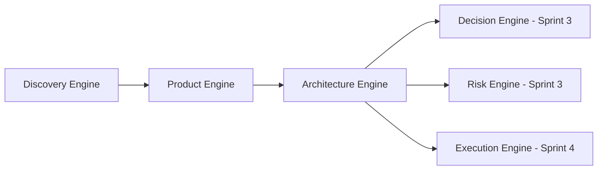

# Sprint 2 Handoff

## Objetivo

Implementar Product Engine e Architecture Engine como engines operacionais oficiais conectadas ao Discovery Engine.

## Fluxo Estabelecido

## Artefatos Entregues

- Product Engine, lifecycle, readiness levels, quality gates and handoff.
- Product framework, PRD protocol, MVP framework, roadmap and backlog standards.
- Architecture Engine, lifecycle, readiness levels, quality gates and handoff.
- Architecture framework, decision protocol, view standard, domain and integration modeling.
- Product and architecture templates.
- ADRs 0012 to 0018.

## Handoff para Sprint 3

Sprint 3 deve consumir Product and Architecture outputs para criar Decision Engine, Risk Engine and Optimization Engine.

## Pendências

- Criar agentes especializados de Product Owner e Solution Architect em sprint futura.
- Expandir exemplos reais para Product and Architecture.
