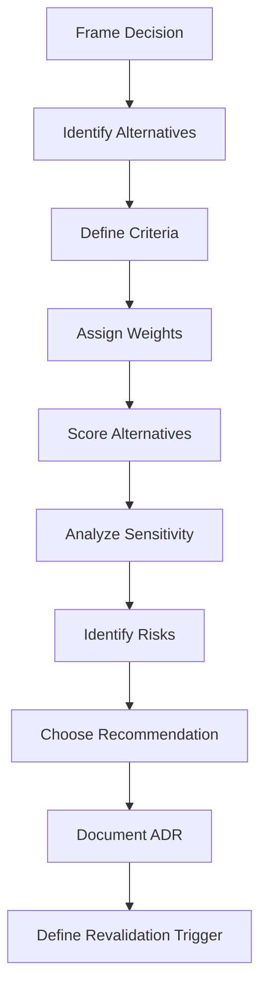

# Decision Framework

## Objetivo

Padronizar como AI-SEOS compara alternativas e escolhe uma direção sem remover julgamento humano.

## Fluxo



## Decision Question Pattern

```text
For [context], given [constraints], should we choose [option category] among [alternatives] in order to achieve [goal] while optimizing for [priority]?
```
