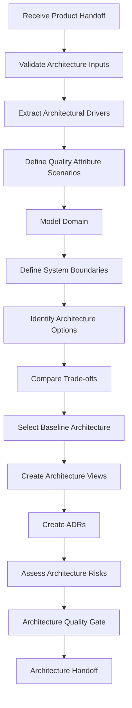

# Architecture Engine

## Objetivo

Transformar product requirements e discovery context em arquitetura explícita, explicável, evolutiva e alinhada ao produto.

## Escopo

- Architecture overview.
- System context, container and component views.
- Domain model.
- Data strategy.
- Integration strategy.
- API strategy.
- Security, observability and deployment signals.
- Quality attribute scenarios.
- Architecture options and trade-off matrix.
- ADR candidates and architecture handoff.

## Não Escopo

Não implementa código, não substitui Security Engine review, não decide escopo de produto e não escolhe tecnologia por tendência.

## Entradas

PRD, MVP Definition, Product Roadmap, Product Backlog Candidate, Architecture Input Brief, Discovery Context Package, NFRs, data requirements, integration requirements, security/privacy signals and future direction.

## Pipeline

## Default Bias

Prefer modular monolith before microservices, boring technology before trendy technology, reversible decisions under uncertainty and security/observability from the start.
