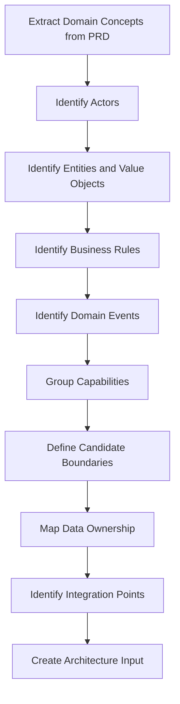

# Domain Modeling Standard

## Principle

Start architecture from actors, entities, rules, events, boundaries, language and data ownership before infrastructure.

## Pipeline

```mermaid
flowchart TD
    A[Extract Domain Concepts from PRD] --> B[Identify Actors]
    B --> C[Identify Entities and Value Objects]
    C --> D[Identify Business Rules]
    D --> E[Identify Domain Events]
    E --> F[Group Capabilities]
    F --> G[Define Candidate Boundaries]
    G --> H[Map Data Ownership]
    H --> I[Identify Integration Points]
    I --> J[Create Architecture Input]
```
