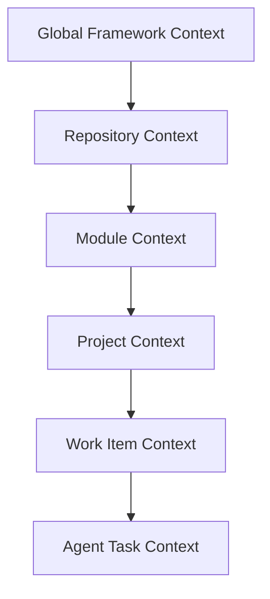

# Context and Knowledge Model

## Objetivo

Definir como o AI-SEOS captura, estrutura, valida, transfere e evolui conhecimento de engenharia.

## Contexto

Contexto é a informação necessária para tomar uma decisão correta ou produzir um artefato útil. Conhecimento é informação validada, reutilizável e durável.

## Camadas

## Escopo

- Context package.
- Assumption register.
- Constraint register.
- Knowledge freshness.
- Context drift.
- Context compression.

## Regras

- No orphan decisions.
- No orphan artifacts.
- No silent assumptions.
- No stale handoffs.
- No ambiguous scope.

## Próximos passos

- Usar o context package como padrão de handoff para todos os agentes.
