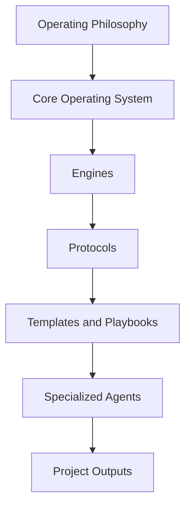

# Mental Model

## Objetivo

Explicar como o AI-SEOS deve ser pensado por mantenedores, contribuidores e agentes.

## Modelo

AI-SEOS opera como um sistema em camadas:

## Princípios

- Engines produzem capacidade operacional.
- Protocolos definem fluxo executável.
- Templates padronizam artefatos.
- Playbooks orientam cenários recorrentes.
- Agentes executam papéis com limites e contratos.

## Responsabilidades

Cada camada deve ser compreensível isoladamente e composable com as demais.

## Próximos passos

- Expandir exemplos de composição entre Discovery, Product e Architecture na Sprint 2.
