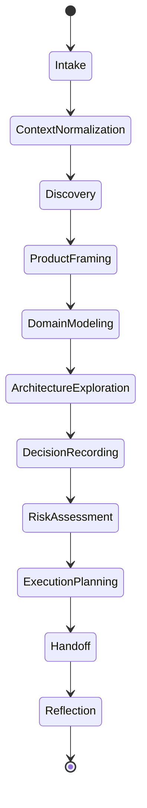

# Operating System Kernel

## Objetivo

Definir como o AI-SEOS coordena módulos, agentes, protocolos, artefatos, quality gates e decisões.

## Escopo

O kernel não executa código. Ele define as regras operacionais que engines e agentes devem seguir.

## Responsabilidades

- Roteamento do trabalho pelo lifecycle correto.
- Normalização de contexto.
- Invocação de engines e agentes.
- Produção de artefatos duráveis.
- Rastreabilidade de decisões.
- Preservação de contexto em handoffs.
- Enforçamento de quality gates.

## Lifecycle

## Quality Gates

- Problem Gate.
- Scope Gate.
- Architecture Gate.
- Risk Gate.
- Handoff Gate.
- Reflection Gate.

## Trade-offs

O kernel cria disciplina operacional e reduz perda de contexto. Em troca, exige artefatos mínimos antes de avançar para execução.

## Próximos passos

- Integrar Product Engine e Architecture Engine ao lifecycle na Sprint 2.
