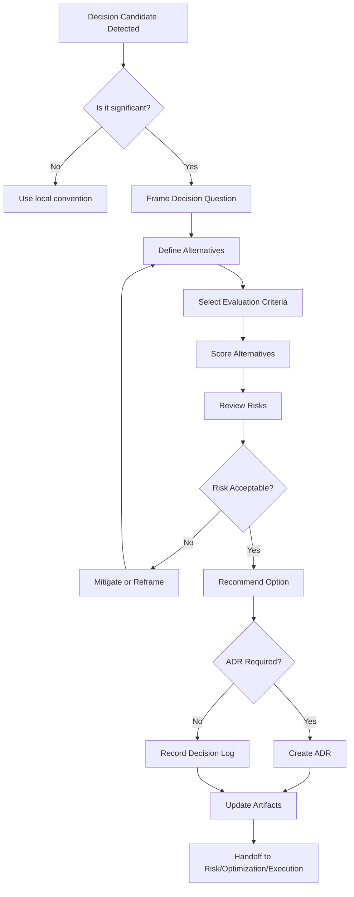

# Decision Engine

## Objetivo

Governar decisões significativas de produto, arquitetura, segurança, operação, entrega, AI usage e custo, evitando que escolhas importantes fiquem escondidas em implementação ou conversa.

## Escopo

- Scope and MVP decisions.
- Architecture and technology choices.
- Build versus buy and vendor choices.
- Data ownership and integration strategy.
- Security, compliance, scalability and operational posture.
- Cost, complexity and AI usage decisions.

## Não Escopo

Não governa detalhes triviais, formatting, pequenas correções ou escolhas locais reversíveis sem impacto arquitetural.

## Entradas

Discovery Document, PRD, MVP Scope, Product Handoff, Architecture Overview, Domain Model, Integration Model, decision candidates, assumptions, constraints, risks and stakeholder priorities.

## Saídas

Decision Record, Decision Matrix, ADR, Decision Log Entry, Risk Review Request, Optimization Review Request, Execution Constraint, Revalidation Trigger and Handoff Package for Risk Engine.

## Fluxo

