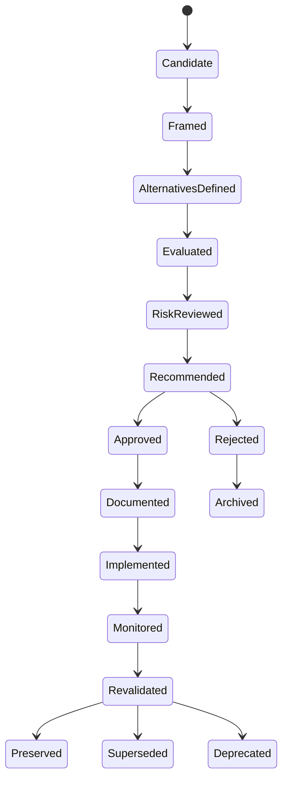

# Decision Lifecycle

## Decision Classes

| Class | Description | Required Artifact | Approval |
|---|---|---|---|
| D0 | Trivial local choice | None or code comment | Implementer |
| D1 | Local design decision | Decision log | Lead agent |
| D2 | Cross-module decision | ADR lite | AI CTO or Architect |
| D3 | Architectural decision | Full ADR | AI CTO + human review recommended |
| D4 | Strategic/platform decision | Full ADR + risk review | Human approval required |
| D5 | Regulated/irreversible decision | Full ADR + risk + security review | Human approval mandatory |
