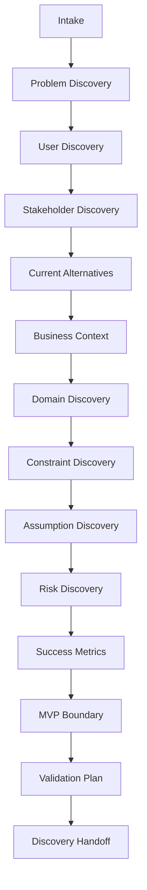

# Discovery Pipeline

## Fluxo

## Quality Gates

Cada etapa deve produzir artefato mínimo antes de avançar. Quando dados forem insuficientes, registre assumptions e open questions.

## Próximos passos

- Criar exemplos preenchidos por domínio.
