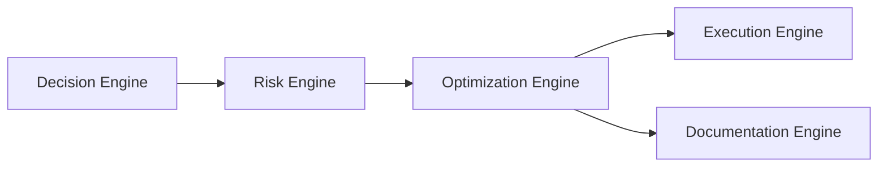

# Optimization Engine

## Objetivo

Perguntar se uma decisão, arquitetura, escopo ou plano pode ser mais simples, seguro, barato, entregável, manutenível, escalável ou reversível sem sacrificar valor essencial.

## Dimensões

- Simplicity.
- Cost.
- Complexity.
- Maintainability.
- Scalability.
- Security.
- Reversibility.
- AI usage.

## Saídas

Optimization Review, simplification recommendation, cost reduction recommendation, scalability adjustment, security hardening recommendation, reversibility improvement, AI usage optimization and execution constraints.

## Position

