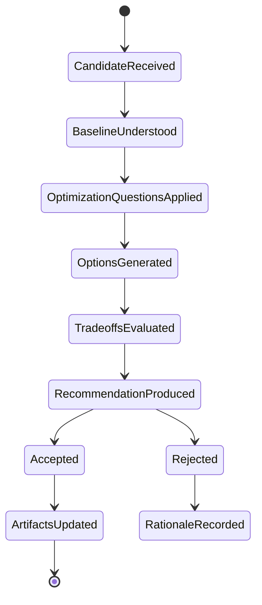

# Optimization Lifecycle

```mermaid
stateDiagram-v2
    [*] --> CandidateReceived
    CandidateReceived --> BaselineUnderstood
    BaselineUnderstood --> OptimizationQuestionsApplied
    OptimizationQuestionsApplied --> OptionsGenerated
    OptionsGenerated --> TradeoffsEvaluated
    TradeoffsEvaluated --> RecommendationProduced
    RecommendationProduced --> Accepted
    RecommendationProduced --> Rejected
    Accepted --> ArtifactsUpdated
    Rejected --> RationaleRecorded
    ArtifactsUpdated --> [*]
```

## Levels

O0 none, O1 checklist, O2 structured review, O3 full analysis, O4 strategic, O5 human-reviewed.
