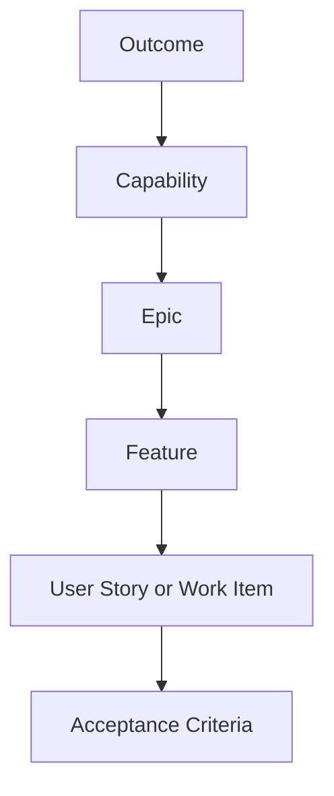

# Product Backlog Standard

## Objetivo

Garantir que backlog seja rastreável a outcomes, capabilities, epics, features and acceptance criteria.

## Hierarquia

## Quality Gates

- Every epic maps to a capability.
- Every capability maps to an outcome.
- MVP and non-MVP items are marked.
- Acceptance criteria exist for MVP features.
- Risks and dependencies are visible.
