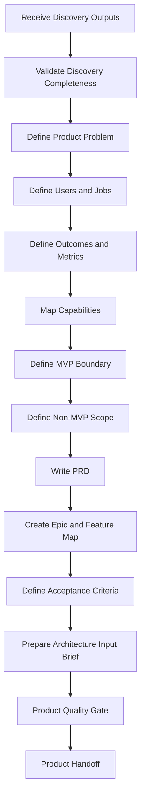

# Product Engine

## Objetivo

Converter discovery validado em produto coerente, mensurável e pronto para arquitetura.

## Escopo

- Product vision.
- PRD.
- MVP boundary.
- Non-MVP scope.
- User journeys.
- Capability map.
- Epic and feature breakdown.
- Acceptance criteria.
- Outcome metrics.
- Product roadmap and backlog.
- Architecture input brief.

## Não Escopo

O Product Engine não escolhe arquitetura final, não substitui validação de mercado, não decide security architecture e não transforma toda solicitação em requisito.

## Entradas

- Discovery Document.
- Context Package.
- Problem Statement.
- User and Buyer Map.
- Business Objectives.
- Assumptions, constraints and risks.
- Initial success metrics.
- Known non-goals.

## Saídas

- PRD.
- MVP Definition.
- Product Roadmap.
- Product Backlog Candidate.
- Product Risk Register.
- Architecture Input Brief.
- Product Handoff Package.

## Pipeline

## Trade-offs

Product Engine adds structure before architecture. This slows direct implementation but reduces product bloat, architecture drift and waste.

## Próximos passos

- Feed Architecture Engine with Product Handoff.
