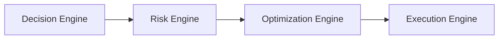

# Risk Engine

## Objetivo

Tornar riscos visíveis, intencionais, gerenciáveis e conectados a decisões.

## Escopo

- Product, technical, security, compliance, operational, cost, delivery, vendor and AI-specific risks.
- Risk scoring.
- Risk response strategy.
- Escalation rules.
- Risk register and risk assessment.

## Entradas

Decision records, ADRs, architecture candidates, product scope, assumptions, constraints, security signals, vendor dependencies and unresolved questions.

## Saídas

Risk Register updates, Risk Assessments, Risk Acceptance records, mitigation tasks, escalation notes and handoff to Optimization/Execution.

## Position

