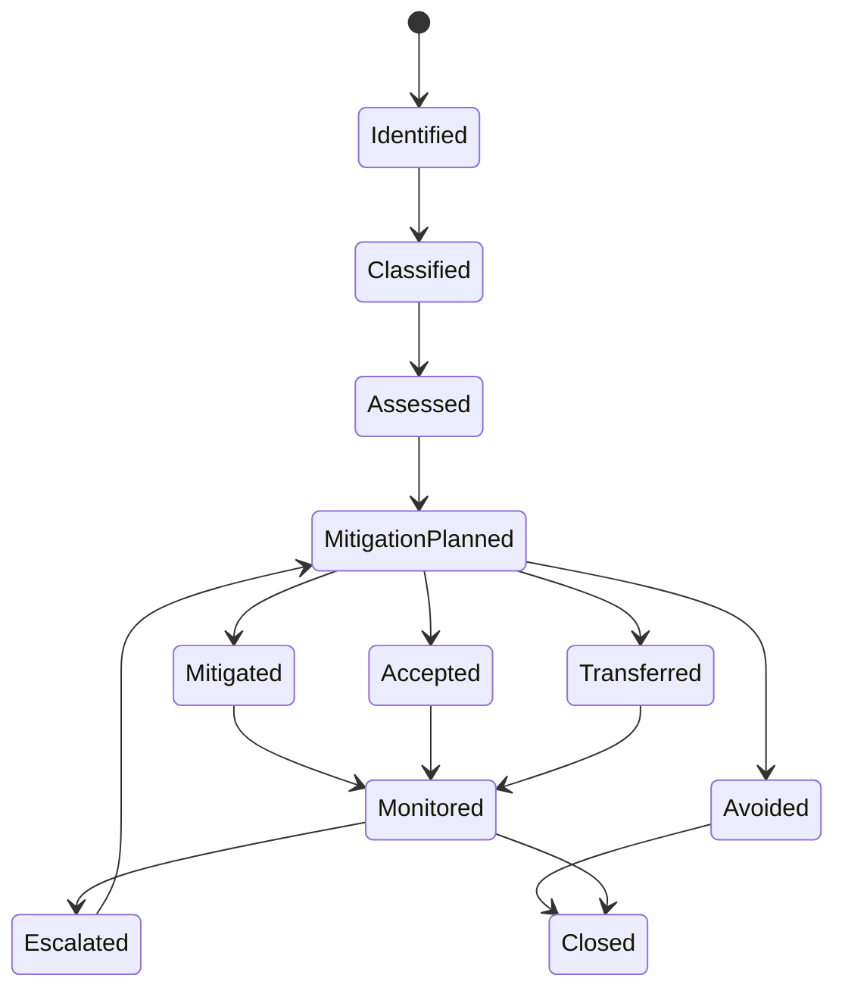

# Risk Lifecycle

```mermaid
stateDiagram-v2
    [*] --> Identified
    Identified --> Classified
    Classified --> Assessed
    Assessed --> MitigationPlanned
    MitigationPlanned --> Mitigated
    MitigationPlanned --> Accepted
    MitigationPlanned --> Transferred
    MitigationPlanned --> Avoided
    Mitigated --> Monitored
    Accepted --> Monitored
    Transferred --> Monitored
    Avoided --> Closed
    Monitored --> Escalated
    Monitored --> Closed
    Escalated --> MitigationPlanned
```

## Response Strategies

Avoid, mitigate, transfer, accept and monitor.
