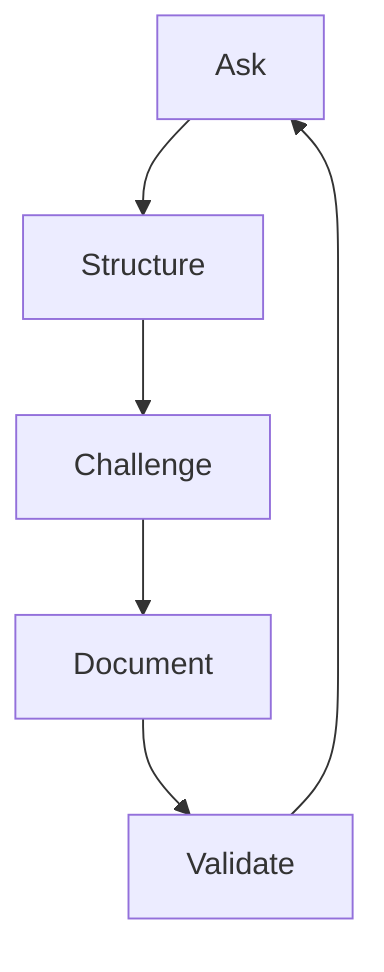

# Project Discovery Playbook

## Objetivo

Explicar como rodar discovery usando a Discovery Engine, o Discovery Protocol e os templates de discovery.

## Quando usar

Use ao iniciar SaaS, ferramenta interna, feature relevante, capacidade AI-first, modernização, migração ou iniciativa arquitetural.

## Modelo de facilitação

## Passos

1. Prepare workspace e arquivos de discovery.
2. Capture a raw idea.
3. Defina depth D0, D1, D2 ou D3.
4. Escreva problem statement.
5. Mapeie usuários e stakeholders.
6. Documente alternativas atuais.
7. Capture business context.
8. Descubra domínio.
9. Capture technical context.
10. Crie registers.
11. Defina MVP boundary.
12. Crie validation plan.
13. Prepare handoff.

## Definition of Done

- [ ] Discovery document exists.
- [ ] Registers exist.
- [ ] MVP is bounded.
- [ ] Validation plan exists.
- [ ] Handoff package exists.
- [ ] Next agent is identified.
