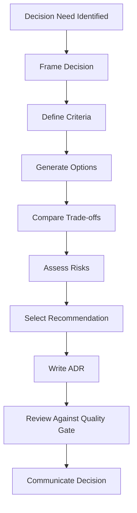

# Architecture Decision Protocol

## Objetivo

Identificar, avaliar, registrar e comunicar decisões arquiteturais antes da Decision Engine completa.

## Pipeline

## Reversibility

| Class | Meaning | Handling |
|---|---|---|
| Type 1 | Hard to reverse | ADR, review and rollback plan |
| Type 2 | Reversible | ADR recommended |
| Type 3 | Local detail | Local docs or code notes |
