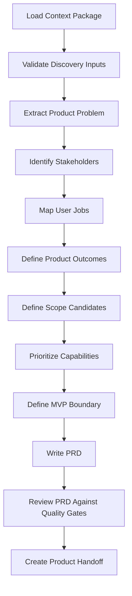

# Discovery to PRD Protocol

## Objetivo

Converter Discovery outputs em PRD sem perder contexto, assumptions, risks, constraints ou trade-offs.

## Princípio

No PRD may be created directly from an idea. It must derive from Context Package and Discovery Output.

## Transformation Map

| Discovery Artifact | PRD Section |
|---|---|
| Problem Statement | Product Problem |
| User Segments | Target Users |
| Buyer/User Map | Stakeholders and Personas |
| Jobs To Be Done | User Needs and Use Cases |
| Current Solution | Alternatives Context |
| Business Goals | Product Objectives |
| Constraints | Product Constraints |
| Assumptions | Assumptions Register |
| Risks | Product Risks |
| Metrics | Success Metrics |
| Non-goals | Out of Scope |

## Pipeline

## Output Contract

- PRD.
- MVP Definition.
- Product Roadmap.
- Backlog Candidate.
- Product Risk Register.
- Architecture Input Brief.
- Product Handoff Package.
