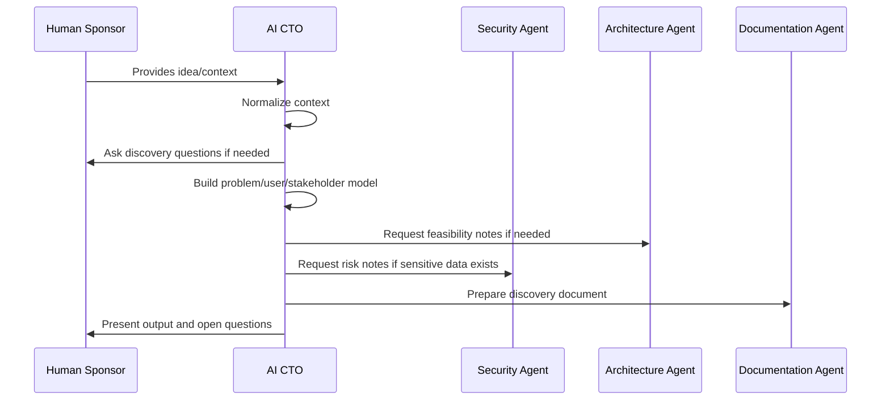

# Discovery Session Flow

```mermaid
sequenceDiagram
    participant H as Human Sponsor
    participant CTO as AI CTO
    participant SEC as Security Agent
    participant ARCH as Architecture Agent
    participant DOC as Documentation Agent
    H->>CTO: Provides idea/context
    CTO->>CTO: Normalize context
    CTO->>H: Ask discovery questions if needed
    CTO->>CTO: Build problem/user/stakeholder model
    CTO->>ARCH: Request feasibility notes if needed
    CTO->>SEC: Request risk notes if sensitive data exists
    CTO->>DOC: Prepare discovery document
    CTO->>H: Present output and open questions
```

## Próximos passos

- Criar facilitation scripts por depth level.
